==  +

link:#introduction[*Introduction*]

link:#prerequisites[*Prerequisites*]

____
link:#verify-access-to-the-environment[Verify access to the environment]

link:#download-the-resources[Download the resources]

link:#update-the-files[Update the files]
____

link:++#lab-1---walkthrough-of-cde-data-service++[*Lab 1 - Walkthrough of CDE Data Service *]

____
link:#accessing-the-virtual-cluster[ACCESSING THE VIRTUAL CLUSTER ]

link:#step-1-select-the-appropriate-cde-service[Step 1 : Select the appropriate CDE Service ]

link:#step-2-virtual-cluster-selection[Step 2 : Virtual cluster selection ]
____

link:++#lab-2---create-and-trigger-ad-hoc-spark-jobs++[*Lab 2 - Create and trigger ad-hoc Spark jobs *]

____
link:#resource-creation[Resource Creation ]

link:#job-creation[Job Creation ]

link:#triggering-the-jobs[Triggering the jobs ]
____

link:++#lab-3---add-schedule-to-the-ad-hoc-spark-jobs++[*Lab 3 - Add schedule to the ad-hoc Spark jobs *]

link:++#lab-4---orchestrate-a-set-of-jobs-using-airflow++[*Lab 4 - Orchestrate a set of jobs using Airflow *]

link:++#lab-5---install-and-configure-cde-cli++[*Lab 5 - Install and Configure CDE CLI *]

____
link:#for-mac-users[For Mac users: ]

link:#for-windows-users[For Windows users: ]
____

link:++#lab-6---run-jobs-using-cde-cli++[*Lab 6 - Run jobs using CDE CLI *]

____
link:#run-a-spark-scala-job-using-cli[Run a spark-scala job using CLI ]
____

link:++#lab-7---data-lineage-and-auto-scaling++[*Lab 7 - Data Lineage and Auto-Scaling *]

____
link:#data-lineage-using-atlas[Data Lineage using Atlas ]

link:#auto-scaling-in-cde[Auto-scaling in CDE ]
____

== Introduction

This document aims to introduce to our partners the features of *CDE*, the Data Engineering Data Service of Cloudera Data Platform (*CDP*). During the course of this workshop,you will experience how simple it is to run and orchestrate spark jobs with the help of auto-scaling infrastructure. We will use Airflow for orchestrating the various jobs.

In this workshop:

* {blank}
+
____
You will be given an active CDE service running in an existing/registered CDP environment in a given tenant.
____
* {blank}
+
____
You will have a virtual cluster with the given configuration that serves as compute for the spark workload.
____
* {blank}
+
____
You will run sample spark jobs as ad-hoc jobs.
____
** {blank}
+
____
PySpark
____
** {blank}
+
____
Spark-scala
____
* {blank}
+
____
You will run the same spark jobs as part of a schedule.
____
* {blank}
+
____
With the help of Airflow, you will orchestrate a set of Spark jobs and trigger them as a flow.
____
* {blank}
+
____
You will use CDE CLI to trigger the jobs from terminal/powershell.
____
* {blank}
+
____
You will see the data lineage using Atlas and witness the auto-scaling capabilities of the CDE Data service.
____

== Prerequisites

=== Verify access to the environment

* {blank}
+
____
Open the shared link and login with the credentials assigned to you.

<Will be shared by the instructor at the start>

image:media/media/image56.png[media/media/image56,width=307,height=222]
____

* {blank}
+
____
You should land on the CDP Console as shown below.

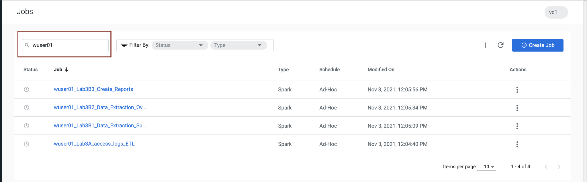
____

=== Download the resources

There are two ways in which you can access the scripts/resources.

* {blank}
+
____
Download the zip file from the GitHub repository.

https://github.com/mmehra12/HOLWorkshops[[.underline]#https://github.com/mmehra12/HOLWorkshops#]

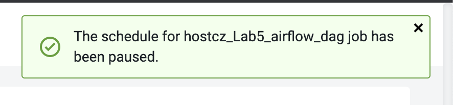

After decompressing the ZIP file the folder structure should look something like this

Note : We will use the CDE folder for this session, you can ignore the CDF content.

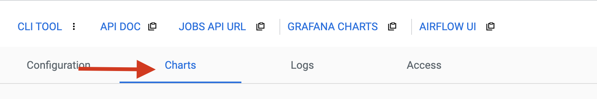
____

* {blank}
+
____

The resources were also sent to you on your registered email an hour before the event. Please download the zip file attached to the email.

After decompressing the ZIP file the folder structure should look something like this.

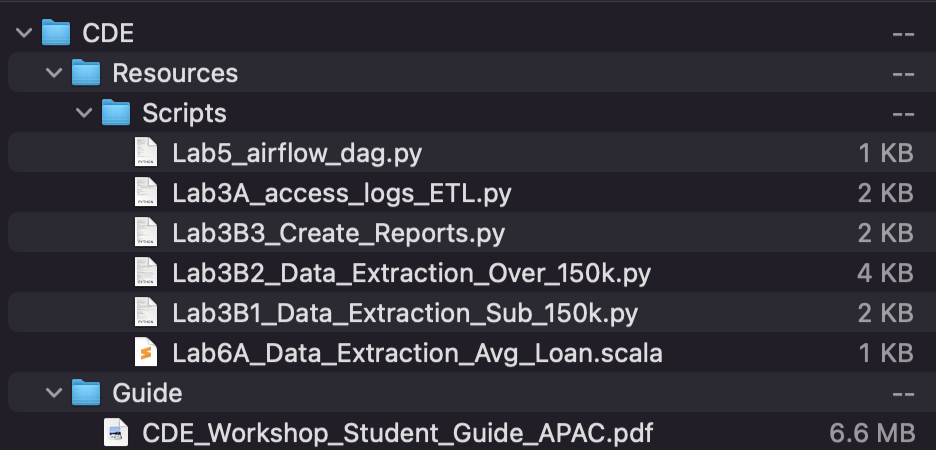
____

=== Update the files

* {blank}
+
____
Go through each script and update the necessary values as mentioned in the script.

** For all the scripts, update the username field with the username that you have been assigned to. You will find this at the starting of the script itself.

image:media/media/image42.png[media/media/image42,width=570,height=362]
____

== Lab 1 - Walkthrough of CDE Data Service

____
[.mark]#Cloudera Data Engineering (CDE) is a serverless service for Cloudera Data Platform that allows you to submit jobs to auto-scaling virtual clusters.#

[.mark]#The CDE service involves several components:#
____

* {blank}
+
____
*[.mark]#Environment#*
____
** {blank}
+
____
[.mark]#A logical subset of your cloud provider account including a specific virtual network.#
____
* {blank}
+
____
*[.mark]#CDE Data Service#*
____
** {blank}
+
____
[.mark]#The long-running Kubernetes cluster and services that manage the virtual clusters. The CDE service must be enabled in an environment before you can create any virtual clusters.#
____
* {blank}
+
____
*[.mark]#Virtual Cluster#*
____
** {blank}
+
____
[.mark]#An individual auto-scaling cluster with defined CPU and memory ranges. Virtual Clusters in CDE can be created and deleted on demand. Jobs are associated with clusters.#
____
* {blank}
+
____
*[.mark]#Job#*
____
** {blank}
+
____
[.mark]#Application code along with defined configurations and resources. Jobs can be run on demand or scheduled.#
____
* {blank}
+
____
*[.mark]#Resource#*
____
** {blank}
+
____
[.mark]#A defined collection of files such as a Python file or application JAR, dependencies, and any other reference files required for a job.#
____
* {blank}
+
____
*[.mark]#Job run#*
____
** {blank}
+
____
[.mark]#An individual job run.#
____

____
[.mark]#The above components can be accessed in the following ways:#
____

* {blank}
+
____
Go to the CDP console and click on Data Engineering.

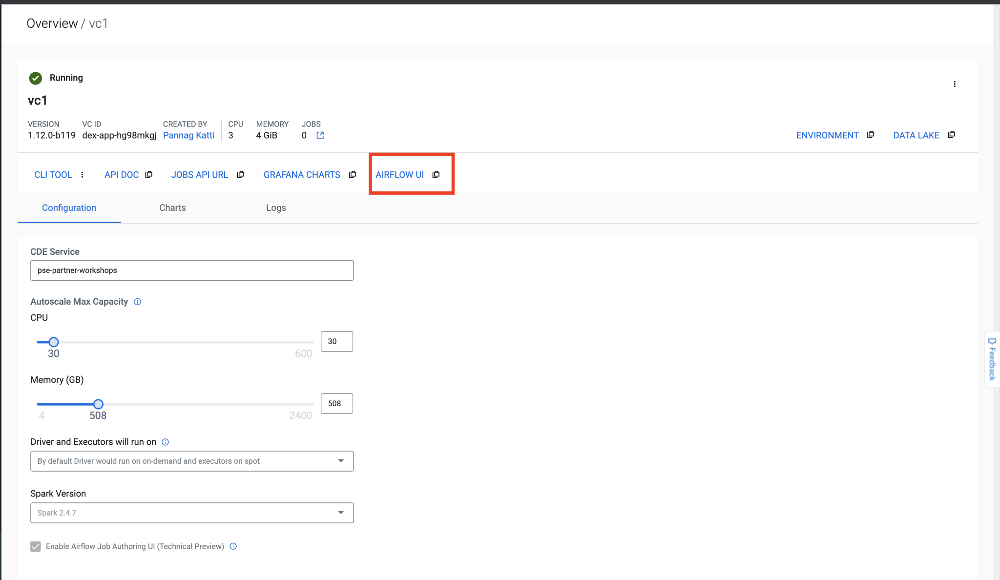
____

* {blank}
+
____
You will see the CDE homepage.

[Note] : If the page load takes a while, you can move to the next step, we can come back to this later

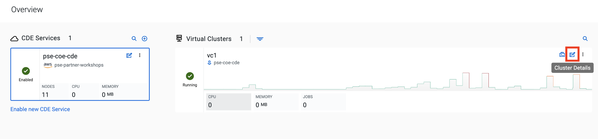
____
* {blank}
+
____
We should have a CDE service running which we will use for this workshop. To check this Select the *ADMINISTRATION* option on the left menu on your screen. You should be able to see all the CDE Service and their status.
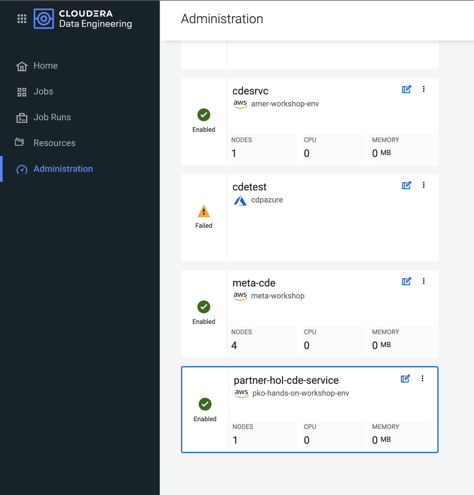
____

* {blank}
+
____
On the *CDE service* *[.mark]#pko-workshop-cde-service#,* click on the pencil icon and observe the configuration and other details related to the service.

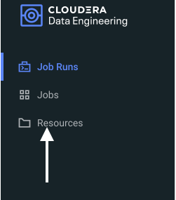

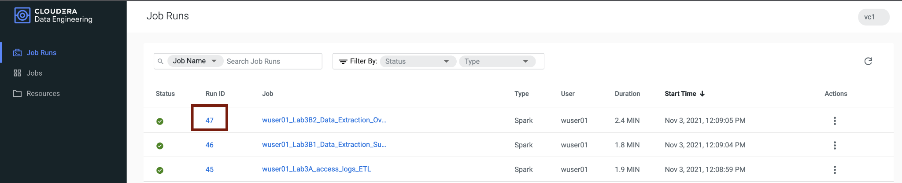
____

* {blank}
+
____
Click on each tab and go through all the details related to the CDE service.
____
* {blank}
+
____
Once done, click on the *Home* on the left tab to go back to the CDE home page.This page shows us the active CDE services and the associate clusters. Let’s start with accessing the virtual cluster that is assigned to you.
____

=== ACCESSING THE VIRTUAL CLUSTER

==== Step 1 : Select the appropriate CDE Service

____
Go to the Administration page and select your CDE Service (In our case *partner-hol-cde-service*)

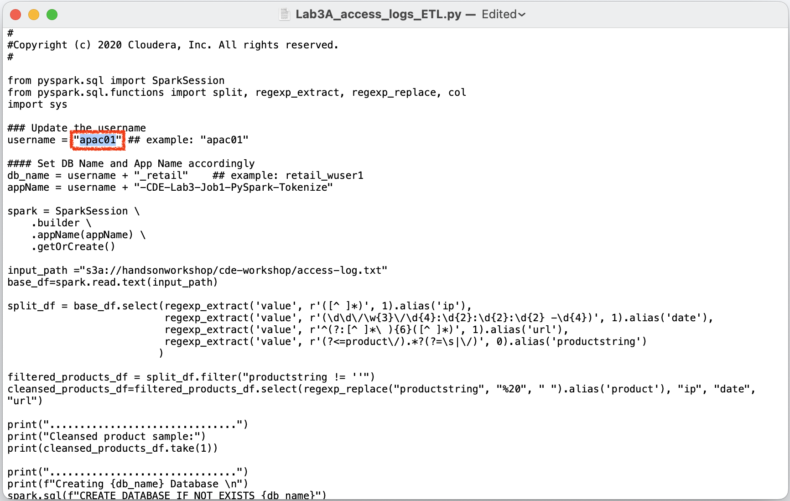
____
==== Step 2 : Virtual cluster selection

[loweralpha]
. {blank}
+
____
Select the CDE Service and click on the virtual cluster that was assigned to you.

image:media/media/image35.png[media/media/image35,width=533,height=274]
____

== Lab 2 - Create and trigger ad-hoc Spark jobs 

In this lab, we will create spark jobs and run them on an ad-hoc basis, i.e., without any schedule. As part of this lab, we have taken two simple use-cases that can be addressed with the help of Spark jobs.

[arabic]
. {blank}
+
____
Log Data Cleansing using Spark
____
. {blank}
+
____
Analyze the Paycheck Protection Program Data
____
[loweralpha]
.. {blank}
+
____
Report 1: Breakdown of all cities in Texas that retained jobs
____
.. {blank}
+
____
Report 2: Breakdown of company type that retained jobs
____

=== Resource Creation

* {blank}
+
____
On the virtual cluster *Cluster Name* : _<username>-virtual-cluster_ [ Virtual cluster created in Lab 1] tab**,** click on view jobs. This will open a new page with details of the Job Runs, Jobs, and Resources.

____

* {blank}
+
____
In the left pane, click on the *Resources* tab.

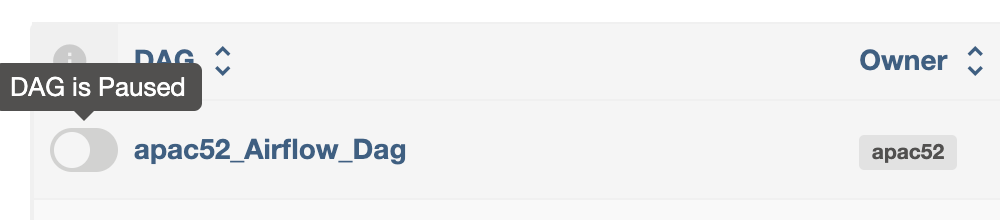
____

* {blank}
+
____
You will get the *Resources* page to the right. Click on *Create Resource*.

image:media/media/image65.png[media/media/image65,width=352,height=93]
____

* {blank}
+
____
Give a unique name(username-resources) and create the resource. This acts as your repository for storing all the scripts and dependencies.
____
* {blank}
+
____
Once it is created, you will get an option to upload the files as shown below.

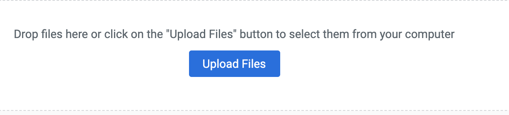
____

* {blank}
+
____
Click on *Upload Files* and select all the scripts downloaded from the link:#prerequisites[[.underline]#prerequisites#] step. (*Please upload only .py files*). Click on Upload

____

* {blank}
+
____
You will get a pop-up with all the files uploaded to your resource.

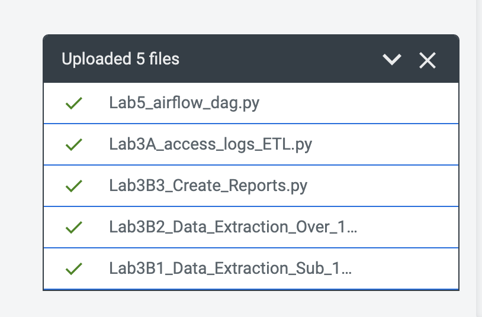
____

* {blank}
+
____
Validate if all the five _.py_ files are present in your resource. We are now ready to create jobs using these resources.

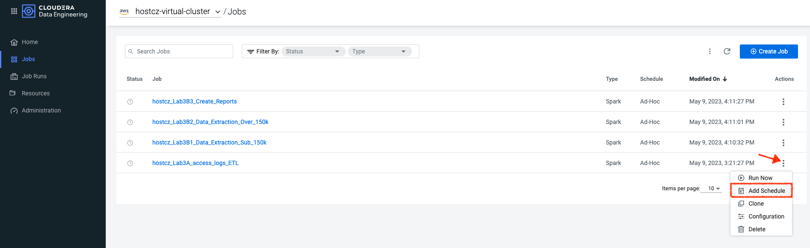
____

=== Job Creation

* {blank}
+
____
We will now create the first job with the script *_Lab3A_access_logs_ETL.py_*.
____
* {blank}
+
____
In the left pane, click on *Jobs*
____
* {blank}
+
____
You will get the *Jobs* page to the right. Click on *Create Job*.

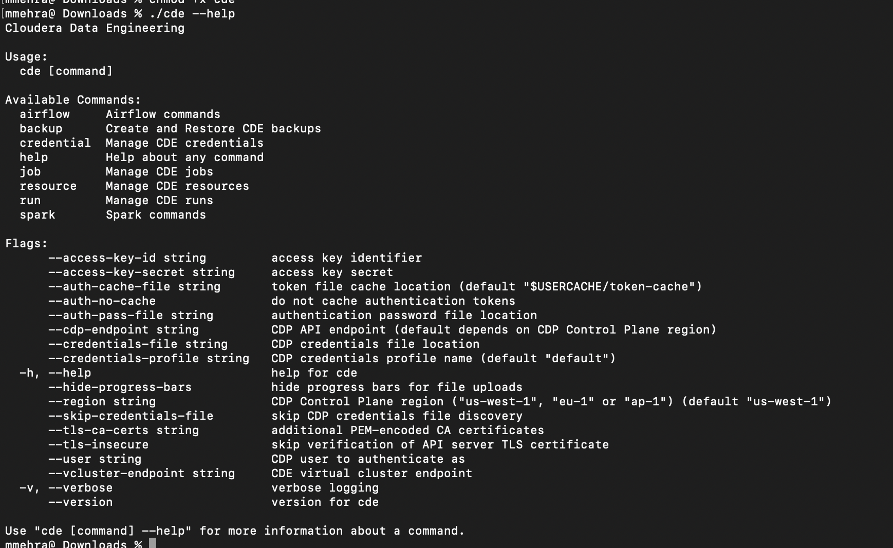
____

* {blank}
+
____
Select job type as *Spark*.
____
* {blank}
+
____
Please give the job names as mentioned below.

<username>_<script_name_without_py_extension>
Eg:- For apac01, job1 name would be *apac01_Lab3A_access_logs_ETL*

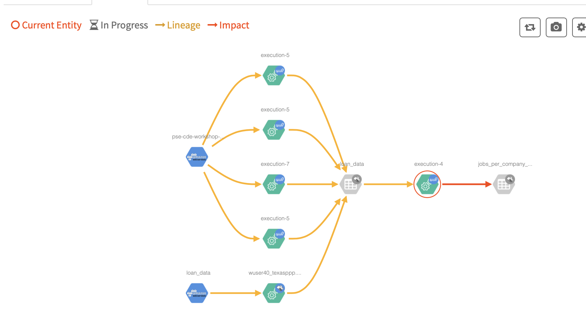
____

* {blank}
+
____
As this is a shared environment, please name the jobs with your username so that it helps in differentiating yours from others’ jobs.
____
* {blank}
+
____
In *Application File*, click on *Select from Resource* and select the file *Lab3A_access_logs_ETL.py* from your resource(<username>-resources). +
 +
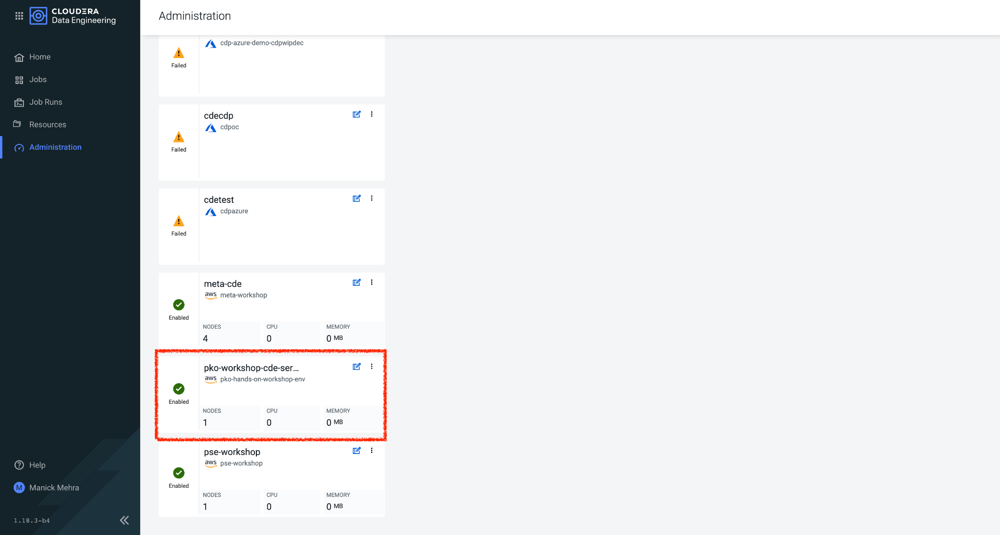

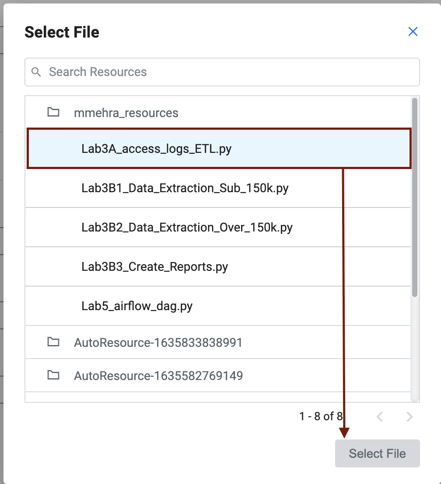
____

* {blank}
+
____
Ignore the remaining configuration options. Do not enable the schedule now. This is how it should finally look like.

____

* {blank}
+
____
Click on the drop down option and click on *Create*. (do not click Create and Run)

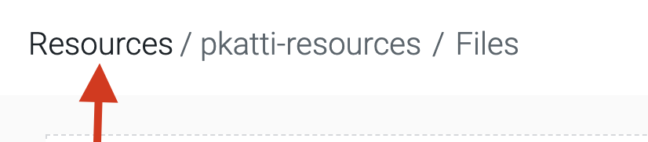
____

* {blank}
+
____
Similarly, create three other jobs with the same naming conventions. Please refer to the table below to confirm you are creating exactly the same.

For *apac01:*

[width="100%",cols="11%,48%,41%",options="header",]
|===
|*Jobs* |*Job Name* |*Script Used*
|Job1 |apac01_Lab3A_access_logs_ETL |Lab3A_access_logs_ETL.py
|Job2 |apac01_Lab3B1_Data_Extraction_Sub_150k |Lab3B1_Data_Extraction_Sub_150k.py
|Job3 |apac01_Lab3B2_Data_Extraction_Over_150k |Lab3B2_Data_Extraction_Over_150k.py
|Job4 |apac01_Lab3B3_Create_Reports |Lab3B3_Create_Reports.py
|===
____
* {blank}
+
____
Create these jobs as *ad-hoc* jobs i.e., without any schedule.
____
* {blank}
+
____
Once done, click on the *Jobs* tab and enter your username in the search bar and press *ENTER.* You should see four jobs as shown below with your username.

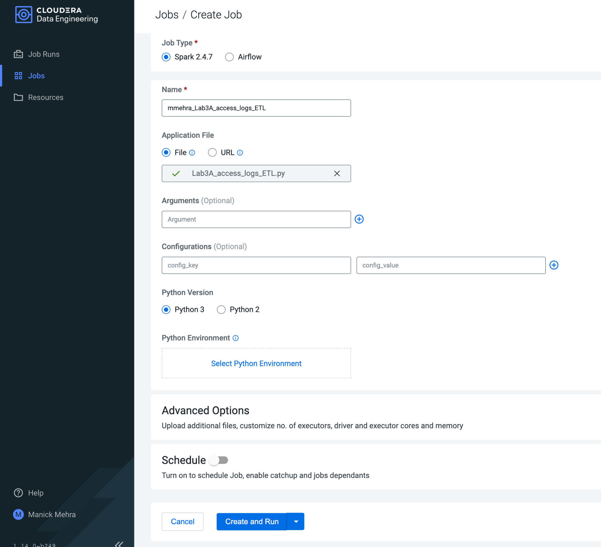
____

* {blank}
+
____
Observe the type of the job is set to Spark and for schedule, it is Ad-hoc.
____

=== Triggering the jobs

* {blank}
+
____
You need to trigger the jobs in the following order
____
** {blank}
+
____
JOB 1 : apac01_Lab3A_access_logs_ETL
____
** {blank}
+
____
JOB 2 : apac01_Lab3B1_Data_Extraction_Sub_150k
____
** {blank}
+
____
JOB 3 : apac01_Lab3B2_Data_Extraction_Over_150k
____
** {blank}
+
____
JOB 4 : apac01_Lab3B3_Create_Reports(Run once JOB 2 and JOB 3 have completed successfully)
____

[NOTE]
====
JOB 1, JOB 2 and JOB 3 can be triggered one after the other.

*JOB 4* should be executed after the successful completion of *JOB 2 and JOB 3*
====

* {blank}
+
____
To trigger the job, go to the *Jobs* tab, click on the 3-dotted icon, and click on *Run Now.*

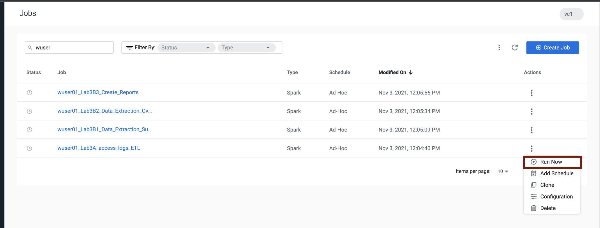
____
* {blank}
+
____
To check the job logs, click on *Job Runs* and select the *ID* against the job that you have triggered.

image:media/media/image53.png[media/media/image53,width=624,height=126]

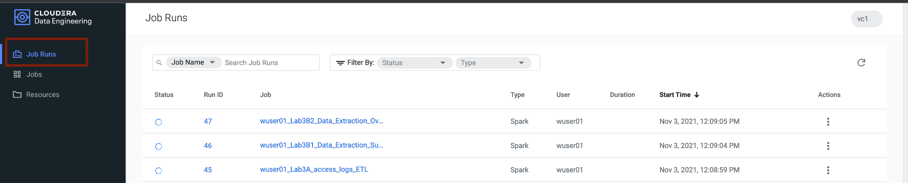

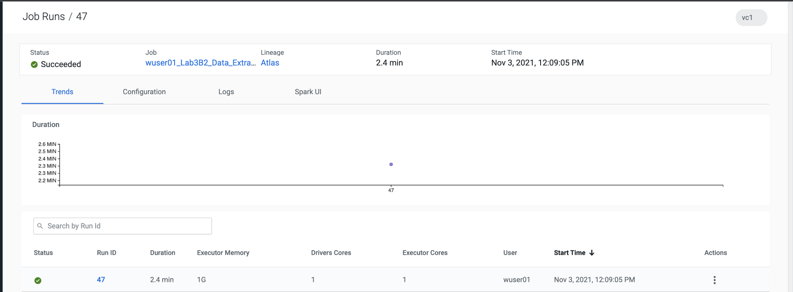
____

* {blank}
+
____
For simplifying the job selection, you can choose the *User* filter and add your username and hit enter. You will see the list of jobs triggered by you.

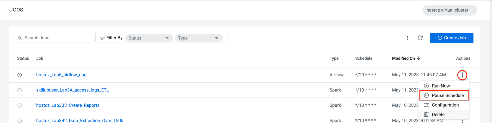
____
* {blank}
+
____
Navigate to different tabs in the job run page and you will see all that you need to observe for the run of a Spark job.

image:media/media/image9.png[media/media/image9,width=624,height=57]
____

==  Lab 3 - Add schedule to the ad-hoc Spark jobs 

In this lab, we will add a schedule to a job created as part of the previous lab.

* {blank}
+
____
We will add a schedule to the job *Lab3A_access_logs_ETL*

In your case it will be <username>_Lab3A_access_logs_ETL
____

* {blank}
+
____
Go to *Jobs* tab, click on the 3-dotted icon next to the job *Lab3A_access_logs_ETL* and select *Add schedule*.

image:media/media/image26.png[media/media/image26,width=624,height=190]
____

* {blank}
+
____
You will land in the *Job Schedule* page. Click on *Create a Schedule*.

image:media/media/image16.png[media/media/image16,width=624,height=128]
____

* {blank}
+
____
Choose the *Cron Expression* option and enter the cron expression as given below. +
 +
*/10 * * * * → This means that the job is scheduled to run every 10 minutes.

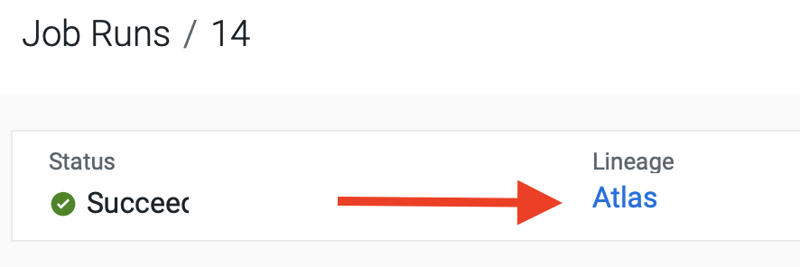
____

* {blank}
+
____
You can repeat the same process for the other jobs as well.
____
** {blank}
+
____
JOB 1 : Run every 10 mins

JOB 2 : Run every 10 mins

JOB 3 : Run every 10 mins

JOB 4 : Run every 30 mins
____

* {blank}
+
____
We do not have to wait for the jobs to get triggered as per the schedule. The idea was to understand how Ad-Hoc jobs are scheduled. We can continue with the next steps
____
* {blank}
+
____
*Please PAUSE the schedule for all the jobs for which it was added by following the below steps.*
____
* {blank}
+
____
Go to the Jobs tab, click on the 3-dotted icon next to the job and select *Pause schedule*. [ Do this for all jobs ]

image:media/media/image70.png[media/media/image70,width=471,height=154]

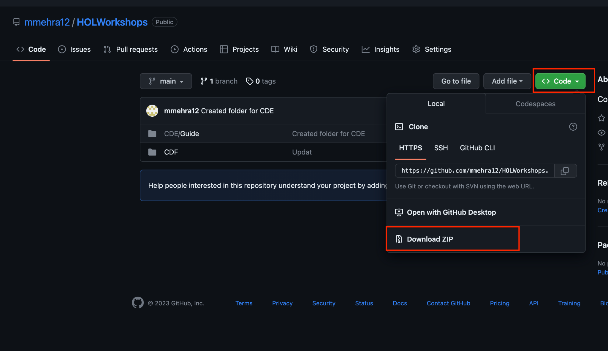
____

== Lab 4 - Orchestrate a set of jobs using Airflow

In this lab, we will create a flow with the help of a dag file that uses the jobs created in Lab3. Thus, you will be able to complete subsequent labs only if you have completed Lab3 successfully.

* {blank}
+
____
Go to Jobs tab, click on *_Create Job_* and choose Airflow in Job type.
____
* {blank}
+
____
Give the job name as below and upload the _Lab5_airflow_dag.py_ file from the resources.

JOB NAME : <username>_Lab5_airflow_dag

Example : For user *_apac01_* the job name will be, *_apac01_Lab5_airflow_dag_*
____

* {blank}
+
____
Click on *Create.*

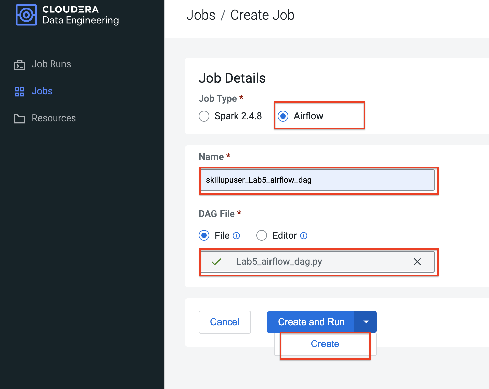
____

* {blank}
+
____
Go to *Jobs* tab and observe the airflow job created with the schedule mentioned in the dag file.
Job
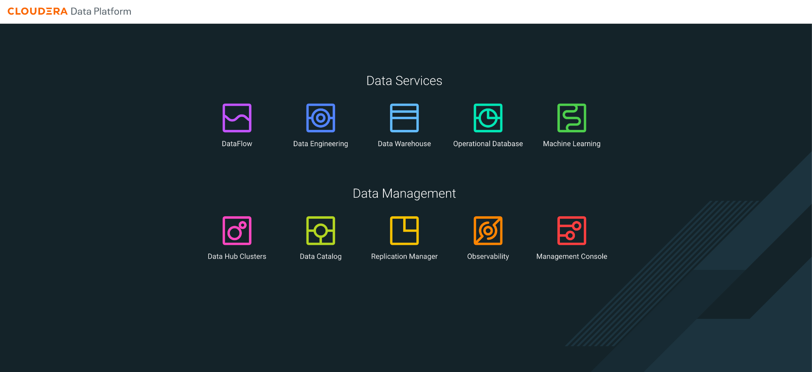
____

DAG File
____

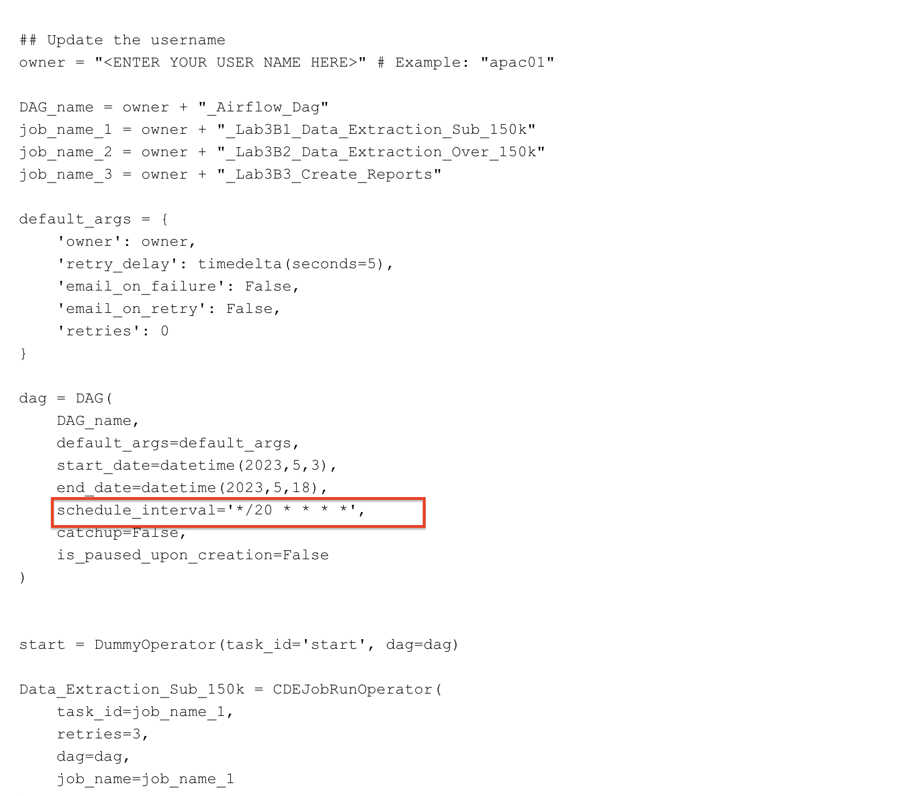
____
* {blank}
+
____
Go to the Virtual Cluster you are using and click on *Cluster Details*.

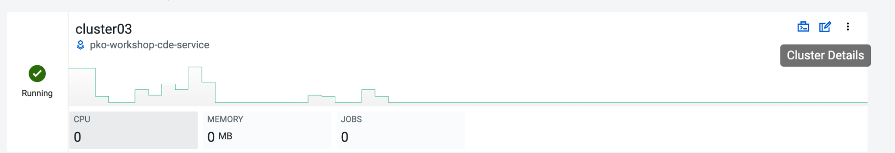
____

* {blank}
+
____
Click on *Airflow UI* and observe the schedule created for your job.

image:media/media/image6.png[media/media/image6,width=572,height=329]

image:media/media/image15.png[media/media/image15,width=631,height=121]

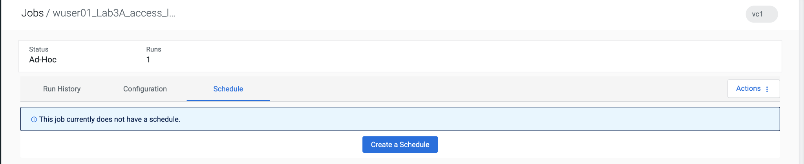
____

* {blank}
+
____
Once the job has run successfully, we need to edit the job to *pause* the schedule.
____
* {blank}
+
____
Click on the Jobs tab and locate the airflow job that you have just created.
____
* {blank}
+
____
Next to the job, click on the 3 dots and click on *Pause Schedule*.

image:media/media/image13.png[media/media/image13,width=624,height=157]

image:media/media/image36.png[media/media/image36,width=534,height=124]
____

* {blank}
+
____
You can go to the AirFLow UI again and see that the Job is now in Paused State

image:media/media/image68.png[media/media/image68,width=423,height=92]
____

== Lab 5 - Install and Configure CDE CLI 

* {blank}
+
____
In this lab, we will use the CDE CLI to create and run a spark job. This way, you can use the rich api’s of CDE CLI to integrate any of your applications to communicate with the CDE service.
____
* {blank}
+
____
The CLI executable can be downloaded from the virtual cluster.
____
** {blank}
+
____
*Step 1* : Go to the *Cluster Details* of the virtual cluster where you are creating your job

image:media/media/image5.png[media/media/image5,width=605,height=120]
____

** {blank}
+
____
*Step 2* : Click on CLI TOOL to download the executable based on your operating system.

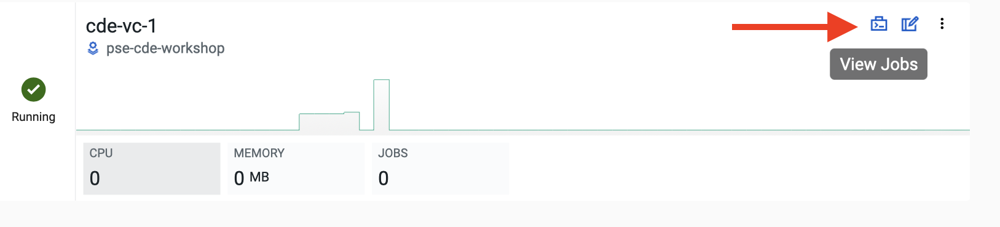
____

=== *For Mac users*: 

* {blank}
+
____
Make sure that the cde file is executable by running the below command.

chmod +x /path/to/cde 
____
* {blank}
+
____
Go to the folder where the executable is present. Right click and select “Open with” -> Terminal . You will get the below message

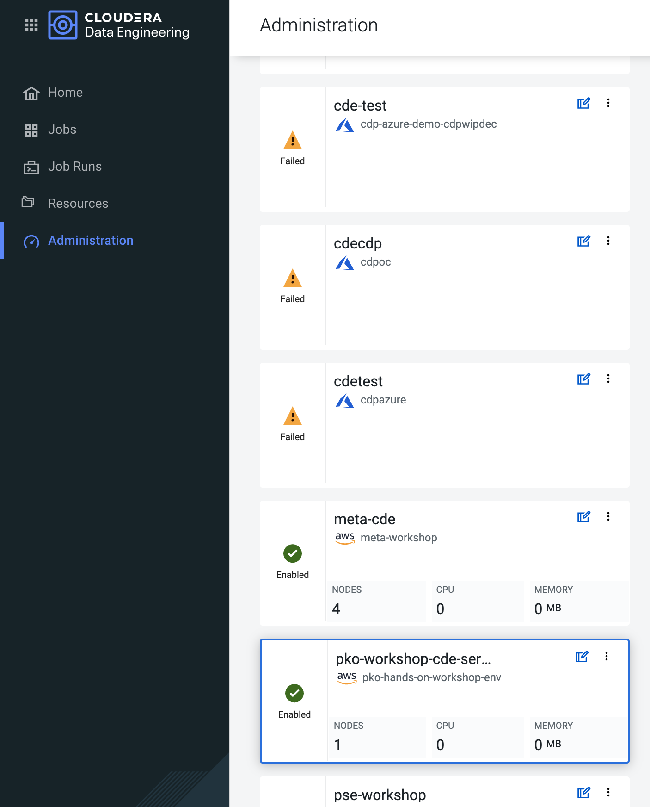
____

* {blank}
+
____
Click on *Open*
____
* {blank}
+
____
Once done, you will get the following window and message

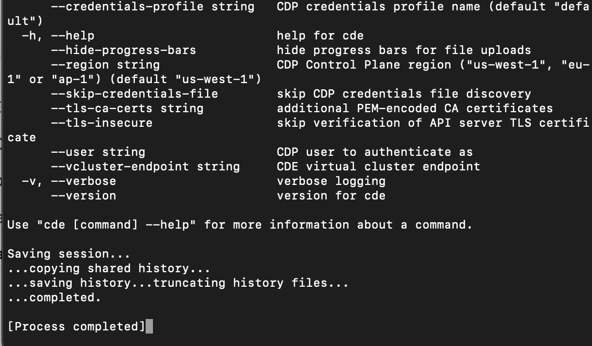
____

* {blank}
+
____
To validate the installation, run the below command from the terminal.

====
*COMMAND* -> ./cde --help
====

image:media/media/image76.png[media/media/image76,width=494,height=304]
____

* {blank}
+
____
If you get the output as shown above, then the installation is completed successfully. We now need to configure the CLI to connect to our virtual cluster.
____
* {blank}
+
____
For configuring the CDE CLI, we create a new file and add the cluster details and use it to connect to the CDE virtual cluster.
____
* {blank}
+
____
Create a file as config.yaml and add the following details.

Command to create the file -> touch config.yaml

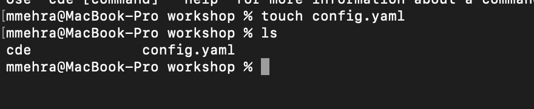
____
* {blank}
+
____
Edit the config.yaml file to include the following details.

Command to edit the file -> vi config.yaml

Content of the file
====
user: <CDP_user>
vcluster-endpoint: <CDE_virtual_cluster_endpoint>
====
Here, *user* is the username you have been mapped in the excel sheet.

*vcluster-endpoint* can be obtained from the Virtual Cluster that is assigned to you. Go to the Virtual Cluster “Cluster Details”

image:media/media/image1.png[media/media/image1,width=504,height=86]

Click on the copy icon next to JOBS API URL to copy the *vcluster-endpoint*

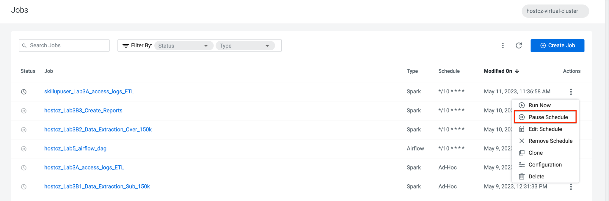

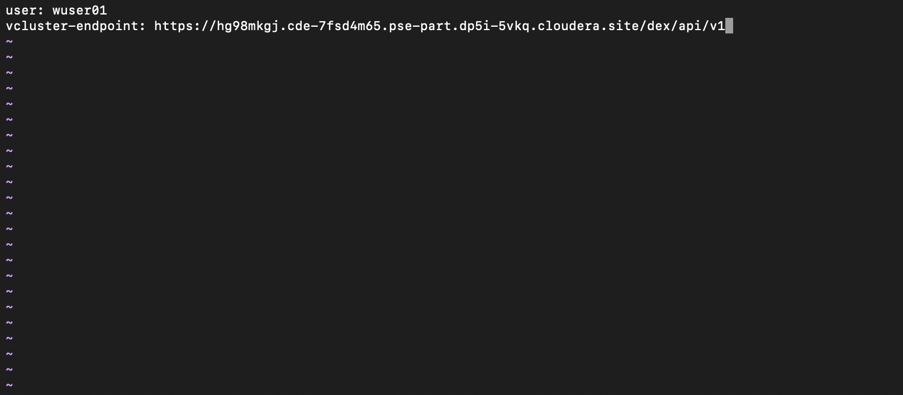
____

* {blank}
+
____
Save config.yaml
____
* {blank}
+
____
Run the below command to validate the configuration. Upon running it, you will be asked to provide the API password. Please enter the password as mentioned in the excel sheet.
____

____
Command to list the jobs -> ./cde job list
____

* {blank}
+
____
Once you enter the password, you should see all the jobs present in the virtual cluster.
____

____
image:media/media/image38.png[media/media/image38,width=539,height=483]
____

* {blank}
+
____
If you get any error related to the certificate, please add the flag to skip tls verification. +
 +
./cde job list --tls-insecure
____
* {blank}
+
____
This marks the end of installation and configuration of CDE CLI. Now, head over to the next lab to trigger the jobs from CLI.
____

=== *For Windows users*: 

* {blank}
+
____
Open Powershell and navigate to the folder where you have downloaded the cde.exe file.
____
* {blank}
+
____
You can use the below command to navigate. +
 +
cd C:\Users\<path-to-cde.exe folder>
____
* {blank}
+
____
Run the below command to start the cde cli. It will be executed in the background. +
 +
start .\cde.exe
____

____
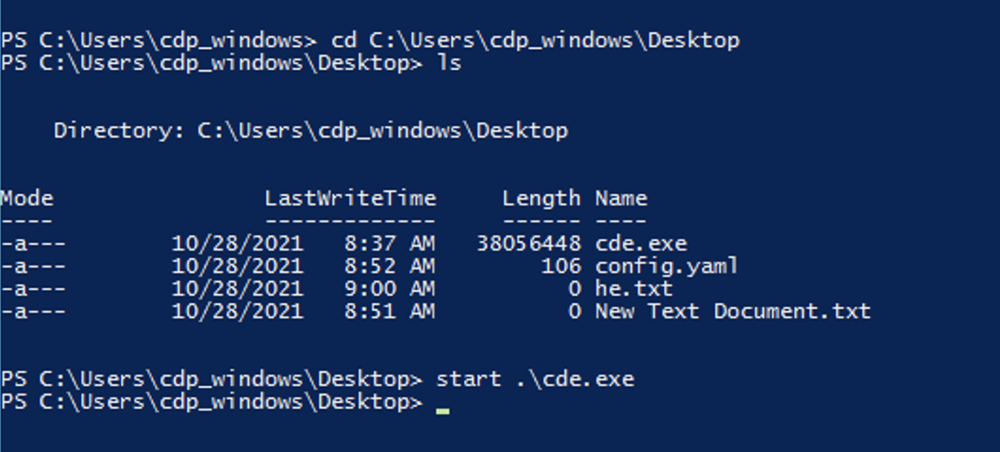
____

* {blank}
+
____
Create a new text file and name it as _config.yaml_. Please note that while saving, choose the format as *All Files and NOT as Text Documents*.
____

image:media/media/image20.png[media/media/image20,width=571,height=103]

* {blank}
+
____
Add the following lines in this file.
____

____
user: <CDP_user>

vcluster-endpoint: <CDE_virtual_cluster_endpoint>

Here, *user* is the username you have been mapped in the excel sheet. For the *vcluster-endpoint* get in touch with the instructor. +
 +
[Can be obtained from your virtual cluster]
____

* {blank}
+
____
Open Powershell and run the below command to create an environment variable. +
 +
$env:CDE_CONFIG = "C:\Users\<path-to-config.yaml>"
____
* {blank}
+
____
Run the below command for validation. You should see the path-to-config.yaml as the output. +
ls env:CDE_CONFIG
____

____
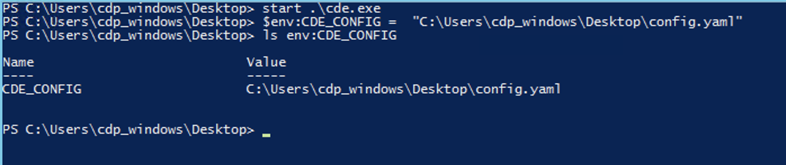
____

* {blank}
+
____
Run the below command to validate the configuration. Upon running it, you will be asked to provide the API password. Please enter the workload password as mentioned in the excel sheet.
____

____
.\cde job list

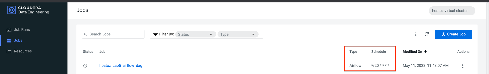
____

* {blank}
+
____
If you get the below error related to certificate, please follow the next step to skip tls verification.
____

____
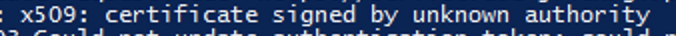
____

* {blank}
+
____
Run the below command with the tls flag and enter the API password.
____

____
.\cde job list --tls-insecure
____

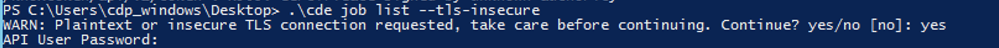

* {blank}
+
____
Once you enter the password, you should see all the jobs present in the virtual cluster.
____
* {blank}
+
____
This marks the end of installation and configuration of CDE CLI. Now, head over to the next lab to trigger the jobs from CLI.
____

==  +

== Lab 6 - Run jobs using CDE CLI 

You can use the CLI to create and update jobs, view job details, manage job resources, run jobs, and so on. Please use the link below to read more about the usage of CLI to manage CDE jobs.

https://docs.cloudera.com/data-engineering/cloud/cli-access/topics/cde-cli-manage-jobs.html[[.underline]#https://docs.cloudera.com/data-engineering/cloud/cli-access/topics/cde-cli-manage-jobs.html#]

=== Run a spark-scala job using CLI

As a first exercise in this lab, we will trigger a spark-scala job using the CDE CLI. Please note that you don’t have to build a jar to submit the job to CDE.

* {blank}
+
____
Locate and get the path of the script _Lab6A_Data_Extraction_Avg_Loan.scala_ downloaded from the prerequisites step.
____
* {blank}
+
____
Run the below command to submit this job to CDE. +
 +
./cde spark submit /path/to/Lab6A_Data_Extraction_Avg_Loan.scala
____

____
image:media/media/image23.png[media/media/image23,width=565,height=119]
____

* {blank}
+
____
Go to CDE UI and click on Job Runs. You will see a job submitted with the name +
cli-submit-<username>-<temp-resource-id>
____

____
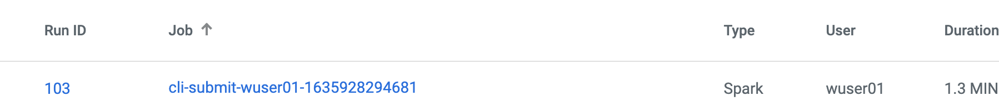
____

* {blank}
+
____
You can observe the logs and SparkUI for this Job Run.
____
* {blank}
+
____
Please note that you are not creating this as a job in CDE. It will be an ad-hoc run without the need of registering it as a job.
____

== Lab 7 - Data Lineage and Auto-Scaling

In this lab, you will go through the data lineage of the two use cases that we worked on. Additionally, you will also see the auto-scaling capabilities of CDE service with the rising demand for compute resources.

=== Data Lineage using Atlas

* {blank}
+
____
In the CDE UI, click on the Jobs tab. Go to the job <username>_Lab3B3_Create_Reports that you have created in the Lab2.
____
* {blank}
+
____
To get the jobs, please filter the jobs with your username.
____

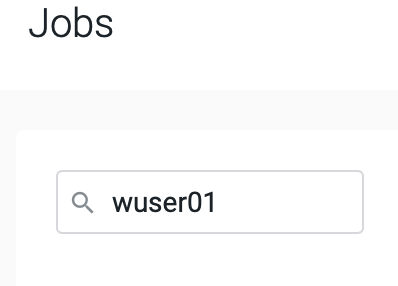

* {blank}
+
____
In *Run History* tab, click on the successful Run ID i.e., the one with the green tick mark.
____

image:media/media/image29.png[media/media/image29,width=624,height=573]

(Note the ID will be different for you from the one you see in the screenshot)

* {blank}
+
____
Click on *Atlas* under Lineage.
____

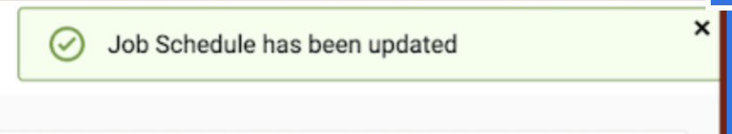

* {blank}
+
____
Click on the execution that you see in the list.
____

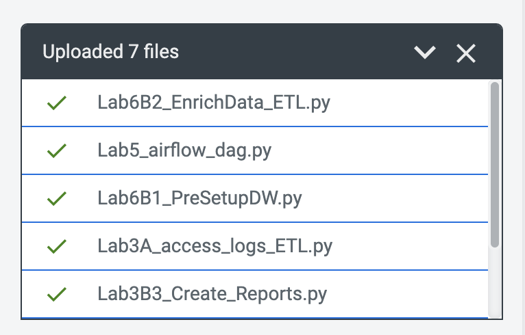

* {blank}
+
____
Click on *Lineage* to observe the Data Lineage for this job.
____

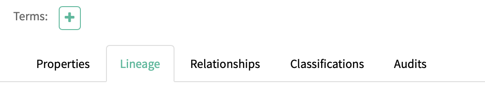

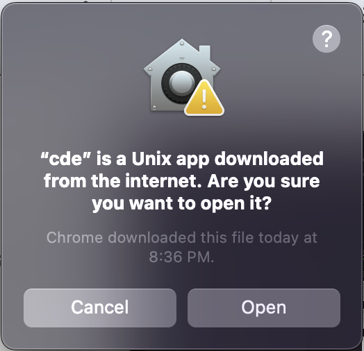

* {blank}
+
____
Click on each entity to understand how the data is flowing from source to consumption.
____

=== Auto-scaling in CDE

* {blank}
+
____
As a last step, we want you to witness the auto-scaling capabilities of CDE. At the start of the lab, you might have noticed the cpu and memory consumption of the virtual cluster. Please check the dashboard now to see how it has scaled up based on the demand experienced.
____
* {blank}
+
____
On the CDE home page, click on the *Cluster Details* on the virtual cluster.
____
* {blank}
+
____
Click on the *Charts* tab.
____

image:media/media/image47.png[media/media/image47,width=624,height=110]

* {blank}
+
____
Set the filter to *Last 2 Hour* and observe the varying load on cpu and memory.
____

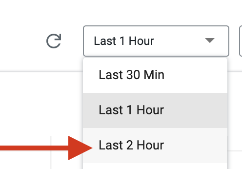

* {blank}
+
____
Click on *Grafana Charts* to view another set of metrics of the virtual cluster.
____

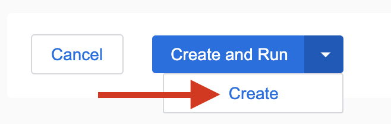

* {blank}
+
____
This marks the end of the overall CDE Hands-on Workshop session.
____

*[.underline]#THANK YOU VERY MUCH FOR YOUR PARTICIPATION#*
