link:#pre-requisites[*Pre-requisites*]

link:++#lab-0---introduction-and-setup++[*Lab 0 - Introduction and setup*]

* link:#verify-access-to-the-workshop-environment[1. Verify access to the workshop environment]

* link:#verify-permissions-in-apache-ranger[2. Verify permissions in Apache Ranger]

** link:#accessing-apache-ranger[2.1 Accessing Apache Ranger]

** link:#kafka-permissions[2.2 Kafka Permissions]

** link:#schema-registry-permissions[2.3 Schema Registry Permissions]

* link:#update-workload-password[3. Update workload password]

* link:#obtain-the-kafka-broker-list[4. Obtain the Kafka Broker List]

** link:#step-1-access-the-data-hub[Step 1 : Access the Data Hub]

** link:#step-2-go-to-the-streams-messaging-interface[Step 2 : Go to the Streams Messaging Interface]

** link:#step-3-select-brokers-from-the-left-tab[Step 3 : Select Brokers from the left tab]

** link:#step-4-save-the-broker-list[Step 4 : Save the broker list]

* link:#download-resources-from-github[5. Download Resources from GitHub]

** link:#step-1-access-the-url-shared-by-the-instructor-for-github[Step 1 : Access the URL shared by the instructor for GitHub]

** link:#step-2-download-the-repo-as-a-zip-file[Step 2 : Download the repo as a zip file]

** link:#step-3-uncompress-the-files[Step 3 : Uncompress the Files]

* link:#unlock-your-keytab[6. Unlock your KeyTab]

** link:#unlock-your-keytab-if-it-is-not-unlocked-already[1. Unlock your Keytab if it is not unlocked already]

*** link:#step-1-go-to-the-ssb-data-hub[Step 1 : Go to the SSB Data Hub]

*** link:#step-2-open-the-ssb-ui-by-clicking-on-streaming-sql-console[Step 2 : Open the SSB UI by clicking on Streaming SQL Console]

*** link:#step-3-click-on-the-user-name-at-the-bottom-left-of-the-screen-and-select-manage-keytab[Step 3 : Click on the User name at the bottom left of the screen and select Manage Keytab]

*** link:#step-4-enter-your-workload-username-immiapacxx-and-password.[Step 4 : Enter your Workload Username (immiapacxx) and Password.]

*** link:#step-5-click-on-unlock-keytab[Step 5 : Click on unlock KeyTab]

** link:#reset-your-keytab-if-it-is-already-unlocked[2. Reset your KeyTab if it is already unlocked]

*** link:#step-1-go-to-the-ssb-data-hub-1[Step 1 : Go to the SSB Data Hub]

*** link:#step-2-open-the-ssb-ui-by-clicking-on-streaming-sql-console-1[Step 2 : Open the SSB UI by clicking on Streaming SQL Console]

*** link:#step-3-click-on-the-user-name-at-the-bottom-left-of-the-screen-and-select-manage-keytab-1[Step 3 : Click on the User name at the bottom left of the screen and select Manage Keytab]

link:#lab-1-create-a-flow-using-the-flow-designer[*Lab 1 : Create a Flow using the Flow Designer*]

* link:#overview[1. Overview]

* link:#building-the-data-flow[2. Building the Data Flow]

** link:#create-the-canvas-to-design-your-flow[2.1. Create the canvas to design your flow]

*** link:#step-1-access-the-dataflow-data-service[Step 1: Access the DataFlow Data Service]

*** link:#step-2-go-to-the-flow-design[Step 2: Go to the Flow Design ]

*** link:#step-3-create-a-new-draft[Step 3: Create a new Draft ]

*** link:#step-4-select-the-appropriate-environment[Step 4: Select the appropriate environment ]

** link:#adding-new-parameters[2.2. Adding new parameters ]

*** link:#step-1-click-on-the-flow-options-on-the-top-right-corner-of-your-canvas-and-then-select-parameters[Step 1: Click on the FLOW OPTIONS on the top right corner of your canvas and then select PARAMETERS ]

*** link:#step-2-configure-parameters[Step 2: Configure Parameters ]

** link:#create-the-flow[2.3. Create the Flow ]

*** link:#step-1-add-generateflowfile-processor[Step 1: Add GenerateFlowFile processor ]

*** link:#step-2-configure-generateflowfile-processor[Step 2: Configure GenerateFlowFile processor ]

*** link:#step-3-add-putcdpobjectstore-processor[Step 3: Add PutCDPObjectStore processor ]

*** link:#step-4-configure-putcdpobjectstore-processor[Step 4: Configure PutCDPObjectStore processor ]

*** link:#step-5-create-connection-between-processors[Step 5: Create connection between processors ]

** link:#naming-the-queues[2.4. Naming the queues ]

* link:#testing-the-data-flow[3. Testing the Data Flow ]

** link:#step-1-start-test-session[Step 1: Start test session ]

** link:#step-2-run-the-flow[Step 2: Run the flow ]

* link:#move-the-flow-to-the-flow-catalog[4. Move the Flow to the Flow Catalog ]

** link:#step-1-stop-the-current-test-session[Step 1: STOP the current test session ]

** link:#step-2-publish-the-flow[Step 2: PUBLISH the flow ]

** link:#step-3-give-your-flow-a-name-and-click-on-publish[Step 3: Give your flow a name and click on PUBLISH ]

* link:#deploying-the-flow[5. Deploying the Flow ]

** link:#step-1-search-for-the-flow-in-the-flow-catalog[Step 1: Search for the flow in the Flow Catalog ]

** link:#step-2-deploy-the-flow[Step 2: Deploy the flow ]

** link:#step-3-select-the-cdp-environment[Step 3: Select the CDP environment ]

** link:#step-4-deployment-name[Step 4: Deployment Name ]

** link:#step-5-set-the-nifi-configuration[Step 5: Set the NiFi Configuration ]

** link:#step-6-set-the-parameters[Step 6: Set the Parameters ]

** link:#step-7-set-the-cluster-size[Step 7: Set the cluster size ]

** link:#step-8-add-key-performance-indicators[Step 8: Add Key Performance indicators ]

** link:#step-9-click-deploy[Step 9: Click Deploy ]

* link:#viewing-details-of-the-deployed-flow[6. Viewing details of the deployed flow ]

** link:#step-1-manage-kpi-and-alerts[Step 1 : Manage KPI and Alerts ]

** link:#step-2-manage-sizing-and-scaling[Step 2 : Manage Sizing and Scaling ]

** link:#step-3-manage-parameters[Step 3 : Manage Parameters ]

** link:#step-4-nifi-configurations[Step 4 : NiFi Configurations ]

** link:#step-5-view-the-deployed-flow-in-nifi[Step 5 : View the deployed flow in NiFi ]

** link:#step-6-terminate-the-flow[Step 6 : Terminate the flow ]

link:#lab-2-migrating-existing-data-flows-to-cdf-pc[Lab 2 : Migrating Existing Data Flows to CDF-PC]

* link:#overview-1[1. Overview ]

* link:#pre-requisites-1[2. Pre-requisites ]

** link:#create-a-kafka-topic[2.1. Create a Kafka Topic ]

** link:#create-a-schema-in-schema-registry[2.2. Create a Schema in Schema Registry ]

link:#lab-3-operationalizing-externally-developed-data-flows-with-cdf-pc[Lab 3 : Operationalizing Externally Developed Data Flows with CDF-PC]

* link:#import-the-flow-into-the-cdf-pc-catalog[1. Import the Flow into the CDF-PC Catalog ]

* link:#deploy-the-flow-in-cdf-pc[2. Deploy the Flow in CDF-PC ]

link:#lab-4-sql-stream-builder[Lab 4 : SQL Stream Builder]

* link:#overview-2[1. Overview ]

* link:#creating-a-project[2. Creating a Project ]

** link:#step-1-go-to-the-sql-stream-builder-ui[Step 1: Go to the SQL Stream Builder UI ]

** link:#step-2-creation-of-a-project[Step 2: Creation of a Project ]

** link:#step-3-create-kafka-data-store[Step 3 : Create Kafka Data Store ]

** link:#step-4-create-kafka-table[Step 4: Create Kafka Table ]

** link:#step-5-configure-the-kafka-table[Step 5: Configure the Kafka Table ]

** link:#step-6-create-a-flink-job[Step 6: Create a Flink Job]

== *Pre-requisites*

For the ease of carrying out the workshop and considering the time at hand, we have already taken care of some of the steps that need to be considered before we can start with the actual Lab steps. The prerequisites that need to be in place are:

[arabic]
. {blank}
+
____
Streams Messaging Data Hub Cluster should be created and running.
____
. {blank}
+
____
Stream analytics Data Hub cluster should be created and running.
____
. {blank}
+
____
Data provider should be configured in SQL Stream Builder.
____
. {blank}
+
____
Have access to the file syslog-to-kafka.json.
____
. {blank}
+
____
Environment should be enabled as part of the CDF Data Service.
____
____
*Note* Lab 0 basically talks about verifying different aspects wrt to access and connections before we could begin with the actual steps.
____

== Lab 0 - Introduction and setup

=== 1. Verify access to the workshop environment

* {blank}
+

The *INSTRUCTOR* will share the Workshop link and the credentials before the start of the workshop

* {blank}
+
Open the shared link and login with the credentials assigned to you.

++++

  Will be shared by the instructor at the start

++++

++++

  

++++

* {blank}
+
You should land on the CDP Console as shown below.

++++

  

++++

=== *2. Verify permissions in Apache Ranger*

____
*Note*: THESE STEPS HAVE ALREADY BEEN DONE FOR YOU, THIS SECTION WILL WALK YOU THROUGH HOW PERMISSIONS/POLICIES ARE MANAGED IN RANGER. PLEASE DO NOT EXECUTE THE STEPS IN THIS SECTION OR CHANGE ANYTHING.
____

==== *2.1 Accessing Apache Ranger*

____
Step 1 : Click on Management Console

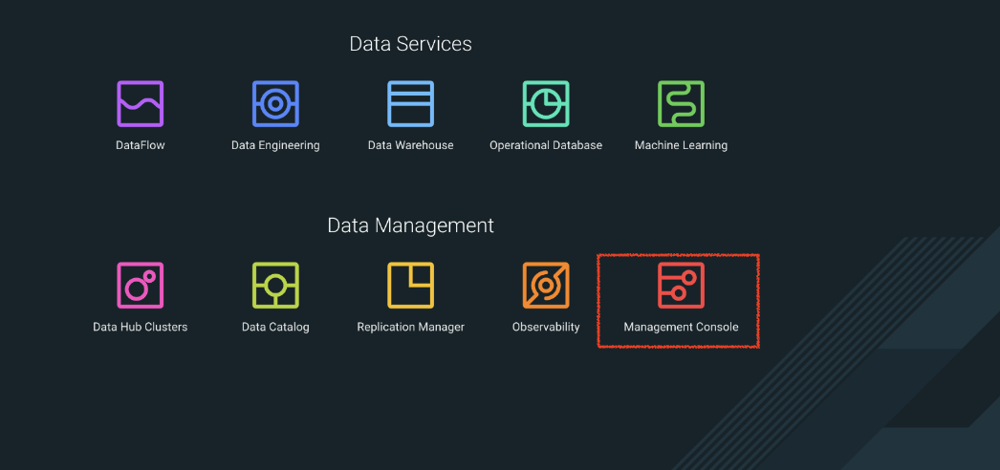
____
____
Step 2 : Click on Environments on the left tab

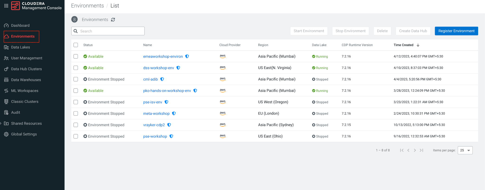
____

____
Step 3 : Select the environment that is shared by the instructor and click on the *Ranger* quick link to access the Ranger UI

image:media/media/image61.png[media/media/image61,width=551,height=187]

image:media/media/image141.png[media/media/image141,width=551,height=286]
____

==== *2.2 Kafka Permissions*

[arabic]
. {blank}
+
____
In Ranger, select the Kafka repository that’s associated with the stream messaging datahub.image:media/media/image93.png[media/media/image93,width=390,height=169]
____
. {blank}
+
____
Verify if the user group(*workshop-users*) who will be performing the workshop is present in both *all-consumergroup* and *all-topic.*

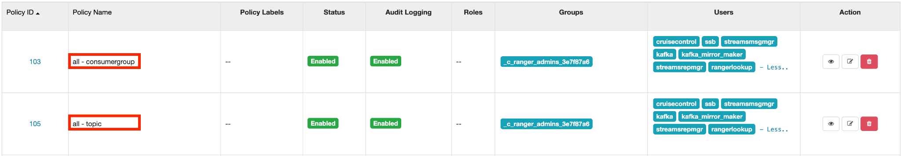

All-consumergroup

image:media/media/image109.png[media/media/image109,width=556,height=212]

all-topic

image:media/media/image128.png[media/media/image128,width=412,height=195]
____

==== *2.3 Schema Registry Permissions*

[arabic]
. {blank}
+
____
In Ranger, select the Schema Registry repository that’s associated with the stream messaging datahub.
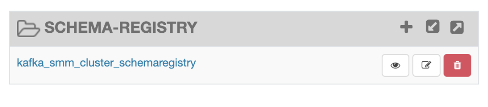
____

[arabic, start=2]
. {blank}
+
____
Verify if the user group(*workshop-users*) who will be performing the workshop is present in the Policy : *all - schema-group, schema-metadata, schema-branch, schema-version.*
image:media/media/image111.png[media/media/image111,width=549,height=191]
image:media/media/image83.png[media/media/image83,width=375,height=292]
image:media/media/image4.png[media/media/image4,width=550,height=96]
____

=== *3. Update workload password*

____
*Note* THESE STEPS NEED TO BE PERFORMED BEFORE MOVING FORWARD
____

You will need to define your CDP Workload Password that will be used to access non-SSO interfaces. You may read more about it here. Please keep it with you. If you have forgotten it, you will be able to repeat this process and define another one.

* {blank}
+
____
* Click on your user name (Ex: immiapac00@workshop.com) at the lower left corner.
* Click on Profile.

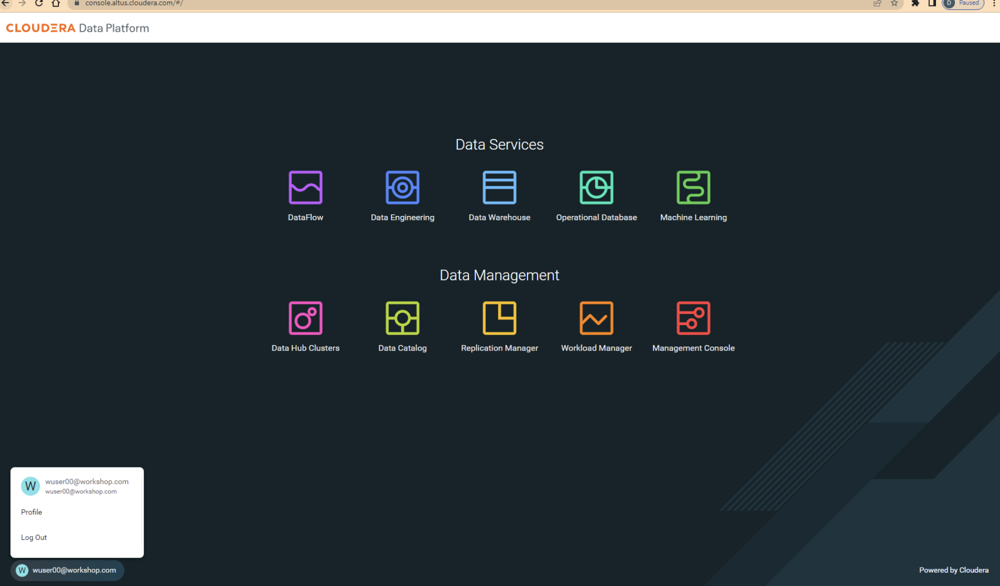
____
* {blank}
+
____
* Click option *Set Workload Password*.

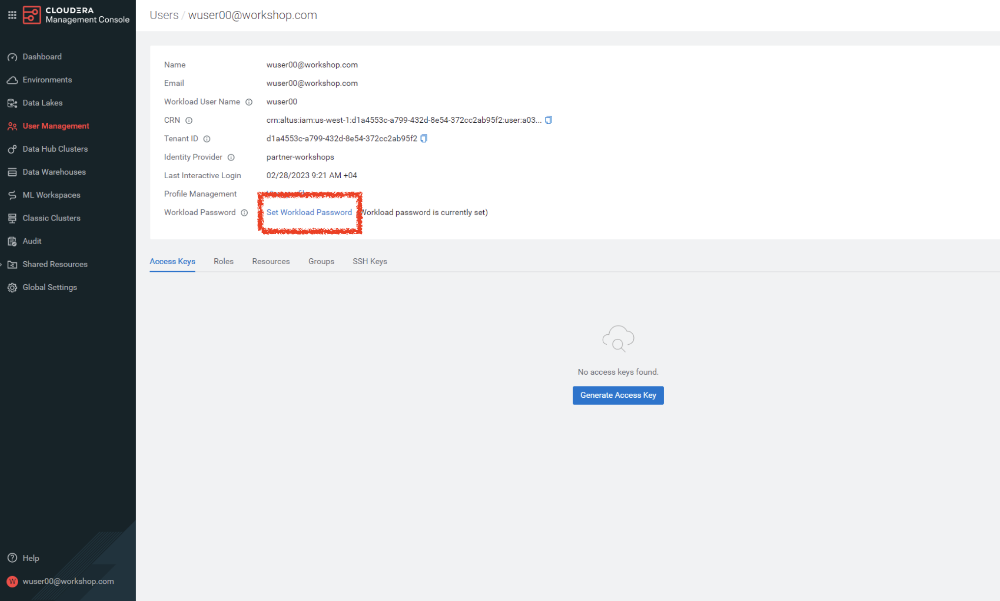
____
* {blank}
+
____
* Enter a password that you can remember. We will require this throughout our labs

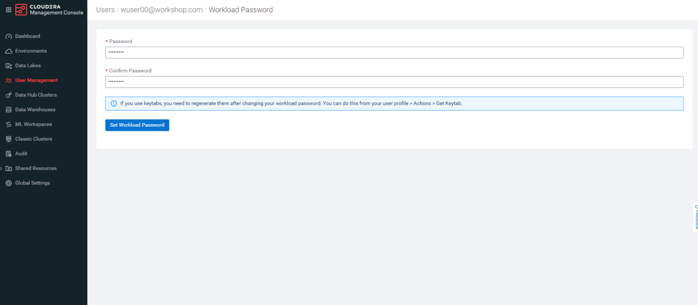

* Click the button Set Workload Password.
____
____
*Note* : DO NOT FORGET THE PASSWORD YOU SET
____

=== *4. Obtain the Kafka Broker List*

We will require the broker list to configure our processors to connect to our Kafka brokers which allow consumers to connect and fetch messages by partition, topic or offset.

This information can be found in the Data Hub cluster associated to the Streams Messaging Manager

==== Step 1 : Access the Data Hub

* {blank}
+
____
Go to the environment that is shared by the INSTRUCTOR
____

____
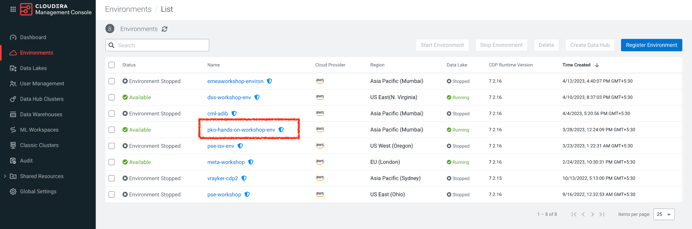
____

* {blank}
+
____
Click on the Data Hub associated with Streams Messaging Manager (kafka-smm-cluster)
____

____
image:media/media/image17.png[media/media/image17,width=577,height=279]
____

==== Step 2 : Go to the Streams Messaging Interface

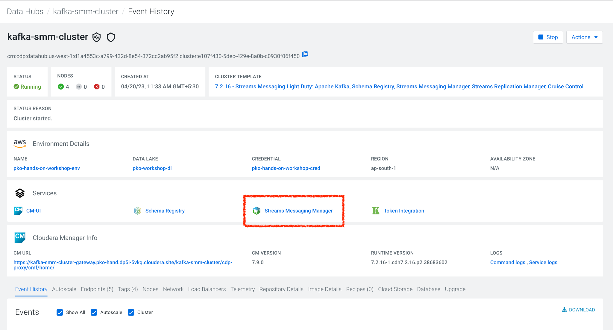

==== Step 3 : Select Brokers from the left tab

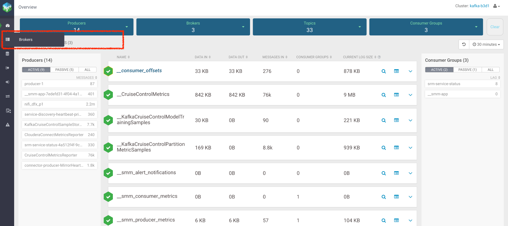

==== 

==== 

==== Step 4 : Save the broker list

== 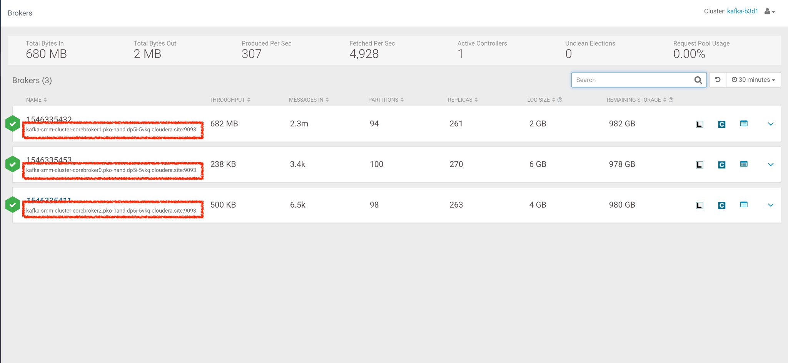

Example :
____
kafka-smm-cluster-corebroker1.pko-hand.dp5i-5vkq.cloudera.site:9093
kafka-smm-cluster-corebroker0.pko-hand.dp5i-5vkq.cloudera.site:9093
kafka-smm-cluster-corebroker2.pko-hand.dp5i-5vkq.cloudera.site:9093
____

=== *5. Download Resources from GitHub*

==== Step 1 : Access the URL shared by the instructor for GitHub

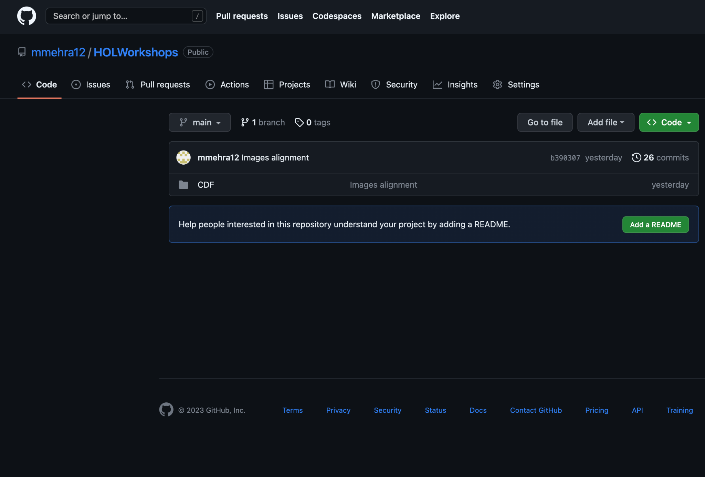

==== Step 2 : Download the repo as a zip file

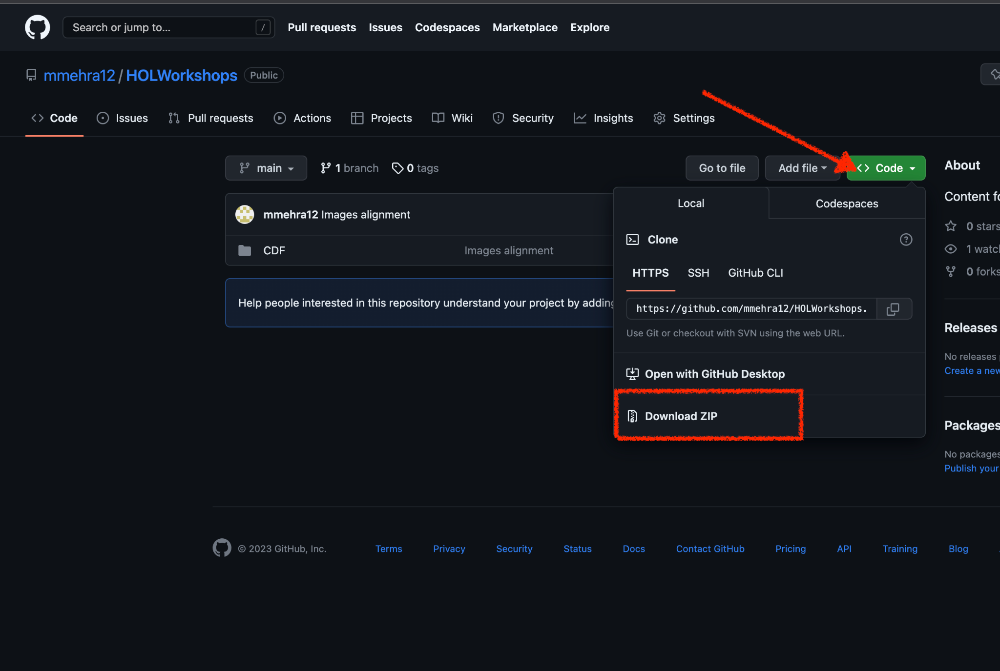

==== Step 3 : Uncompress the Files 

Uncompress the Files and you should have the following files and folders within it

==== 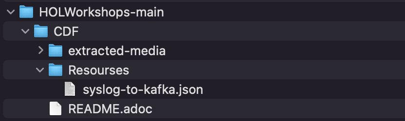

We will use this at a later point in our Labs

=== *6. Unlock your KeyTab*

To run queries on the SQL Stream Builder you need to have your KeyTab unlocked. This is mainly for authentication purposes. As the credential you are using is sometimes reused as part of other people doing the same lab it is possible that your Keytab is already unlocked. We have shared the steps for both the scenarios:

==== Unlock your Keytab if it is not unlocked already

===== Step 1 : Go to the SSB Data Hub

____
Click on Environments on the left tab and select the environment that is shared by the INSTRUCTOR

Click on the DataHub associated with SQL Stream Builder (ssb-analytics-cluster)

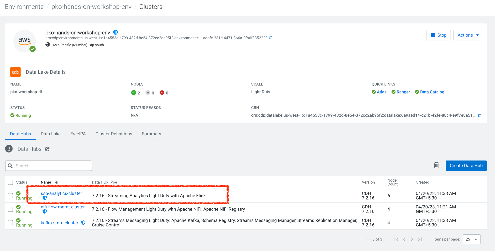
____

===== Step 2 : Open the SSB UI by clicking on *Streaming SQL Console*

____
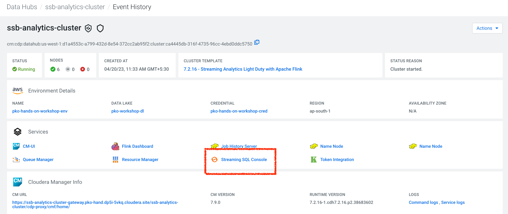
____

===== Step 3 : Click on the User name at the bottom left of the screen and select Manage Keytab
____
image:media/media/image16.png[media/media/image16,width=404,height=362]
____

===== Step 4 : Enter your Workload Username (immiapacxx) and Password. 

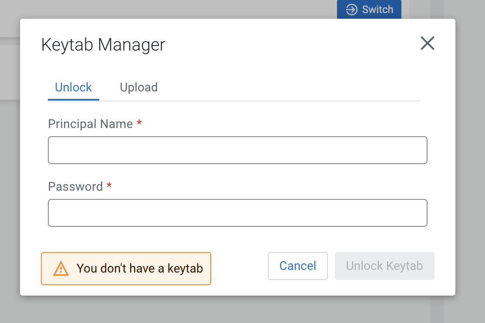

===== Step 5 : Click on unlock KeyTab

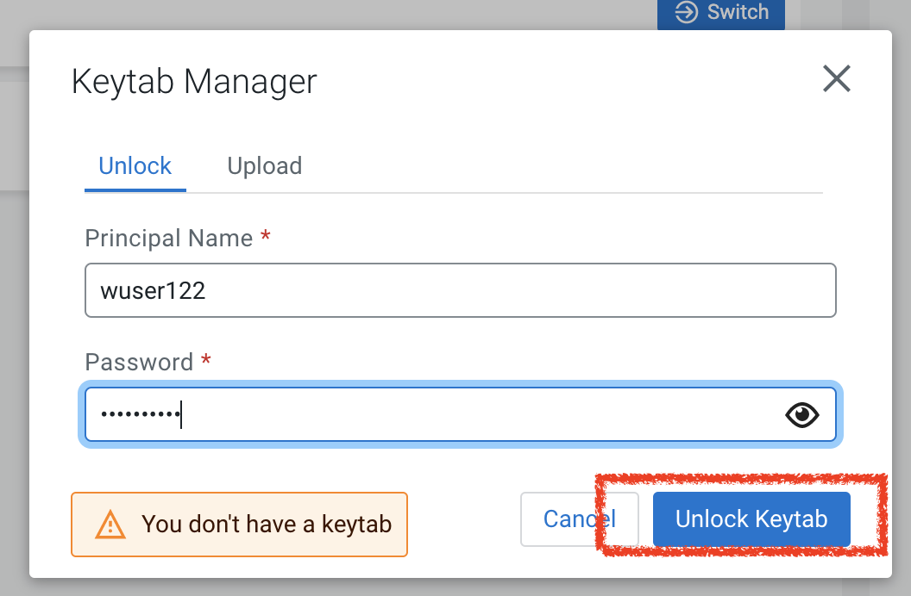

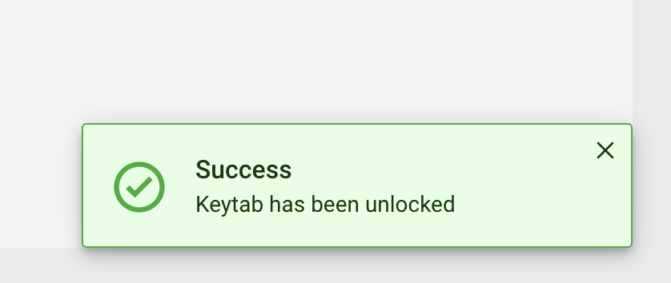

==== Reset your KeyTab if it is already unlocked

===== Step 1 : Go to the SSB Data Hub

____
Click on Environments on the left tab and select the environment that is shared by the INSTRUCTOR

Click on the DataHub associated with SQL Stream Builder (ssb-analytics-cluster)

____

===== Step 2 : Open the SSB UI by clicking on *Streaming SQL Console*
____

____
 

===== Step 3 : Click on the User name at the bottom left of the screen and select Manage Keytab
____
image:media/media/image16.png[media/media/image16,width=319,height=285]

If you get the following dialog box it means that your Keytab is already unlocked. *But it would be necessary to reset here by locking it and unlocking it again using your newly set workload password*

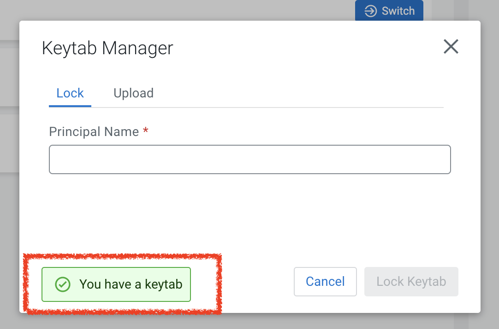

____

===== Step 4 : Enter your Principal Name which is the same as your workload username

Example : immiapacXY* 
____
* Click on Lock KeyTab

* You can now continue from the STEP 3 in the “link:#unlock-your-keytab-if-it-is-not-unlocked-already[*_[.underline]#Unlock your KeyTab if not unlocked already#_*]” section above

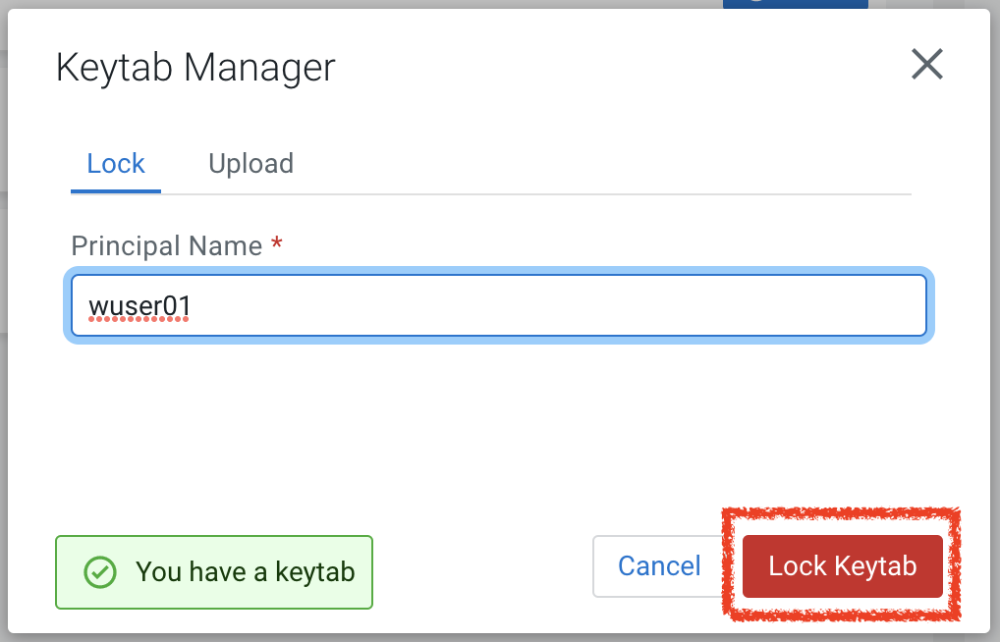
____

== *Lab 1 : Create a Flow using the Flow Designer*

=== *1. Overview*

Creating a data flow for CDF-PC is the same process as creating any data flow within Nifi with 3 very important steps:

* {blank}
+
____
The data flow that would be used for CDF-PC must be self contained within a process group
____
* {blank}
+
____
Data flows for CDF-PC must use parameters for any property on a processor that is modifiable, e.g. user names, Kafka topics, etc.
____
* {blank}
+
____
All queues need to have meaningful names (instead of Success, Fail, and Retry). These names will be used to define Key Performance Indicators in CDF-PC.
____

The following is a step by step guide in building a data flow for use within CDF-PC.

=== *2. Building the Data Flow*

==== *2.1. Create the canvas to design your flow*

===== *Step 1:* Access the DataFlow Data Service
____
Access the DataFlow dataservice from the Management Console

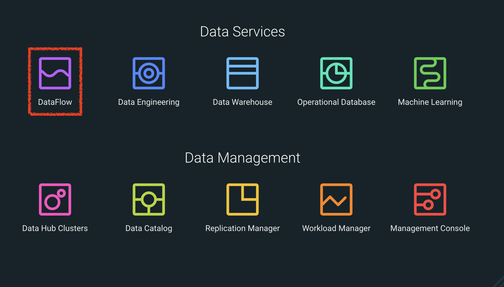
____

===== *Step 2:* Go to the Flow Design
____
image:media/media/image121.png[media/media/image121,width=143,height=270]
____

===== *Step 3: Create a new Draft* 
____
(This will be the main process group of your flow)

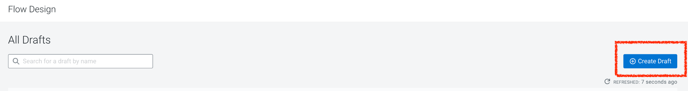
____

===== *Step 4: Select the appropriate environment* 
____
*Select the appropriate environment as part of the workspace* and give your flow a name and click on *CREATE*

Workspace Name : *_The name of the environment will be shared by the INSTRUCTOR_*

Draft Name : \{user_id}_datadump_flow

_Example : immiapacXY_datadump_flow_

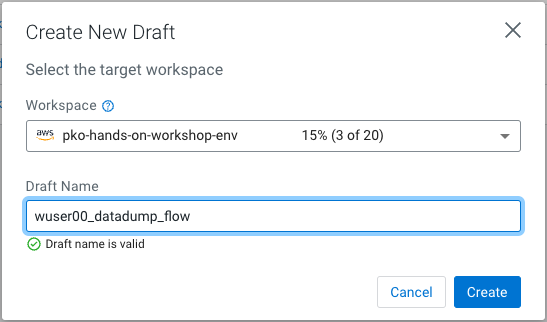

On successful creation of the Draft, you should now be redirected to the canvas on which you can design your flow

image:media/media/image125.png[media/media/image125,width=467,height=305]
____

==== *2.2. Adding new parameters*

===== *Step 1:* Click on the *FLOW OPTIONS* on the top right corner of your canvas and then select *PARAMETERS*

image:media/media/image130.png[media/media/image130,width=624,height=290]

===== *Step 2:* Configure Parameters

The next step is to configure what is called a parameter. These parameters are reused within the flow multiple times and will also be configurable at the time of deployment. Click on *ADD PARAMETER* to add non sensitive values, for any sensitive parameter please select *ADD SENSITIVE PARAMETER.*

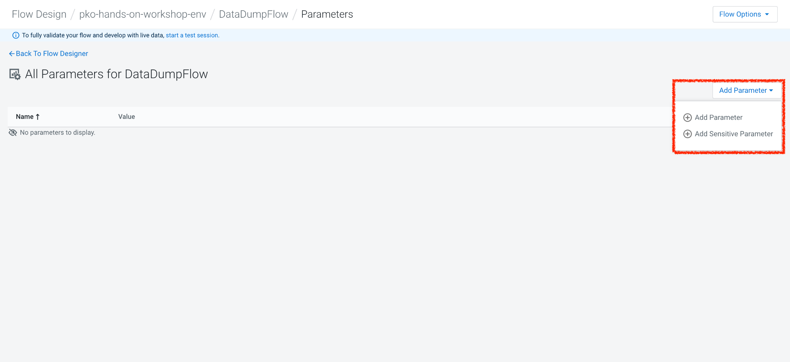

We need to add the following parameters.

* {blank}
+
____
*S3 Directory*

* Selection under Add Parameter : *_Add Parameter_*

* Name : S3 Directory

* Value : LabData or TestDir

image:media/media/image138.png[media/media/image138,width=314,height=302]

____

* {blank}
+
____
*CDP Workload User*

Selection under Add Parameter : *_Add Parameter_*

Name : CDP Workload User

Value : <The username assigned to you>

EXAMPLE : immiapac01

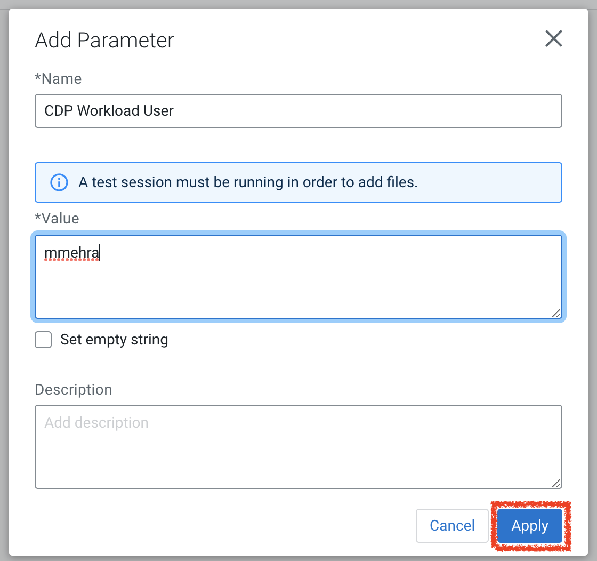
____
*Note* : Do not add the domain ‘@workload.com’
____
____

* {blank}
+
____
*CDP Workload User Password - Sensitive Field*

* Selection under Add Parameter : *_Add Sensitive Parameter_*

* Name : CDP Workload User Password

* Value : <Workload Password set by yourself in Lab 0>
** EXAMPLE : immiapac@2021

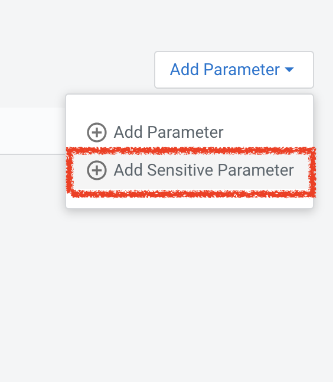
image:media/media/image49.png[media/media/image49,width=298,height=281]

____

* Click *APPLY CHANGES*
____
image:media/media/image126.png[media/media/image126,width=444,height=259]
____

Now go back to the Flow Designer. Click _‘Back to Flow Designer’_

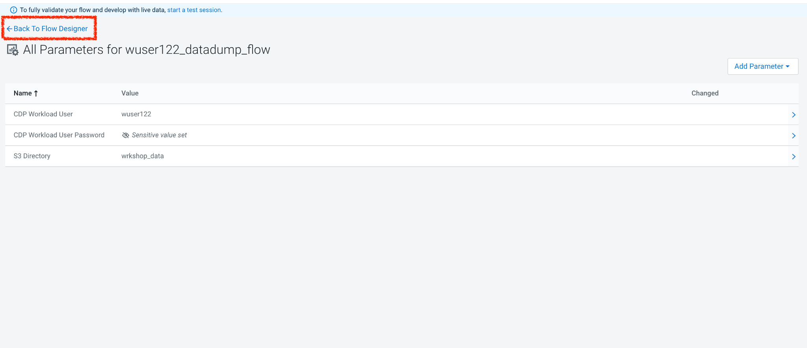

Now that we have created these parameters, we can easily search and reuse them within our dataflow. This is especially useful for *CDP Workload User* and *CDP Workload User Password*.

.Note
----
To search for existing parameters:
Open a processor's configuration and proceed to the properties tab.
Enter: #{

Hit ‘control+spacebar’
This will bring up a list of existing parameters that are not tagged as sensitive.
----

==== *2.3. Create the Flow*

Let’s go back to the canvas to start designing our flow. This flow will contain 2 Processors:

* *GenerateFlowFile* - Generates random data
* *PutCDPObjectStore* - Loads data into HDFS(S3)
Our final flow will look like this:
++++

  

++++

===== *Step 1:* Add *GenerateFlowFile* processor 

Pull the Processor onto the canvas and select *GenerateFlowFile* Processor and click on *ADD.*

++++

  

++++
++++

  

++++

===== *Step 2:* Configure *GenerateFlowFile* processor 

The GenerateFlowFile Processor will now be on your canvas and you can configure it in the following way by right clicking and selecting *Configuration*.

++++

  

++++

Configure the processor in the following way

[width="100%",cols="50%,50%",options="header",]
|===
|*Property* |*Value*
|*Processor Name* |DataGenerator
|*Scheduling Strategy(default)* |Timer Driven
|*Run Duration(default)* |0 ms
|*Run Schedule* |30 sec
|*Execution(default)* |All Nodes
|*Custom Text* |<26>1 2021-09-21T21:32:43.967Z host1.example.com application4 3064 ID42 [exampleSDID@873 iut="4" eventSource="application" eventId="58"] application4 has stopped unexpectedly
|===

_This represents a syslog out in RFC5424 format. Subsequent portions of this workshop will leverage this same syslog format._

image:media/media/image11.png[media/media/image11,width=314,height=494]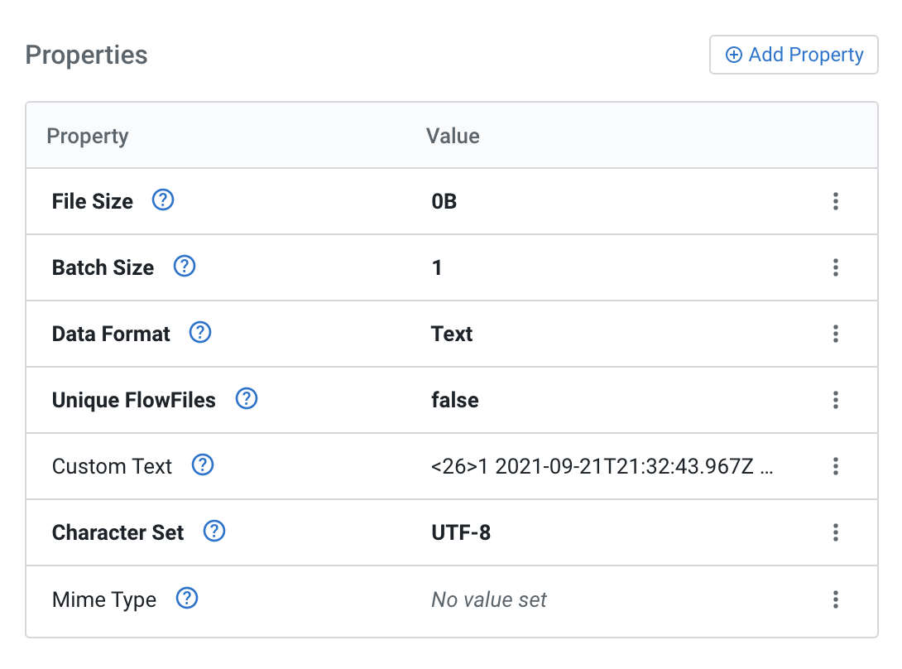

Click on *APPLY.*

===== *Step 3:* Add *PutCDPObjectStore* processor 

Pull a new Processor onto the canvas and select *PutCDPObjectStore* Processor and click on *ADD.*

++++

  

++++

++++

  

++++

===== *Step 4:* Configure *PutCDPObjectStore* processor 

The PutCDPObjectStore Processor needs to be configured as follows:

[width="100%",cols="50%,50%",options="header",]
|===
|*Property* |*Value*
|*Processor Name* |Move2S3
|*Scheduling Strategy(default)* |Timer Driven
|*Run Duration(default)* |0 ms
|*Run Schedule(default)* |0 sec
|*Execution(default)* |All Nodes
|*Directory* |#\{S3 Directory}
|*CDP Username* |#\{CDP Workload User}
|*CDP Password* |#\{CDP Workload User Password}
|*Auto Terminate Relationships:* |Check the “Terminate” box under “success”
|===

++++

  

++++
++++

  

++++

*Click APPLY*
++++

  

++++

===== *Step 5:* Create connection between processors

Connect the two processors by dragging the arrow from *DataGenerator* processor to the *Move2S3* processor and select on *SUCCESS* relation and click *ADD*

++++

  

++++
++++

  

++++
Your flow will now look something like this:
++++

  

++++

The Move2S3 processor does not know what to do in case of a failure, let’s add a retry queue to it. This can be done by dragging the arrow on the processor outwards then back to itself, as below:

++++

  

++++
++++

  

++++
++++

  

++++

==== *2.4. Naming the queues*

Providing unique names to all queues is very important as they are used to define Key Performance Indicators upon which CDF-PC will auto-scale.

To name a queue, double-click the queue and give it a unique name. A best practice here is to start the existing queue name (i.e. success, failure, retry, etc…) and add the source and destination processor information.

For example, the success queue between *DataGenerator* and *Move2S3* is named *success_Move2S3.*

++++

  

++++

The failure queue for *Move2S3* is named *failure_Move2S3*.

++++

  

++++

=== *3. Testing the Data Flow*

==== *Step 1:* Start test session

To test your flow we need to first start the test session

Click on *FLOW OPTIONS* and then select *START* on TEST SESSION

++++

  

++++
++++

  

++++

In the next window, click *START SESSION*

The activation should take about a couple of minutes. While this happens you will see this at the top right corner of your screen

++++

  

++++

Once the Test Session is ready you will see the following message on the top right corner of your screen.
++++

  

++++

==== *Step 2:* Run the flow

Right click on the empty part of the canvas and select START.

++++

  

++++

Both the processors should now be in the START state.
++++

  

++++

You will now see files coming into the folder which was specified as the Directory on the S3 bucket which is the Base data store for this environment.

image:media/media/image23.png[media/media/image23,width=357,height=231]
image:media/media/image36.png[media/media/image36,width=577,height=285]

____
*Note* : You will not be able to access this S3 bucket by your self but the instructor will show you where everyones data is moving to
____

=== *4. Move the Flow to the Flow Catalog*

After the flow has been created and tested we can now PUBLISH the flow to the Flow Catalog

==== *Step 1:* STOP the current test session 
____
STOP the current test session by clicking on the green tab on top right and click *END*

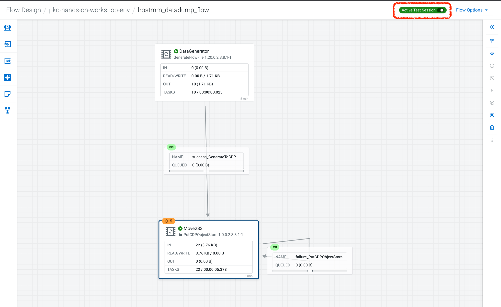

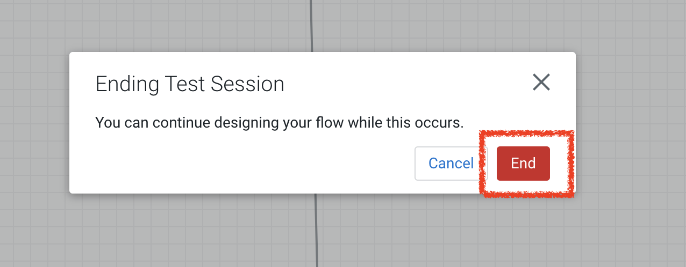
____
==== *Step 2:* PUBLISH the flow
____
Once the session stops, click on *FLOW OPTION* on the top right corner of your screen and click on *PUBLISH*

++++

  

++++
____
==== Step 3: Give your flow a name and click on *PUBLISH*
____
Flow Name : \{user_id}_datadump_flow

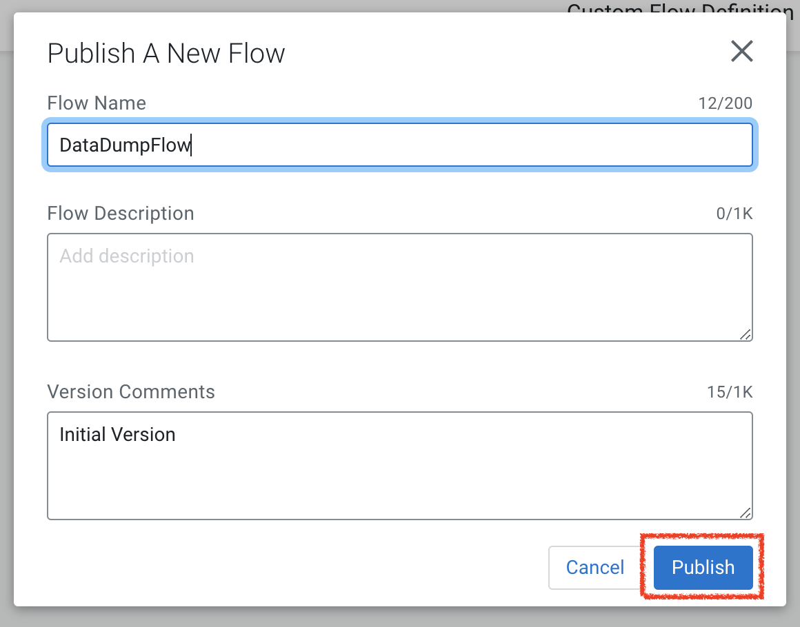

The flow will now be visible on the *FLOW CATALOG* and is ready to be deployed

image:media/media/image5.png[media/media/image5,width=401,height=360]
____

=== *5. Deploying the Flow*

==== *Step 1:* Search for the flow in the Flow Catalog
____
image:media/media/image29.png[media/media/image29,width=390,height=277]

* Click on the Flow, you should see the following:

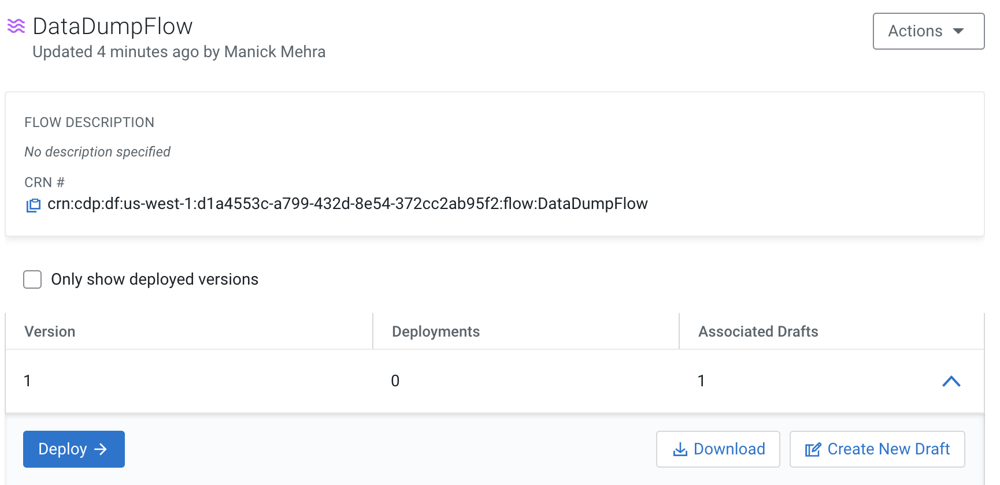
____

==== *Step 2:* Deploy the flow
____
Click on *Version 1*, you should see a *Deploy* Option appear shortly. Then click on *Deploy*.

image:media/media/image38.png[media/media/image38,width=364,height=235]
____

==== *Step 3:* Select the CDP environment 
____
Select the CDP environment where this flow will be deployed and click on *CONTINUE*

image:media/media/image35.png[media/media/image35,width=334,height=316]
____
____
*Note* THE NAME OF THE ENVIRONMENT WILL BE SHARED BY THE INSTRUCTOR
____

==== *Step 4:* Deployment Name
____
Give the deployment a unique name( \{user_id}_flow_prod), then click Next
* Example : immiapac01_flow_prod

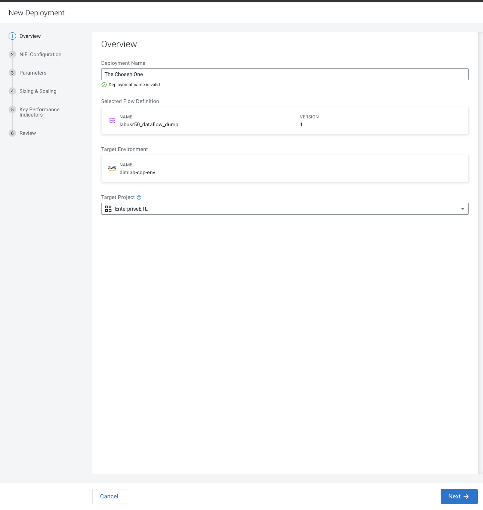

____

==== *Step 5:* Set the NiFi Configuration
____
We can let everything be the default here and click NEXT

image:media/media/image133.png[media/media/image133,width=257,height=307]
____
==== *Step 6:* Set the Parameters
____
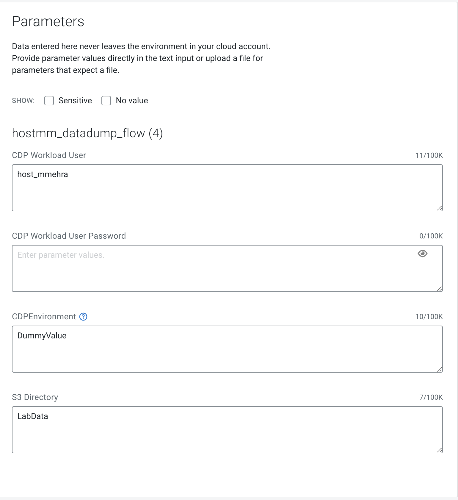

Set the Username, Password and the Directory name and click NEXT
____
[width="100%",cols="50%,50%",options="header",]
|===
|*Property* |*Value*
|*CDP Workload User* |immiapacXY
|*CDP Workload User Password* |<The Password you set>>
|*S3 Directory* |dirFlowCatalogDataDump
|*CDP Environment* |TestParameter
|===

_[The CDP Environment parameter that shows here is used at the time we perform a test run on our test session. It holds the CDP Environment configuration resources files such as ssl-client.xml, hive-site.xml and core-site.xml. You do not have to specify these to deploy your flow from the flow catalog as it automatically picks up those files,hence we give a dummy value to this. To avoid giving a dummy value, this parameter can be deleted before we publish the flow]_

==== *Step 7:* Set the cluster size
____
Select the Extra Small size and click NEXT. In this step you can configure how your flow will autoscale, but keep it disabled for this lab.

image:media/media/image104.png[media/media/image104,width=278,height=331]
____
==== *Step 8:* Add Key Performance indicators

____
Set up KPIs to track specific performance metrics of a deployed flow.

Click on “Add New KPI”

image:media/media/image22.png[media/media/image22,width=624,height=209]

In the KPI Scope drop-down list, choose “Connection”

image:media/media/image18.png[media/media/image18,width=332,height=368]

In the “Add New KPI” window, add an alert as below

image:media/media/image15.png[media/media/image15,width=357,height=393]

Click Add and then Click Next

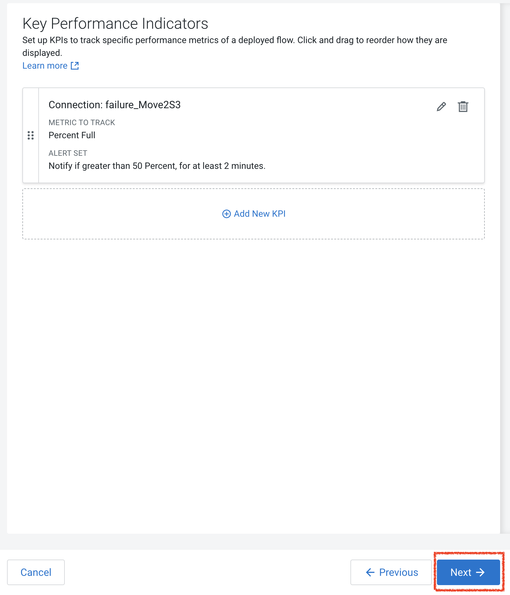
____

==== *Step 9:* Click *Deploy*

____
image:media/media/image60.png[media/media/image60,width=359,height=335]

The “Deployment Initiated” message will be displayed. Wait until the flow deployment is completed, which might take a few minutes.

image:media/media/image66.png[media/media/image66,width=580,height=276]

When deployed, the flow will show up on the Data flow dashboard, as below:

image:media/media/image8.png[media/media/image8,width=624,height=242]
____

=== *6. Viewing details of the deployed flow*

Click on the flow in the Dashboard and select Manage Deployment

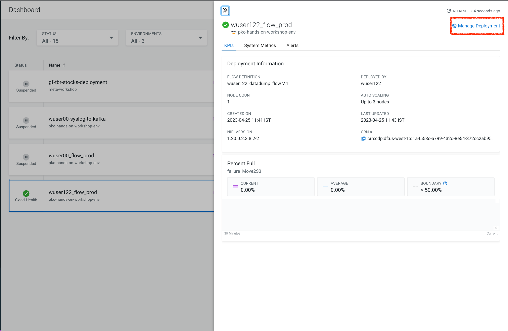

==== Step 1 : Manage KPI and Alerts
____
Click on the KPI tab to get the list of KPIs that have been set. You also have an option to modify or add more KPIs to your flow here.

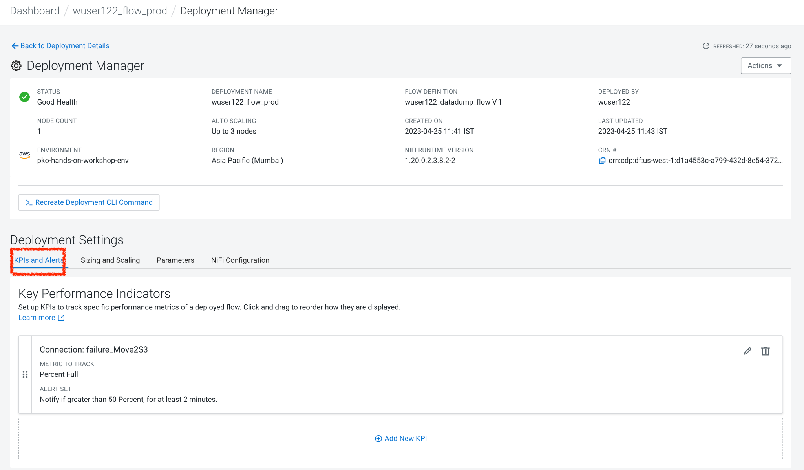
____
==== Step 2 : Manage Sizing and Scaling
____
Click on the Sizing and Scaling tab to get detailed information

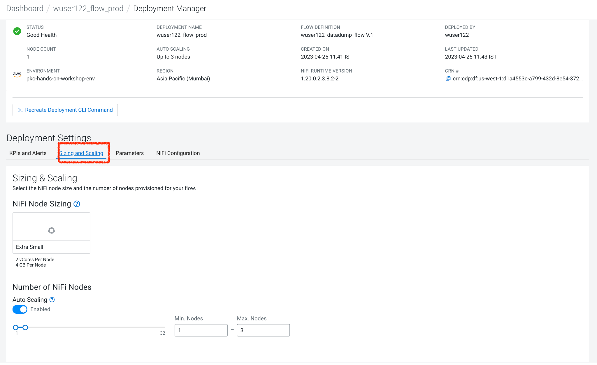
____

==== Step 3 : Manage Parameters
____
The parameters that we earlier created can be managed from the Parameters tab. Click on Parameters.

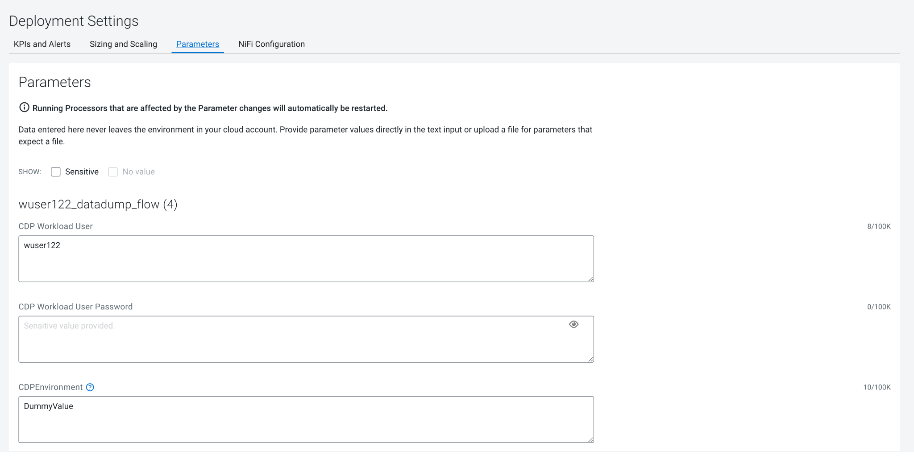
____

==== Step 4 : NiFi Configurations
____
If you have set any configuration wrt to Nifi they will show up on the ‘NiFi Configuration’ tab

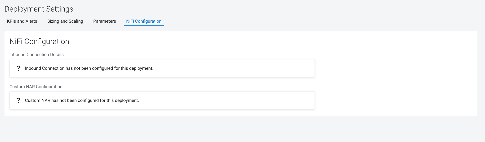
____

==== Step 5 : View the deployed flow in NiFi

* {blank}
+
____
Select ACTIONS on the Deployment Manager page and then click on ‘View in NiFi’
____

____
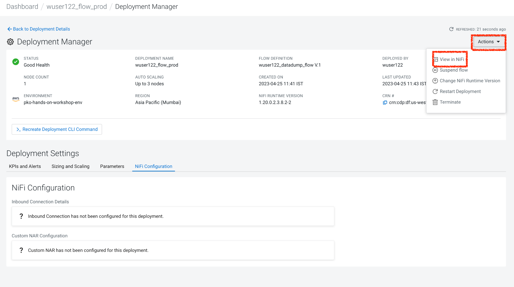

This will open the flow in the NiFi UI.

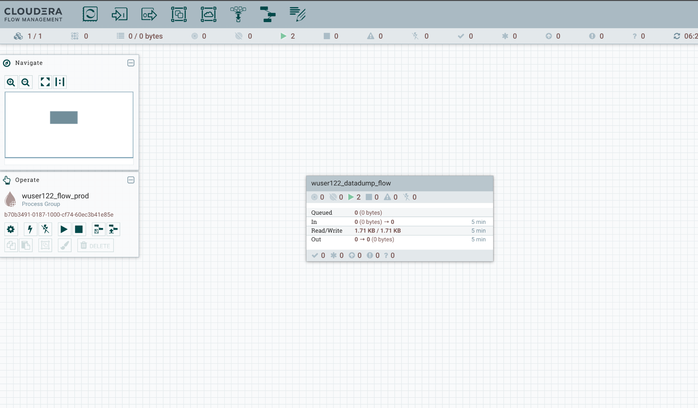
____

==== Step 6 : Terminate the flow

As we have completed the Lab, it is best to terminate this flow. Follow the below given procedure to terminate your flow.

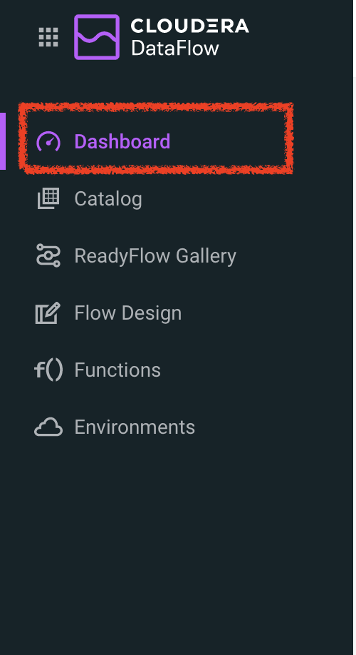

Select Dashboard from the Cloudera Data Flow UI

Select your flow and go to Manage Deployment

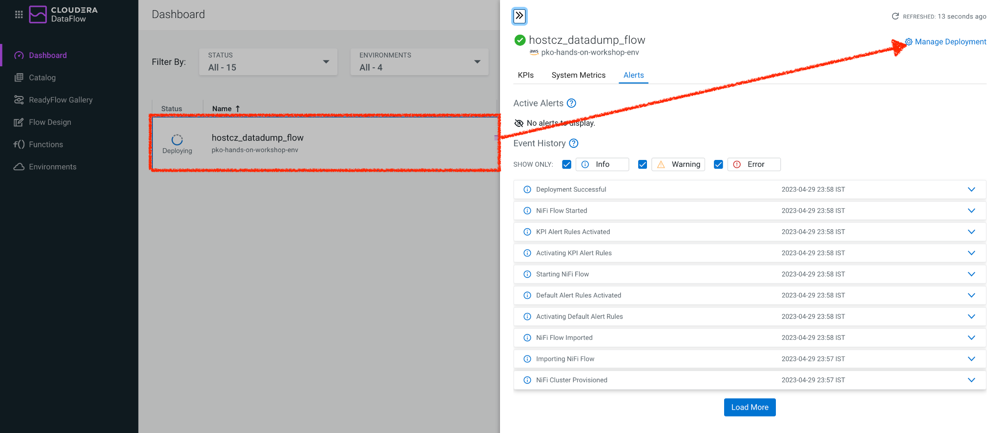 +

On the Deployment Manager Page, Select *Actions* and click on *Terminate*

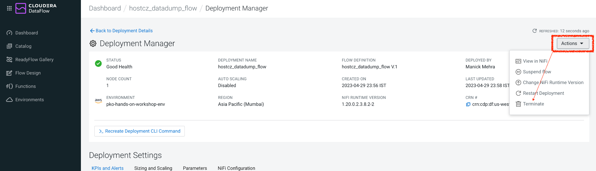

In the next dialog box, enter the name of the flow we are trying to terminate and click on *Terminate*

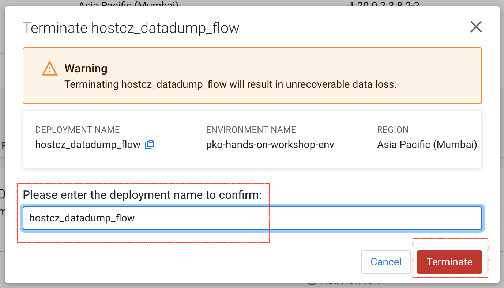

You will now see that the termination process has started.

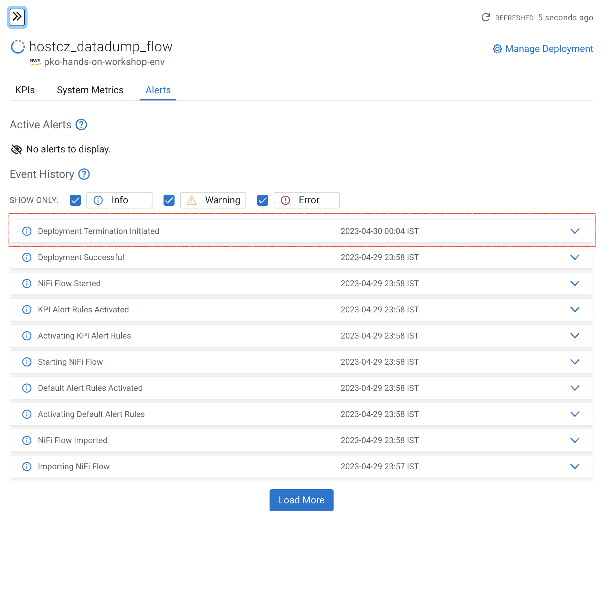

== *Lab 2 : Migrating Existing Data Flows to CDF-PC*

=== *1. Overview*

The purpose of this lab is to demonstrate how existing NiFi flows can be migrated to the Data Flow Experience. This workshop will leverage an existing NiFi flow template that has been designed with the best practices for CDF-PC flow deployment.

The existing NiFi Flow will perform the following actions:

[arabic]
. {blank}
+
____
Generate random syslogs in 5424 Format
____
. {blank}
+
____
Convert the incoming data to a JSON using record writers
____
. {blank}
+
____
Apply a SQL filter to the JSON records
____
. {blank}
+
____
Send the transformed syslog messages to Kafka
____

____
*Note* Parameter context has already been defined in the flow and the queues have been uniquely named.
____

For this we will be leveraging the DataHubs which have already been created, namely:

* {blank}
+
____
ssb-analytics-cluster
____
* {blank}
+
____
kafka-smm-cluster
____

=== *2. Pre-requisites*

==== 2.1. Create a Kafka Topic

[arabic]
. {blank}
+
____
Login to Streams Messaging Manager by clicking the appropriate hyperlink in the Streams Messaging Datahub ( kafka-smm-cluster )

++++

  

++++
++++

  

++++
____

[arabic, start=2]
. {blank}
+
____
Click on Topics in the left tab

++++

  

++++
____

[arabic, start=3]
. {blank}
+
____
Click on Add New

++++

  

++++
____

[arabic, start=4]
. {blank}
+
____
Create a Topic with the following parameters then click *Save*:

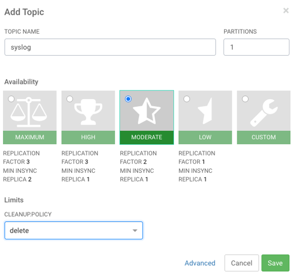

[width="100%",cols="50%,50%",options="header",]
|===
|*Property* |*Value*
|*Name* |<username>-syslog
|*Partitions* |1
|*Availability* |Moderate
|*leanup Policy* |Delete
|===
____
____
*Note*: The Flow will not work if you set the Cleanup Policy to anything other than *Delete*. This is because we are not specifying keys when writing to Kafka.
____

==== 2.2. Create a Schema in Schema Registry

[arabic]
. {blank}
+
____
Login to Schema Registry by clicking the appropriate hyperlink in the Streams Messaging Datahub(kafka-smm-cluster )
____
++++

  

++++
++++

  

++++

[arabic, start=2]
. {blank}
+
____
Click on the + button on the top right to create a new schema.
____
++++

  

++++

[arabic, start=3]
. {blank}
+
____
Create a new schema with the following information:
____
[width="100%",cols="50%,50%",options="header",]
|===
|*Property* |*Value*
|*Name* |<username>-syslog
|*Description* |syslog schema for dataflow workshop
|*Type* |Avro schema provider
|*Schema Group* |Kafka
|*Compatibility* |BACKWARD
|*Evolve* |True
|*Schema Text* |Copy and paste the schema text below into the “Schema Text” field
|===
[source,json]
----
{
  "name": "syslog",
  "type": "record",
  "namespace": "com.cloudera",
  "fields": [
    {
      "name": "priority",
      "type": "int"
    },
    {
      "name": "severity",
      "type": "int"
    },
    {
      "name": "facility",
      "type": "int"
    },
    {
      "name": "version",
      "type": "int"
    },
    {
      "name": "timestamp",
      "type": "long"
    },
    {
      "name": "hostname",
      "type": "string"
    },
    {
      "name": "body",
      "type": "string"
    },
    {
      "name": "appName",
      "type": "string"
    },
    {
      "name": "procid",
      "type": "string"
    },
    {
      "name": "messageid",
      "type": "string"
    },
    {
      "name": "structuredData",
      "type": {
        "name": "structuredData",
        "type": "record",
        "fields": [
          {
            "name": "SDID",
            "type": {
              "name": "SDID",
              "type": "record",
              "fields": [
                {
                  "name": "eventId",
                  "type": "string"
                },
                {
                  "name": "eventSource",
                  "type": "string"
                },
                {
                  "name": "iut",
                  "type": "string"
                }
              ]
            }
          }
        ]
      }
    }
  ]
}

----

____
____
*Note*
The name of the Kafka Topic you previously created and the Schema Name must be the same.
____

Click on *SAVE*.

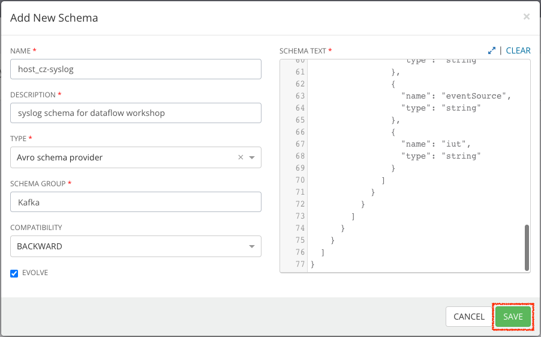

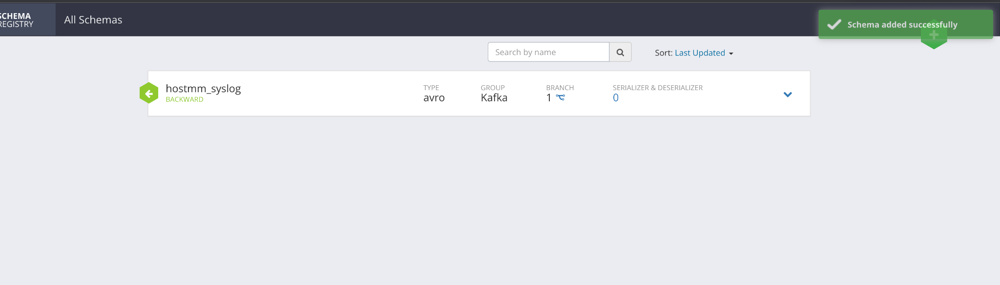
____

== *Lab 3 : Operationalizing Externally Developed Data Flows with CDF-PC*

=== *1. Import the Flow into the CDF-PC Catalog*

[loweralpha]
. {blank}
+
____
Open the CDF-PC data service and click on Catalog in the left tab.

image:media/media/image62.png[media/media/image62,width=161,height=176]
____

[loweralpha, start=2]
. {blank}
+
____
Select Import Flow Definition on the Top Right

image:media/media/image56.png[media/media/image56,width=191,height=37]
____

[loweralpha, start=3]
. {blank}
+
____
Add the following information:

[width="100%",cols="50%,50%",options="header",]
|===
|*Property* |*Value*
|*Flow Name* |<username>-syslog-to-kafka
|*Flow Description* |Reads Syslog in RFC 5424 format, applies a SQL filter, transforms the data into JSON records, and publishes to Kafka
|*NiFi Flow Configuration* |syslog-to-kafka.json (From the resources downloaded earlier)
|*Version Comments* |Initial Version
|===

image:media/media/image73.png[media/media/image73,width=242,height=248]
Click *IMPORT*
____

=== *2. Deploy the Flow in CDF-PC*

[arabic]
. {blank}
+
____
Search for the flow in the Flow Catalog

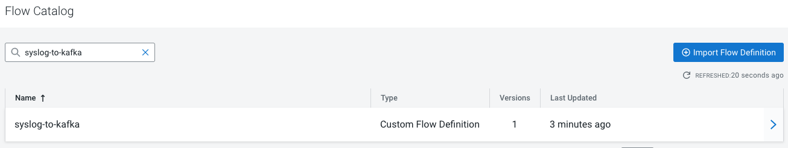
____

[arabic, start=2]
. {blank}
+
____
Click on the Flow, you should see the following:

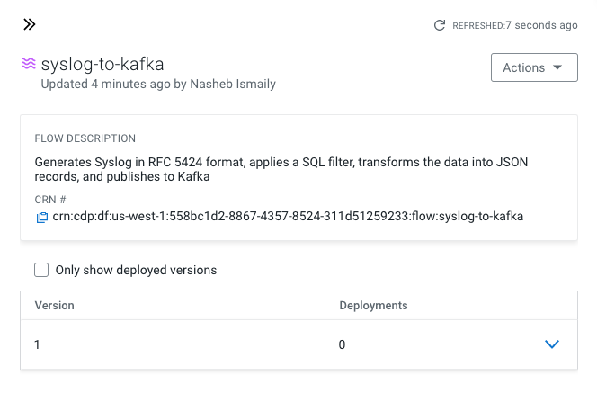
____

[arabic, start=3]
. {blank}
+
____
Click on *Version 1*, you should see a *Deploy* Option appear shortly. Then click on *Deploy*.

image:media/media/image38.png[media/media/image38,width=364,height=235]
____

[arabic, start=4]
. {blank}
+
____
Select the CDP environment where this flow will be deployed, then click *Continue*.

*Note* : THE NAME OF THE ENVIRONMENT WILL BE SHARED BY THE INSTRUCTOR
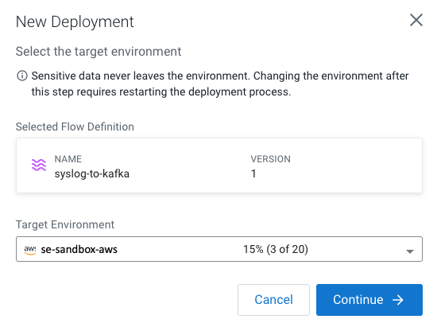
____
[arabic, start=5]
. {blank}
+
____
Give the deployment a unique name, then click *Next*.

Example : \{user_id}-syslog-to-kafka

image:media/media/image47.png[media/media/image47,width=468,height=88]
____

[arabic, start=6]
. {blank}
+
____
In the NiFi Configuration screen, click *Next*.

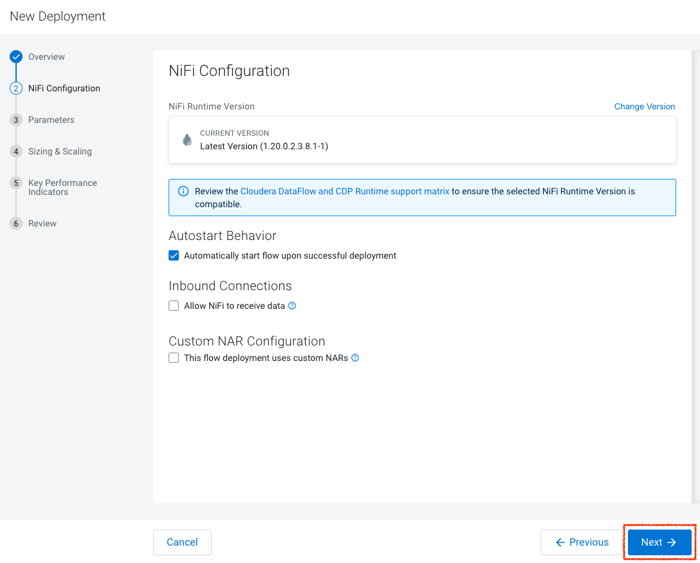
____

[arabic, start=7]
. {blank}
+
____
Add the Flow Parameters as below, then click *Next*.

[width="100%",cols="50%,50%",options="header",]
|===
|*Property* |*Value*
|*CDP Workload User* |The workload username for the current user. Example : immiapac00
|*CDP Workload Password* | The workload password for the current user [This password was set by you in Lab 0, section 3]
|*Filter Rule* |SELECT * FROM FLOWFILE
|*Kafka Broker Endpoint* |A comma separated list of Kafka Brokers.
|*Kafka Destination Topic* |<username>-syslog (Ex: immiapac00-syslog)
|*Kafka Producer ID* |nifi_dfx_p1
|*Schema Name* |<username>-syslog (Ex: immiapac00-syslog)
|*Schema Registry Hostname* |The hostname of the master server in the Kafka Datahub(kafka-smm-cluster)[Refer screenshot below] Example : *kafka-smm-cluster-master0.pko-hand.dp5i-5vkq.cloudera.site*
|===
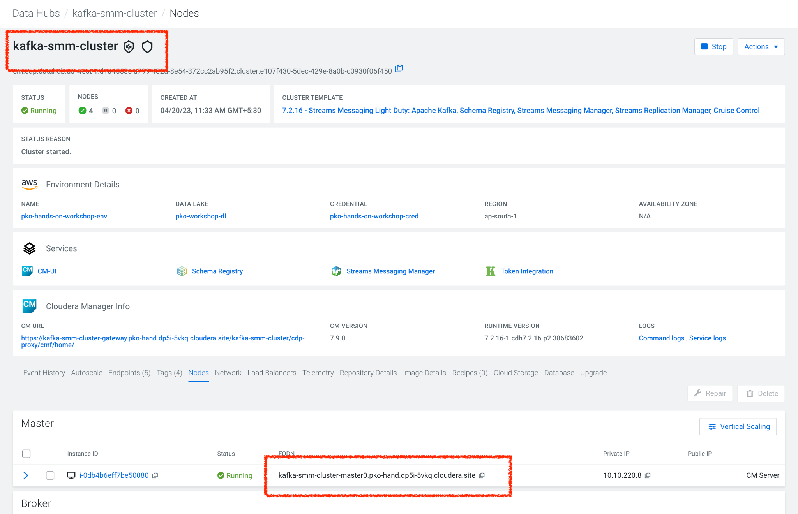

Example : kafka-smm-cluster-master0.pko-hand.dp5i-5vkq.cloudera.site
____

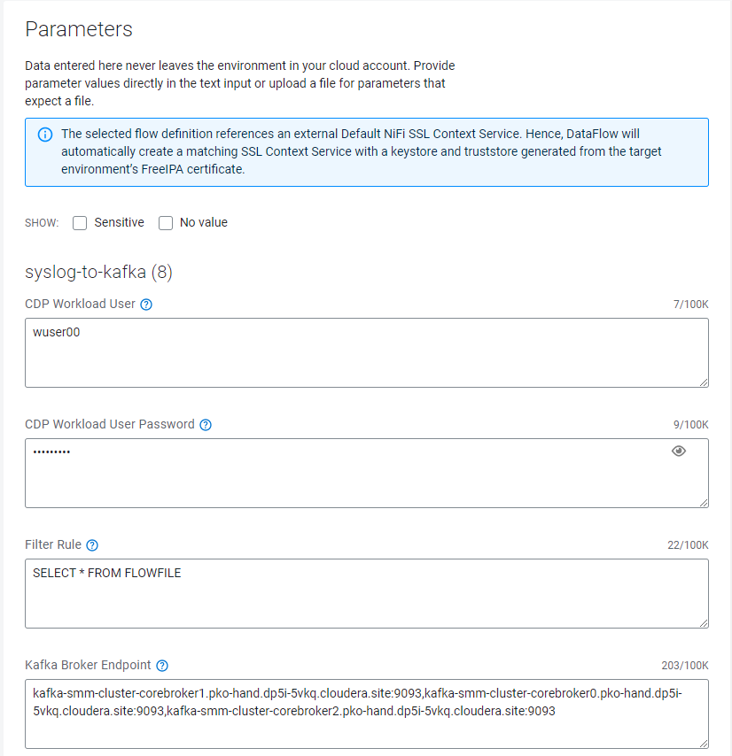

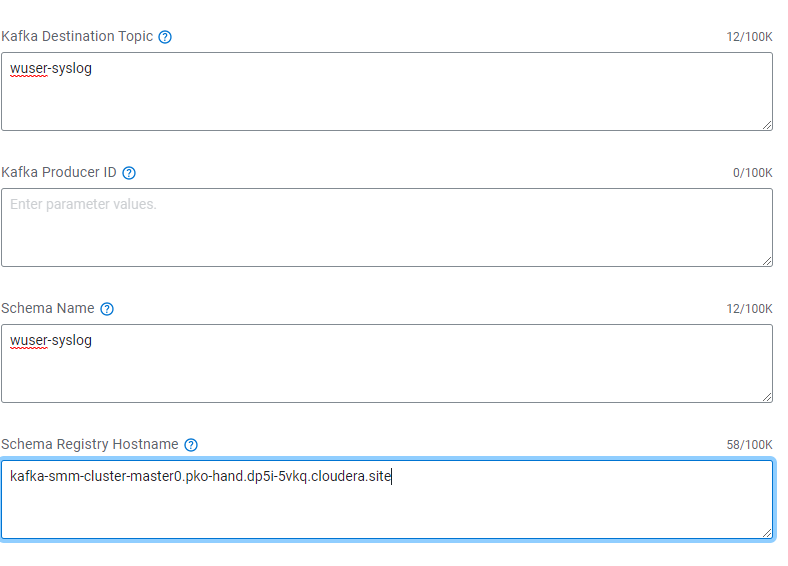

[arabic, start=8]
. {blank}
+
____
On the next page, define the Sizing and Scaling as follows, then click *Next*.

* {blank}
+

*Size:* Extra Small

* {blank}
+

*Enable Auto Scaling:* True

* {blank}
+

*Min Nodes:* 1

* {blank}
+

*Max Nodes:* 3

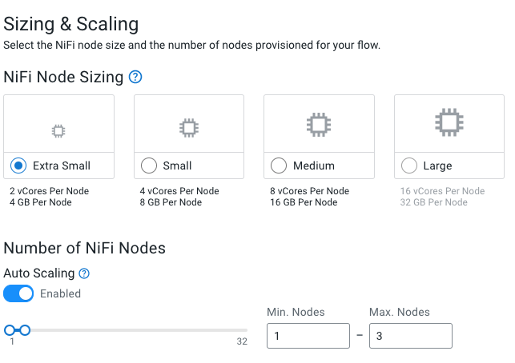
____

[arabic, start=9]
. {blank}
+
____
Skip the KPI page by clicking *Next* and Review your deployment. Then Click *Deploy*.

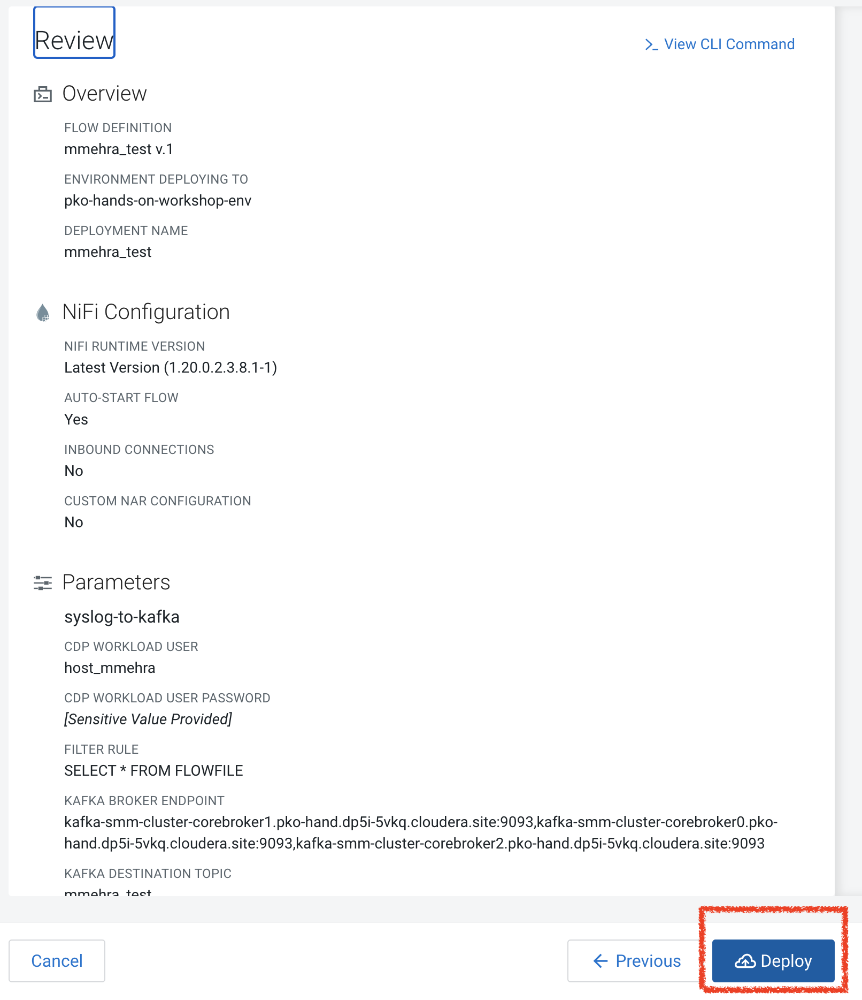
____

[arabic, start=10]
. {blank}
+
____
Proceed to the CDF-PC Dashboard and wait for your flow deployment to complete, which might take a few minutes. A Green Check Mark will appear once complete, which might take a few minutes.

image:media/media/image48.png[media/media/image48,width=624,height=40]
____

[arabic, start=11]
. {blank}
+
____
Click into your deployment and then Click *Manage Deployment* on the top right to view your flow in NiFi.

image:media/media/image107.png[media/media/image107,width=515,height=287]

Now click on *ACTIONS* and select *_View in NiFi_*

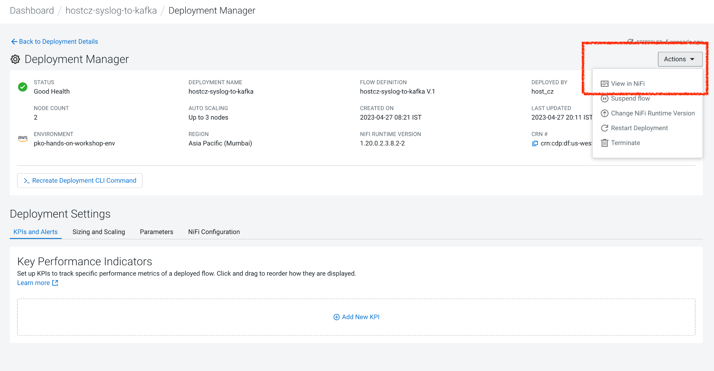
____

The flow that you just deployed will look something like this on NiFi

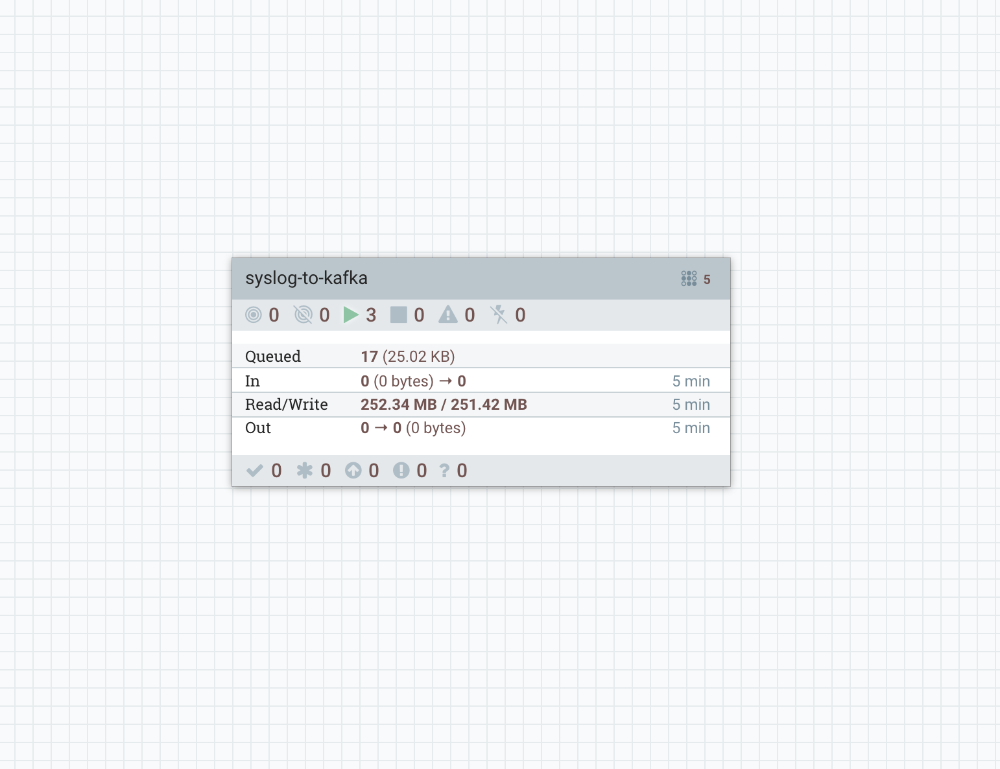

Double click on the Process Group to see the flow

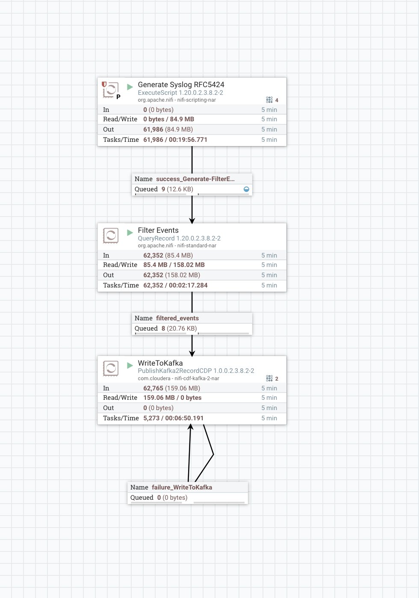

== *Lab 4 : SQL Stream Builder*

=== *1. Overview*

The purpose of this workshop is to demonstrate streaming analytic capabilities using Cloudera SQL Stream Builder. We will leverage the NiFi Flow deployed in CDF-PC from the previous lab and demonstrate how to query live data and subsequently sink it to another location. The SQL query will leverage the existing syslog schema in Schema Registry.

=== *2. Creating a Project*

==== *Step 1:* Go to the SQL Stream Builder UI

SSB Interface can be reached from the Data Hub that is running the Streams Analytics, in our case - _ssb-analytics-cluster_

Within the Data Hub, click on *Streaming SQL Console*

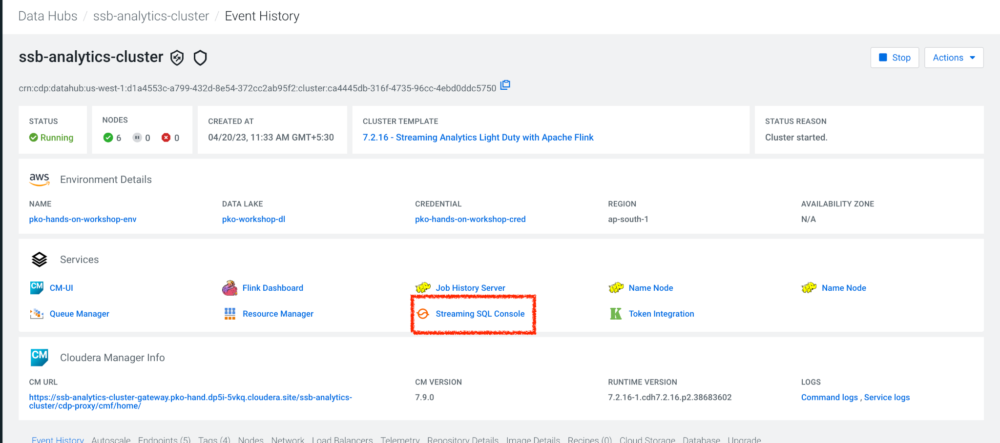

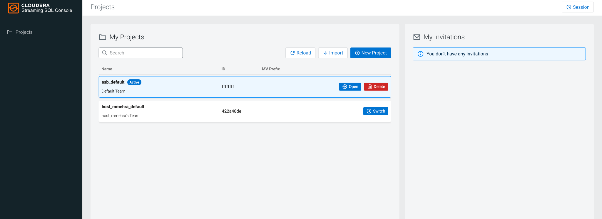

==== *Step 2:* Creation of a Project

Create a SSB Project by clicking *“New Project”* using the following details and click “*Create”*

[.mark]#Name : \{user-id}_hol_workshop#

[.mark]#Description : SSB Project to analyze streaming data#

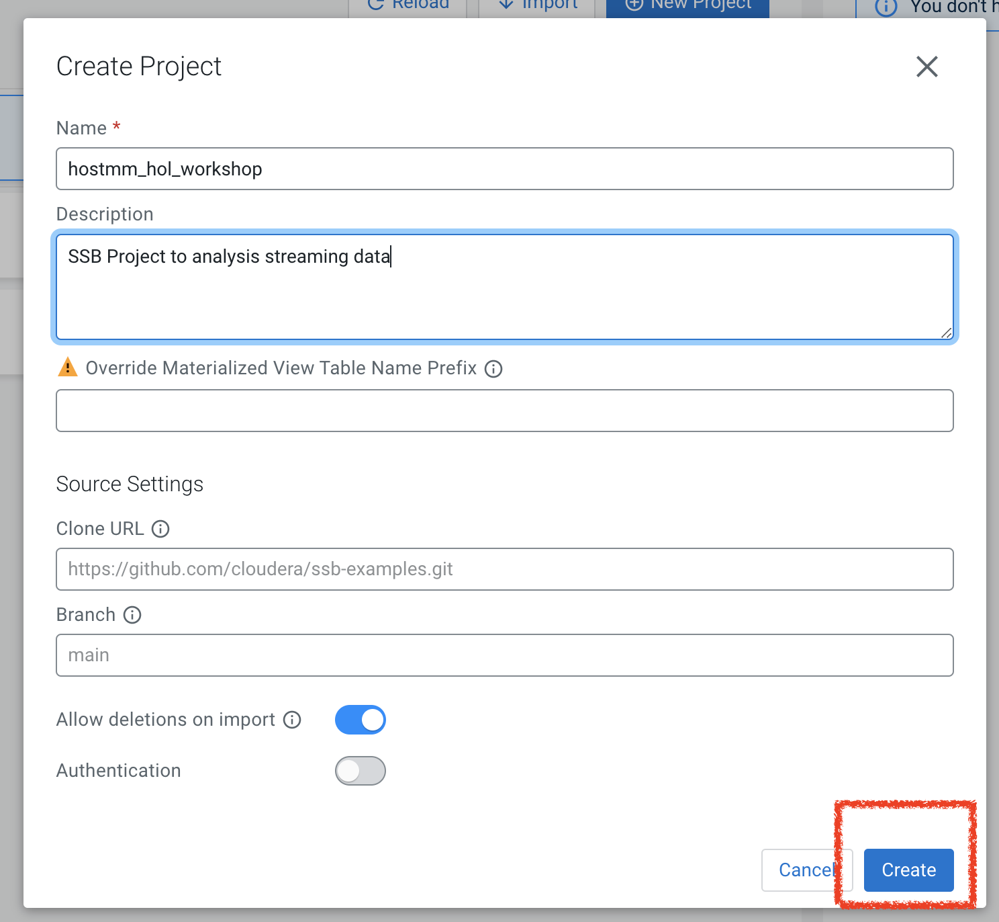

Switch to the created project. Click on *Switch*

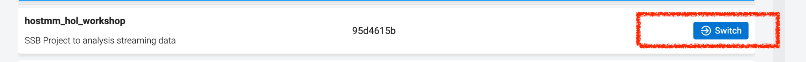

==== 

==== 

==== *Step 3 :* Create Kafka Data Store 

Create Kafka Data Store by selecting “*Data Sources”* in the left pane, clicking on the three-dotted icon next to “*Kafka”*, then selecting *“New Kafka Data Source”*.

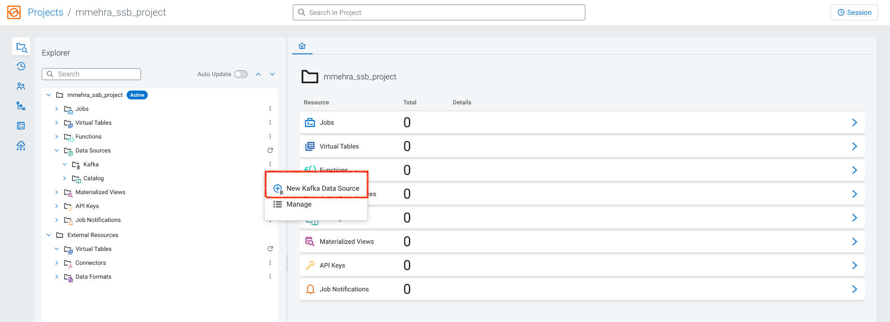

*Name :* \{user-id}_cdp_kafka

*Brokers (Comma-separated List)*

kafka-smm-cluster-corebroker1.pko-hand.dp5i-5vkq.cloudera.site:9093,kafka-smm-cluster-corebroker0.pko-hand.dp5i-5vkq.cloudera.site:9093,kafka-smm-cluster-corebroker2.pko-hand.dp5i-5vkq.cloudera.site:9093image:media/media/image102.png[media/media/image102,width=450,height=399]

*Protocol :* SASL/SSL

*SASL Username :* <workload-username>

Example : immiapacXY

*SASL Password :* <Set in Lab 0 Section 3>

*SASL Mechanism :* PLAIN

____
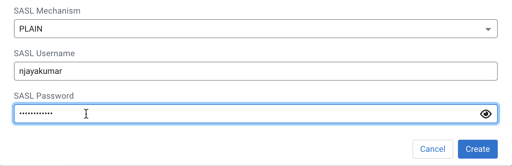
____

Click on *VALIDATE* to test the connections once successful click on *CREATE*

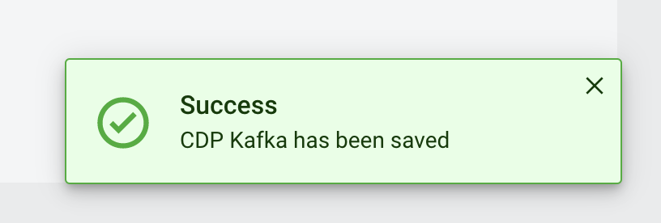

==== *Step 4:* Create Kafka Table

Create Kafka Table, by selecting *“Virtual Tables”* in the left pane, clicking on the three-dotted icon next to it, then clicking on *“New Kafka Table”*.

image:media/media/image77.png[media/media/image77,width=354,height=368]

==== *Step 5:* Configure the Kafka Table

[arabic]
. {blank}
+
____
Enter the following details in the Kafka Table dialog box:

* {blank}
+
Table Name: *\{user-id}_syslog_data*

* {blank}
+

Kafka Cluster: *<select the Kafka data source you created previously>*

* {blank}
+

Data Format: *JSON*

* {blank}
+

Topic Name: *<select the topic created in Schema Registry>*

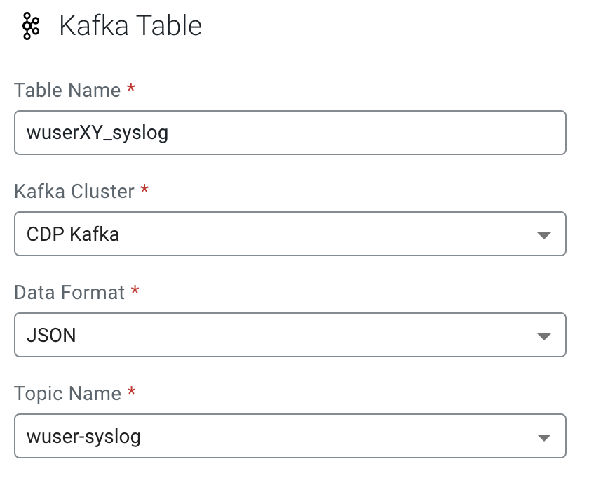
____

[arabic, start=2]
. {blank}
+
____
When you select Data Format as AVRO, you must provide the correct Schema Definition when creating the table for SSB to be able to successfully process the topic data. +
 +
For JSON tables, though, SSB can look at the data flowing through the topic and try to infer the schema automatically, which is quite handy at times. Obviously, there must be data in the topic already for this feature to work correctly. +
 +
*Note:* SSB tries its best to infer the schema correctly, but this is not always possible and sometimes data types are inferred incorrectly. You should always review the inferred schemas to check if it's correctly inferred and make the necessary adjustments. +
 +
Since you are reading data from a JSON topic, go ahead and click on *Detect Schema* to get the schema inferred. You should see the schema be updated in the *Schema Definition* tab.

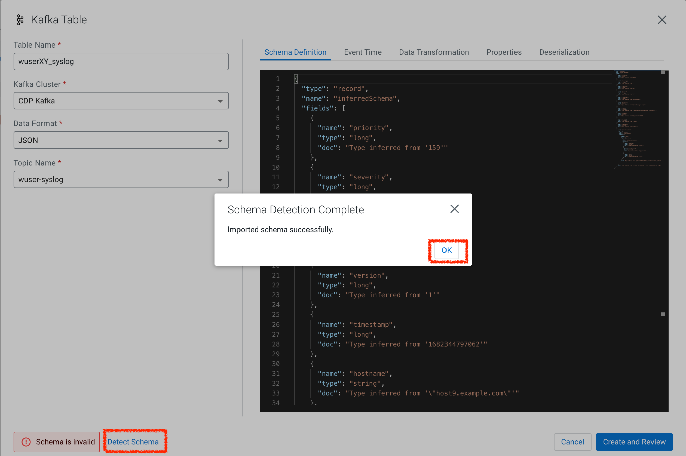
____

[arabic, start=3]
. {blank}
+
____
You will also notice that a "Schema is invalid" message appears upon the schema detection. If you hover the mouse over the message it shows the reason:

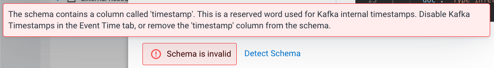

You will fix this in the next step.
____

[arabic, start=4]
. {blank}
+
____
Each record read from Kafka by SSB has an associated timestamp column of data type TIMESTAMP ROWTIME. By default, this timestamp is sourced from the internal timestamp of the Kafka message and is exposed through a column called eventTimestamp. +
 +
However, if your message payload already contains a timestamp associated with the event (event time), you may want to use that instead of the Kafka internal timestamp. +
 +
In this case, the syslog message has a field called "*timestamp*" that contains the timestamp you should use. You want to expose this field as the table's "*event_time*" column. To do this, click on the Event Time tab and enter the following properties:
____

* {blank}
+
____
Use Kafka Timestamps: *Disable*

* {blank}
+
Input Timestamp Column: *timestamp*

* {blank}
+
Event Time Column: *event_time*

* {blank}
+
Watermark Seconds: *3*

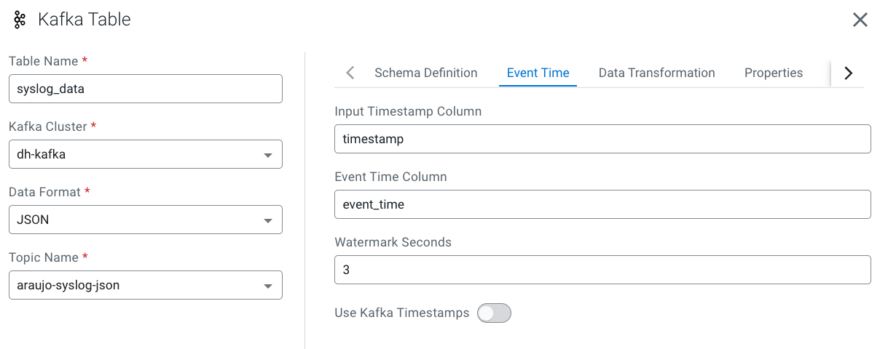
____

[arabic, start=5]
. {blank}
+
____
Now that you have configured the event time column, click on *Detect Schema* again. You should see the schema turn valid: +
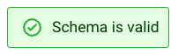
____
. {blank}
+
____
Click the *Create and Review* button to create the table.

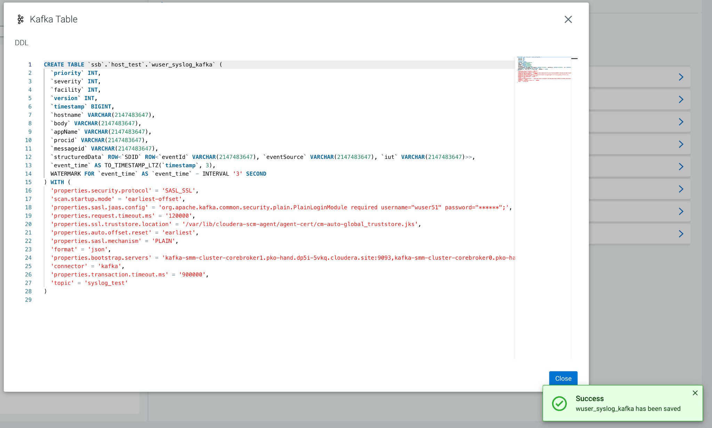

Review the table's DDL and click *Close*.
____

==== *Step 6:* Create a Flink Job

Create a Flink Job, by selecting *“Jobs”* in the left pane, clicking on the three-dotted icon next to it, then clicking on *“New Job”*.

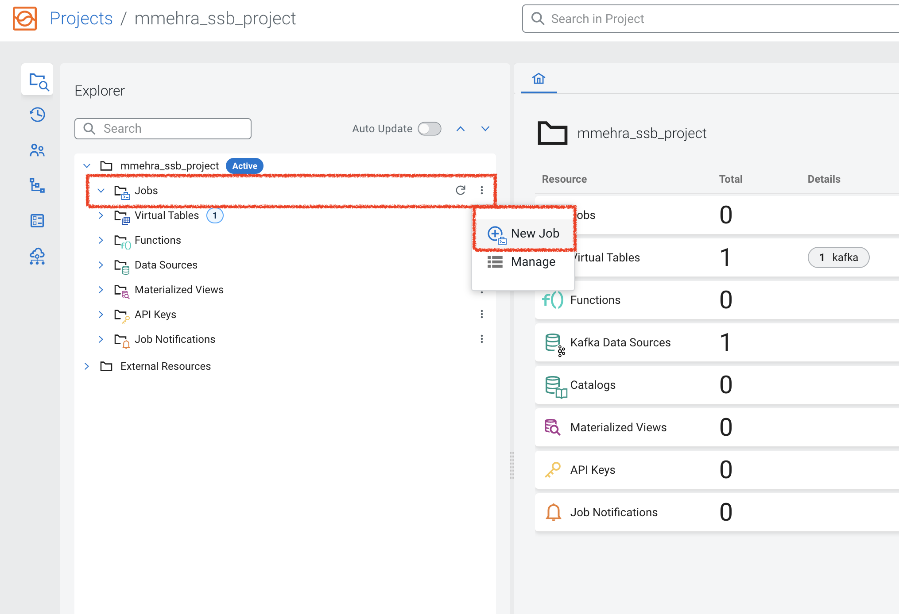

Give a job name and click *CREATE*

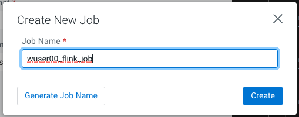

The Query Editor should now show up

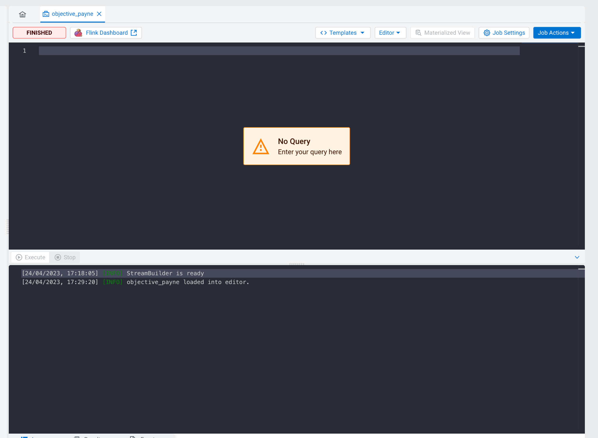

____
Add the following SQL Statement in the Editor
____

[width="100%",cols="100%",options="header",]
|===
|SELECT * FROM *\{user-id}_syslog_data* WHERE severity <=3
|===

____
*Note* : Replace \{user-id} with your assigned username
____

____
Run the Streaming SQL Job by clicking *Execute*. Also, ensure your \{user_id}-syslog-to-kafka flow is running in CDF-PC.

image:media/media/image90.png[media/media/image90,width=624,height=242]
____

In the Results tab, you should see syslog messages with severity levels <=3

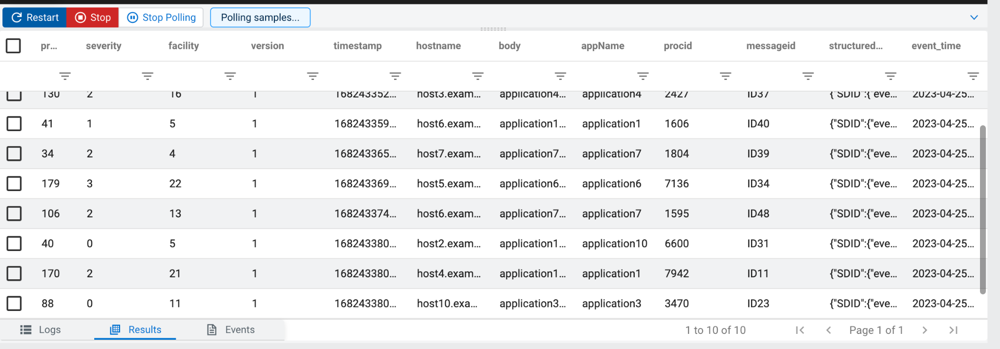
