++++

  

++++

link:#preface[[.underline]#Preface#]

link:#pre-requisites[[.underline]#Pre-requisites#]

link:#workshop-overview[[.underline]#Workshop Overview#]

link:#lab-1---getting-started[[.underline]#LAB 1 - Getting Started#]

** link:#verify-resources[[.underline]#VERIFY RESOURCES#]

** link:#define-cdp-workload-password[[.underline]#DEFINE CDP WORKLOAD PASSWORD#]

*** link:#step-1-login[[.underline]#Step 1 : Login#]

*** link:#step-2-go-to-profile[[.underline]#Step 2 : Go to Profile#]

*** link:#step-3-set-workload-password[[.underline]#Step 3 : Set Workload Password#]

link:#lab-2---raw-layer[[.underline]#LAB 2 - RAW LAYER#]

** link:#database-and-table-creation[[.underline]#DATABASE AND TABLE CREATION#]

*** link:#step-1-go-to-hue-hive-cluster[[.underline]#Step 1 : Go To Hue Hive Cluster]#

*** link:#step-2-create-database[[.underline]#Step 2 : CREATE DATABASE#]

*** link:#step-3-create-external-tables[[.underline]#Step 3 : CREATE EXTERNAL TABLES#]

*** link:#step-4-verify-if-the-tables-are-created[[.underline]#Step 4 : VERIFY IF THE TABLES ARE CREATED#]

*** link:#step-5-query-created-tables-using-impala-virtual-warehouse[[.underline]#Step 5 : QUERY CREATED TABLES USING IMPALA VIRTUAL WAREHOUSE#]

link:#lab-3---data-lakehouse[[.underline]#LAB 3 - DATA LAKEHOUSE#]

** link:#curated-layer-creation[[.underline]#CURATED LAYER CREATION#]

*** link:#step-1-create-and-load-planes-table[[.underline]#Step 1 : CREATE and LOAD PLANES TABLE#]

*** link:#step-2-describe-created-table[[.underline]#Step 2 : DESCRIBE CREATED TABLE#]

*** link:#step-3-create-and-load-airlines-table[[.underline]#Step 3 : CREATE AND LOAD AIRLINES TABLE#]

*** link:#step-4-check-acid-capabilities[[.underline]#Step 4 : CHECK ACID CAPABILITIES#]

** link:#migrate-hive-to-iceberg-table[[.underline]#MIGRATE HIVE TO ICEBERG TABLE#]

*** link:#utilize-table-migration-feature[[.underline]#Utilize Table Migration Feature#]

*** link:#use-create-table-as-selectctas[[.underline]#Use Create table as Select(CTAS)#]

** link:#create-iceberg-tables[[.underline]#CREATE ICEBERG TABLES#]

link:#lab-4---performance-optimization-and-table-maintenance[[.underline]#LAB 4 - PERFORMANCE OPTIMIZATION AND TABLE MAINTENANCE#]

** link:#iceberg-in-place-partition-evolutionperformance-optimization[[.underline]#Iceberg in-place Partition Evolution-Performance Optimization#]

*** link:#step-1-open-hue-for-the-cdw-hive-virtual-warehouse[[.underline]#Step 1 : Open HUE for the CDW Hive Virtual Warehouse#]

*** link:#step-2-execute-query[[.underline]#Step 2 : Execute Query#]

*** link:#step-3-check-for-optimizations[[.underline]#Step 3 : Check for optimizations#]

** link:#iceberg-snapshots-table-maintenance[[.underline]#Iceberg Snapshots [Table Maintenance]#

** link:#iceberg-time-travel-table-maintenance[[.underline]#Iceberg Time Travel [Table Maintenance]#

** link:#iceberg-rollback-table-maintenance---do-not-run[[.underline]#Iceberg Rollback [Table Maintenance] - DO NOT RUN#

** link:#iceberg-rollback-table-maintenance---do-not-run-1[[.underline]#Iceberg Rollback [Table Maintenance] - DO NOT RUN#

** link:#materialized-views-performance-optimization[[.underline]#Materialized Views -Performance Optimization#]

link:#lab-5---security-and-governance[[.underline]#LAB 5 - SECURITY AND GOVERNANCE#]

** link:#step-1-add-new-policy[[.underline]#Step 1 : Add New Policy#]

** link:#step-2-test-new-policy[[.underline]#Step 2 : Test New Policy#]

link:#lab-6---cloudera-data-visualization[[.underline]#LAB 6 - CLOUDERA DATA VISUALIZATION#]

** link:#data-modeling[[.underline]#Data Modeling#]

** link:#dashboard-creation[[.underline]#Dashboard Creation#]

== CLOUDERA DATA WAREHOUSE WORKSHOP

== Preface

Working for an Aircraft Engine company, the company wants to increase competitive advantage in two keyways:

* {blank}
+
____
Engineer better, more fault tolerant aircraft engines.
____
* {blank}
+
____
Be proactive in predictive maintenance on engines, and faster discovery-to-fix in new engine designs.
____

This will be a three-phase plan:

* {blank}
+
____
Phase One: Understand how our current engines contribute to airline flight delays and fix for future engines.
____
* {blank}
+
____
Phase Two: Implement an ongoing reporting service to support ongoing engineering efforts to continuously improve engines based on delay data.
____
* {blank}
+
____
Phase Three: Move to real-time analysis to fix things before they break both in engines already sold, and in new engine designs.
____

To do this, we’re going to build a data warehouse & data lakehouse to create reports that engineers can use to improve our engines. The following people will get to work:

We will dive into this scenario to show Cloudera Data Warehouse (CDW) is used to enable the Aircraft company to gain competitive advantage - and at the same time it highlights the performance and automation capabilities that help ensure performance is maintained while controlling costs.

The Hands on Labs will take you through how to use the Cloudera Data Warehouse service to quickly explore raw data, create curated versions of the data for simple reporting and dashboarding, and then scale up usage of the curated data by exposing it to more users.

[width="100%",cols="30%,70%"]
|===
|*Fact Table:* |flights (86M rows)
|*Dimension Tables:* |airlines (1.5k rows), + 
airports (3.3k rows) +
planes (5k rows)
|===

++++

  ER - Diagram of the data

++++
++++

  

++++

== Pre-requisites

* {blank}
+
____
Laptop with a supported OS (Windows 7 not supported) or MacBook.
____
* {blank}
+
____
A modern browser - Google Chrome (IE, Firefox, Safari not supported).
____

== Workshop Overview

Below are the high-level steps for what we will be doing in the workshop.

* {blank}
+

*[Lab 1 & 2]: General introduction to CDW* to get ourselves oriented for the workshop.
____
** {blank}
+
*As an Admin:* Create and enable the BI analyst team with a Virtual Warehouse.

** {blank}
+

*As a BI Analyst*: Get familiar with CDW on CDP and set up our first VW to start working.

** {blank}
+
*As a BI Analyst:* Wrangle our first set of data - sent to us as a series of .csv files exported from “somewhere else”.

** {blank}
+
*As an Admin:* Monitor the VW and watch as it scales up and down, suspends, etc.

** {blank}
+

*As a BI Analyst:* Start digging into the data - looking for “needle in a haystack” - running a complex query that will find which engines seem to be correlated to airplane delays for any reason.

____

* {blank}
+
*[Lab 3]: Set it up.*
____
** {blank}
+

*As an Admin:* Create and enable the BI analyst team with a Virtual Warehouse.

** {blank}
+

*As a BI Analyst:* Get familiar with CDW on CDP, and set up our first VW to start working.

** {blank}
+

*As a BI Analyst:* Wrangle our first set of data - sent to us as a series of .csv files exported from “somewhere else”.

** {blank}
+

*As an Admin:* Monitor the VW and watch as it scales up and down, suspends, etc.

** {blank}
+

*As a BI Analyst:* Start digging into the data - looking for “needle in a haystack” - running a complex query that will find which engines seem to be correlated to airplane delays for any reason.

____

* {blank}
+
*[Lab 4]: Making it better.*
____
** {blank}
+
*As a BI Analyst:* Start curating data and building a data lakehouse to improve quality by tweaking data, performance by optimizing schema structures, and ensure reliability and trustworthiness of the data through snapshots, time travel, and rollback.

** {blank}
+

Create Hive ACID tables and tweak data for consistency (ex: airline name changes - ensure reporting is consistent with the new name to avoid end user confusion, a new airline joins our customer list, make sure they’re tracked for future data collection, etc..).

** {blank}
+

Migrate Tables to Iceberg (We want snapshot and rollback).

** {blank}
+

Create new Iceberg tables (we want partitioning).
____

* {blank}
+

*[Lab 5]: Optimizing for production.*
____
** {blank}
+

Loading more data - change partitioning to maintain performance (NOTE: Ongoing ELT = CDE?).

** {blank}
+

Bad data is loaded - use time travel to detect, and rollback to resolve.

** {blank}
+

Introduce materialized views to support scaling to 1000’s of simultaneous users.

** {blank}
+

As an admin: Monitor, report, kill queries that run amock, etc.
____
* {blank}
+
[red]#*and*#
*[Lab 6]: Security & Governance.*
____
** {blank}
+

Check on the lineage to enable governance/audit.

** {blank}
+

Row level security to make sure only relevant party can see data.
____

* {blank}
+
*[Lab 7]: Cloudera Data Visualization*
____
** {blank}
+

Data Modeling for the lakehouse.

** {blank}
+

Data Visualization for insights.
____

== LAB 1 - Getting Started

=== VERIFY RESOURCES

For this workshop you will use the following credentials and resources

[width="100%",cols="40%,60%",]
|===
|*Workshop Login Username* |<Check with your instructor>
|*Workshop Login Password* |<Check with your instructor>
|*CDP Workload User (${user_id})* |<Check with your instructor>
|*CDP Workload Password* |<Check with your instructor>
|*Hive Virtual Warehouse Name* |<Check with your instructor>
|*Impala Virtual Warehouse Name* |<Check with your instructor>
|===

=== DEFINE CDP WORKLOAD PASSWORD

==== Step 1 : Login

Login to the environment using the URL and credentials provided.. The login page will look like this.

++++

  

++++

==== Step 2 : Go to Profile

Once you log in successfully you will be able to see the CDP HomePage with all the data services and the management services. Click on the username at the bottom left of the screen and select *PROFILE*

++++

  

++++

++++

  

++++

==== Step 3 : Set Workload Password

++++

  

++++

Click option Set Workload Password.

Enter the Password shared by the instructor and Confirm Password.

++++

  

++++

Click the button *Set Workload Password.*

== LAB 2 - RAW LAYER

The objective of this step is to create External tables on top of raw CSV files sitting in cloud storage (In this case it has been stored in AWS S3 by the instructor) and then run a few queries to access the data via SQL using HUE.

To access Data Warehouse data service click on Data Warehouse on the left.

++++

  

++++

=== DATABASE AND TABLE CREATION

==== Step 1 : Go To Hue [Hive Cluster]

Hue is associated with each of the virtual clusters that are present under the Database Catalog.

In the virtual cluster that has been assigned to you select HUE from the top right corner of the virtual cluster.

++++

  

++++

==== Step 2 : CREATE DATABASE

Create new databases. Enter the following query and then make sure that you enter the user assigned to you as a prefix(replace ${user_id}) to the database name.

[source,sql]
----
CREATE DATABASE ${user_id}_airlines_raw;
CREATE DATABASE ${user_id}_airlines;
----

Example Query

[source,sql]
----
CREATE DATABASE apac01_airlines_raw;
CREATE DATABASE apac01_airlines;
----

++++

  

++++

Verify if the database is created using the following query. Do not forget to replace the ${user-id} with your actual username

[source,sql]
----
SHOW DATABASES LIKE '${user_id}%';
----
++++

  

++++

==== Step 3 : CREATE EXTERNAL TABLES

Run the following DDL in the editor.

This will create External Tables on CSV Data Files that have been uploaded previously by your instructor in AWS S3. This provides a fast way to allow SQL layers on top of data in cloud storage.

ifdef::env-github[]
:tip-caption: :bulb:
:note-caption: :information_source:
:important-caption: :heavy_exclamation_mark:
:caution-caption: :fire:
:warning-caption: :warning:
endif::[]

[IMPORTANT]
Replace ${user_id} with the user name assigned to you

**--FLIGHTS TABLE**

[source,sql]
----
drop table if exists ${user_id}_airlines_raw.flights_csv;

CREATE EXTERNAL TABLE ${user_id}_airlines_raw.flights_csv(
  month int, dayofmonth int, dayofweek int, 
  deptime int, crsdeptime int, arrtime int, 
  crsarrtime int, uniquecarrier string, 
  flightnum int, tailnum string, actualelapsedtime int, 
  crselapsedtime int, airtime int, arrdelay int, 
  depdelay int, origin string, dest string, 
  distance int, taxiin int, taxiout int, 
  cancelled int, cancellationcode string, 
  diverted string, carrierdelay int, 
  weatherdelay int, nasdelay int, securitydelay int, 
  lateaircraftdelay int, year int
) ROW FORMAT DELIMITED FIELDS TERMINATED BY ',' LINES TERMINATED BY '\n' STORED AS TEXTFILE LOCATION 's3a://handsonworkshop/my-data/meta-cdw-workshop/airlines-raw/airlines-csv/flights' tblproperties("skip.header.line.count" = "1");
----

*--PLANES TABLE*
[source,sql]
----
drop table if exists ${user_id}_airlines_raw.planes_csv;

CREATE EXTERNAL TABLE ${user_id}_airlines_raw.planes_csv(
  tailnum string, owner_type string, 
  manufacturer string, issue_date string, 
  model string, status string, aircraft_type string, 
  engine_type string, year int
) ROW FORMAT DELIMITED FIELDS TERMINATED BY ',' LINES TERMINATED BY '\n' STORED AS TEXTFILE LOCATION 's3a://handsonworkshop/my-data/meta-cdw-workshop/airlines-raw/airlines-csv/planes' tblproperties("skip.header.line.count" = "1");

----

*--AIRLINES TABLE*

[source,sql]
----
drop table if exists ${user_id}_airlines_raw.airlines_csv;

CREATE EXTERNAL TABLE ${user_id}_airlines_raw.airlines_csv(code string, description string) ROW FORMAT DELIMITED FIELDS TERMINATED BY ',' LINES TERMINATED BY '\n' STORED AS TEXTFILE LOCATION 's3a://handsonworkshop/my-data/meta-cdw-workshop/airlines-raw/airlines-csv/airlines' tblproperties("skip.header.line.count" = "1");
----

*--AIRPORT TABLE*
[source,sql]
----
drop table if exists ${user_id}_airlines_raw.airports_csv;

CREATE EXTERNAL TABLE ${user_id}_airlines_raw.airports_csv(
  iata string, airport string, city string, 
  state DOUBLE, country string, lat DOUBLE, 
  lon DOUBLE
) ROW FORMAT DELIMITED FIELDS TERMINATED BY ',' LINES TERMINATED BY '\n' STORED AS TEXTFILE LOCATION 's3a://handsonworkshop/my-data/meta-cdw-workshop/airlines-raw/airlines-csv/airports' tblproperties("skip.header.line.count" = "1");
----

++++

  

++++

==== Step 4 : VERIFY IF THE TABLES ARE CREATED

Run the following queries in the editor to verify if the tables are created correctly.

[source,sql]
----
USE ${user_id}_airlines_raw;
SHOW TABLES;
----

Make sure that 4 tables (airlines_csv, airports_csv, flights_csv, planes_csv) are created as shown below.

++++

  

++++

==== Step 5 : QUERY CREATED TABLES USING IMPALA VIRTUAL WAREHOUSE

Go to the page where now you will access HUE of an Impala virtual warehouse assigned to you. Click on HUE for impala as shown in the screenshot below.

++++

  

++++

Make sure that you click to get Impala instead of default in the HUE browser as shown below and then click the refresh button.

++++

  

++++

Now, copy paste the following in the HUE editor and click on Run as shown below.

[source,sql]
----
select count(*) from ${user_id}_airlines_raw.flights_csv;
----

++++

  

++++

Over the course of this workshop we will execute many queries which are compute heavy and this will make the virtual warehouse that is assigned to you to auto scale up and down based on the workload.

We will now run a compute heavy query and check how that affects the scaling up/down of the virtual warehouse. This autoscaling can be observed from the graph that shows each of the virtual warehouses as shown in the image below. Look specifically for the warehouse you are using.

Query:

ifdef::env-github[]
:tip-caption: :bulb:
:note-caption: :information_source:
:important-caption: :heavy_exclamation_mark:
:caution-caption: :fire:
:warning-caption: :warning:
endif::[]

[IMPORTANT]
DO NOT forget to change the ${user_id}

[source,sql]
----
SELECT 
  model, 
  engine_type 
FROM 
  ${user_id}_airlines_raw.planes_csv 
WHERE 
  planes_csv.tailnum IN (
    SELECT 
      tailnum 
    FROM 
      (
        SELECT 
          tailnum, 
          count(*), 
          avg(depdelay) AS avg_delay, 
          max(depdelay), 
          avg(taxiout), 
          avg(cancelled), 
          avg(weatherdelay), 
          max(weatherdelay), 
          avg(nasdelay), 
          max(nasdelay), 
          avg(securitydelay), 
          max(securitydelay), 
          avg(lateaircraftdelay), 
          max(lateaircraftdelay), 
          avg(airtime), 
          avg(actualelapsedtime), 
          avg(distance) 
        FROM 
          ${user_id}_airlines_raw.flights_csv 
        WHERE 
          tailnum IN (
            'N194JB', 'N906S', 'N575ML', 'N852NW', 
            'N000AA'
          ) 
        GROUP BY 
          tailnum
      ) AS delays
  );
----

++++

  

++++

Post execution, look at the graph on your virtual warehouse.

++++

  

++++

Go back to the editor and observe the amount of time the query has taken to complete.

++++

  

++++

== LAB 3 - DATA LAKEHOUSE

In this Lab we will take steps to make use of Hive and Iceberg Table formats to provide us with best of both world scenarios in our Data Lakehouse.

++++

  

++++

=== CURATED LAYER CREATION

ifdef::env-github[]
:tip-caption: :bulb:
:note-caption: :information_source:
:important-caption: :heavy_exclamation_mark:
:caution-caption: :fire:
:warning-caption: :warning:
endif::[]

[IMPORTANT]
Make sure that you are using the HUE of the HIVE virtual warehouse that has been assigned to you.

++++

  

++++

==== Step 1 : CREATE and LOAD PLANES TABLE

* {blank}
+
____
From the data that is stored in the RAW layer(CSV format) we will now create a table using that data
____

Create planes table in Hive table format and stored its data in parquet file format.

[source,sql]
----
drop table if exists ${user_id}_airlines.planes;

CREATE EXTERNAL TABLE ${user_id}_airlines.planes (
  tailnum STRING, owner_type STRING, 
  manufacturer STRING, issue_date STRING, 
  model STRING, status STRING, aircraft_type STRING, 
  engine_type STRING, year INT
) STORED AS PARQUET TBLPROPERTIES ('external.table.purge' = 'true');
----

++++

  

++++

____

____

* {blank}
+
____
Load planes table with data from the Raw layer table planes_csv.
____

[source,sql]
----
INSERT INTO ${user_id}_airlines.planes 
SELECT 
  * 
FROM 
  ${user_id}_airlines_raw.planes_csv;
----

++++

  

++++

____

____

* {blank}
+
____
Once the data is loaded successfully, run the below query to verify if the table now contains data.
____

[source,sql]
----
SELECT * FROM ${user_id}_airlines.planes LIMIT 100;
----
++++

  

++++

==== Step 2 : DESCRIBE CREATED TABLE

* {blank}
+
____
Execute the following command.
____

[source,sql]
----
DESCRIBE FORMATTED ${user_id}_airlines.planes;
----
____
In the output look for the following.
____

* {blank}
+
____
*Location:* s3a://handsonworkshop/my-data/warehouse/tablespace/external/hive/wuser00_airlines.db/planes
____
* {blank}
+
____
*Table Type:* EXTERNAL_TABLE
____
* {blank}
+
____
*SerDe Library:* org.apache.hadoop.hive.ql.io.parquet.serde.ParquetHiveSerDe
____

____
++++

  

++++

++++

  

++++

____

==== Step 3 : CREATE AND LOAD AIRLINES TABLE

Create airlines table in Hive table format and orc file format. This table should also be fully ACID capable. We will use Create Table As Select (CTAS). Since, airlines table can change we need the ability to Insert/Update/Delete records.

Run the following query to create the table

[source,sql]
----
drop table if exists ${user_id}_airlines.airlines_orc;

CREATE TABLE ${user_id}_airlines.airlines_orc STORED AS ORC AS 
SELECT 
  * 
FROM 
  ${user_id}_airlines_raw.airlines_csv;
----
++++

  

++++

Run the following query to check data in the airlines_orc table and it should return only 1 row for code 'UA'.

[source,sql]
----
SELECT 
  * 
FROM 
  ${user_id}_airlines.airlines_orc 
WHERE 
  code IN ("UA", "XX", "PAW");
----

++++

  

++++

==== Step 4 : CHECK ACID CAPABILITIES

* {blank}
+
____
*Insert New record*
____

____
We shall now add a new record to the airlines_orc table to see some Hive ACID capabilities.
____

[source,sql]
----
INSERT INTO ${user_id}_airlines.airlines_orc VALUES("PAW","Paradise Air");
----
____
++++

  

++++

____

* {blank}
+
____
*Update Existing Record*
____

____
Let’s update an existing record to change the description of United Airlines to Adrenaline Airlines to see more of the ACID capablities provided by Hive ACID. Run the following SQL.
____

[source,sql]
----
drop table if exists ${user_id}_airlines.airlines_dim_updates;

CREATE EXTERNAL TABLE ${user_id}_airlines.airlines_dim_updates(code string, description string) tblproperties("external.table.purge"="true");

INSERT INTO ${user_id}_airlines.airlines_dim_updates VALUES("UA","Adrenaline Airlines");

INSERT INTO ${user_id}_airlines.airlines_dim_updates VALUES("XX","Get Out of My Airway!");

-- Merge inserted records into Airlines_orc table

MERGE INTO ${user_id}_airlines.airlines_orc USING (SELECT * FROM ${user_id}_airlines.airlines_dim_updates) AS s
ON s.code = airlines_orc.code
WHEN MATCHED THEN UPDATE SET description = s.description
WHEN NOT MATCHED THEN INSERT VALUES (s.code,s.description);
----

____

Run the following query to return the following result - codes XX and PAW were inserted rows, and code UA which had its description value changed from United Air Lines Inc. to Adrenaline Airlines.
____

[source,sql]
----
SELECT 
  * 
FROM 
  ${user_id}_airlines.airlines_orc 
WHERE 
  code IN ("UA", "XX", "PAW");
----
++++

  

++++

=== MIGRATE HIVE TO ICEBERG TABLE

If you already have created a Data Warehouse using the Hive Table Format but would like to take advantage of the features offered in the Iceberg Table Format, you have 2 options.

* {blank}
+
____
Utilize the table Migration feature
____
* {blank}
+
____
Use Create Table as Select (CTAS)
____

==== Utilize Table Migration Feature

Run the following SQL and note what happens next.

[source,sql]
----
ALTER TABLE ${user_id}_airlines.planes

SET TBLPROPERTIES ('storage_handler'='org.apache.iceberg.mr.hive.HiveIcebergStorageHandler');

DESCRIBE FORMATTED ${user_id}_airlines.planes;
----

The following changes occured:

* {blank}
+
____
This migration to Iceberg happened in-place & there was no re-writing of data that occurred as part of this process. It retained the File Format of parquet for the Iceberg table as well. There was a Metadata file that is created, which you can see when you run the DESCRIBE FORMATTED.
____

* {blank}
+
____
In the output look for the following fields - look for the following (see image with highlighted fields) key values:
____

[width="100%",cols="24%,76%",options="header",]
|===
|*Location* |Data is stored in cloud storage and in this case AWS S3 in the same location as the Hive Table Format.
|*Table Type* |Indicates that it is an EXTERNAL TABLE.
|*MIGRATED_TO_ICEBERG* |Indicates that the table has migrated to ICEBERG.[TRUE]
|*table_type* |Indicates ICEBERG table format.
|*metadata_location* |Indicates the location of metadata which is path to cloud storage.
|*storage_handler* |org.apache.iceberg.mr.hive.HiveIcebergStorageHandler.
|*SerDe Library* |org.apache.iceberg.mr.hive.HiveIcebergSerDe.
|===

==== Use Create table as Select(CTAS)

Run the following SQL to create airports table using CTAS. Notice the syntax to create an Iceberg Table within Hive is “*_Stored by Iceberg_*”.

[source,sql]
----
drop table if exists ${user_id}_airlines.airports;

CREATE EXTERNAL TABLE ${user_id}_airlines.airports
STORED BY ICEBERG AS
SELECT * FROM ${user_id}_airlines_raw.airports_csv;

DESCRIBE FORMATTED ${user_id}_airlines.airports;
----

Look for: Table Type, Location (location of where table data is stored), SerDe Library, and in Table Parameters look for properties storage_handler, metadata_location, and table_type.

=== CREATE ICEBERG TABLES

In this step we will create a partitioned table, in Iceberg Table Format, stored in Parquet File Format. Other than that we could specify other file formats that are supported for Iceberg which are: ORC and Avro.

[source,sql]
----
drop table if exists ${user_id}_airlines.flights;

CREATE EXTERNAL TABLE ${user_id}_airlines.flights (
month int, dayofmonth int,
dayofweek int, deptime int, crsdeptime int, arrtime int,
crsarrtime int, uniquecarrier string, flightnum int, tailnum string,
actualelapsedtime int, crselapsedtime int, airtime int, arrdelay int,
depdelay int, origin string, dest string, distance int, taxiin int,
taxiout int, cancelled int, cancellationcode string, diverted string,
carrierdelay int, weatherdelay int, nasdelay int, securitydelay int,
lateaircraftdelay int
)
PARTITIONED BY (year int)
STORED BY ICEBERG
STORED AS PARQUET
tblproperties ('format-version'='2');

SHOW CREATE TABLE ${user_id}_airlines.flights;
----

++++

  

++++

The SHOW CREATE TABLE command is the unformatted version of DESCRIBE FORMATTED command. Pay attention to the PARTITIONED BY SPEC, where we have partitioned the flights table using the *year* column.

++++

  

++++
++++

  

++++

We insert data into this table it will write data together within the same partition (ie. all 2006 data is written to the same location, all 2005 data is written to the same location, etc.). This command will take some time to run.

[source,sql]
----
INSERT INTO ${user_id}_airlines.flights
SELECT * FROM ${user_id}_airlines_raw.flights_csv
WHERE year <= 2006;
----

++++

  

++++

Run the following SQL and notice that each of the years have a range of data within a few million flights (each record in the flights table counts as a flight).

[source,sql]
----
SELECT year, count(*)
FROM ${user_id}_airlines.flights
GROUP BY year
ORDER BY year desc;
----
++++

  

++++

Now, make sure that the following 5 tables are created up until this point as shown in the screenshot below.

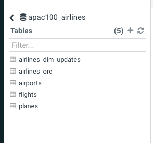

As a final step here let’s run the same analytic query we ran against the Raw layer now in our Data Lakehouse DW, to see what happens with performance. From the cloudera console select the IMPALA virtual warehouse assigned to you

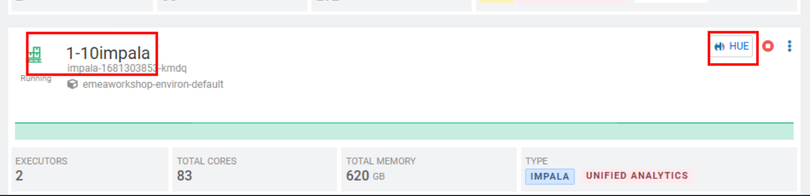

Make sure that 'Unified Analytics' is NOT selected.

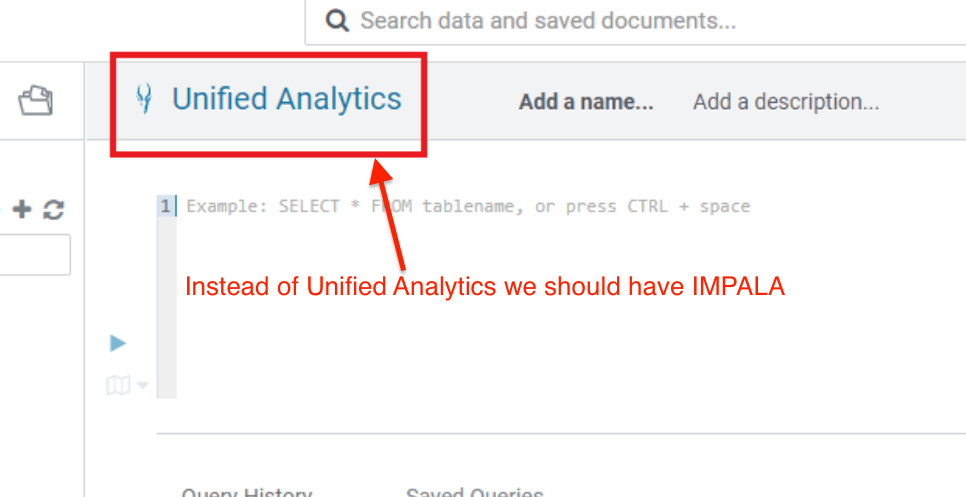

Instead click on the Editor option in the left top corner and select Impala editor.

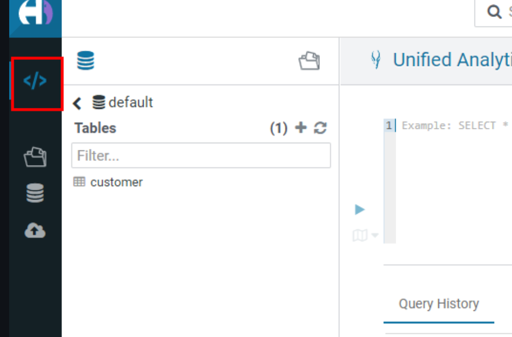

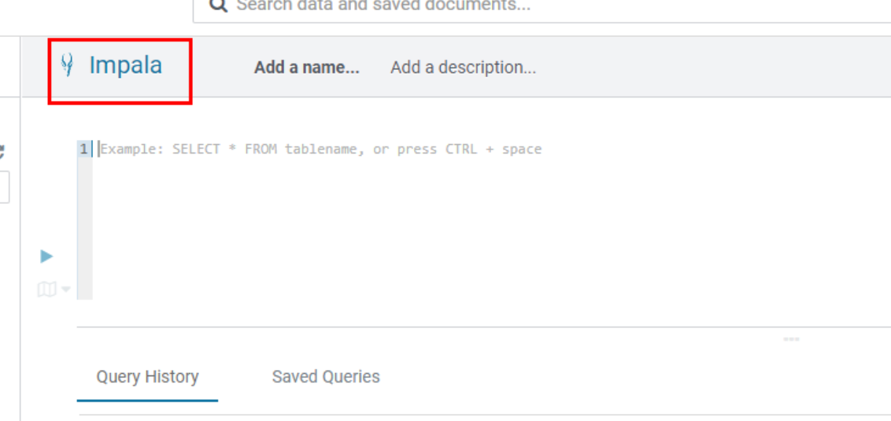

Now run the following query again.

[source,sql]
----
SELECT model,
       engine_type
FROM   ${user_id}_airlines.planes
WHERE  planes.tailnum IN
       (
              SELECT tailnum
              FROM   (
                              SELECT   tailnum,
                                       count(*),
                                       avg(depdelay) AS avg_delay,
                                       max(depdelay),
                                       avg(taxiout),
                                       avg(cancelled),
                                       avg(weatherdelay),
                                       max(weatherdelay),
                                       avg(nasdelay),
                                       max(nasdelay),
                                       avg(securitydelay),
                                       max(securitydelay),
                                       avg(lateaircraftdelay),
                                       max(lateaircraftdelay),
                                       avg(airtime),
                                       avg(actualelapsedtime),
                                       avg(distance)
                              FROM     ${user_id}_airlines.flights
                              WHERE    tailnum IN ('N194JB',
                                                   'N906S',
                                                   'N575ML',
                                                   'N852NW',
                                                   'N000AA')
                              GROUP BY tailnum) AS delays);
----

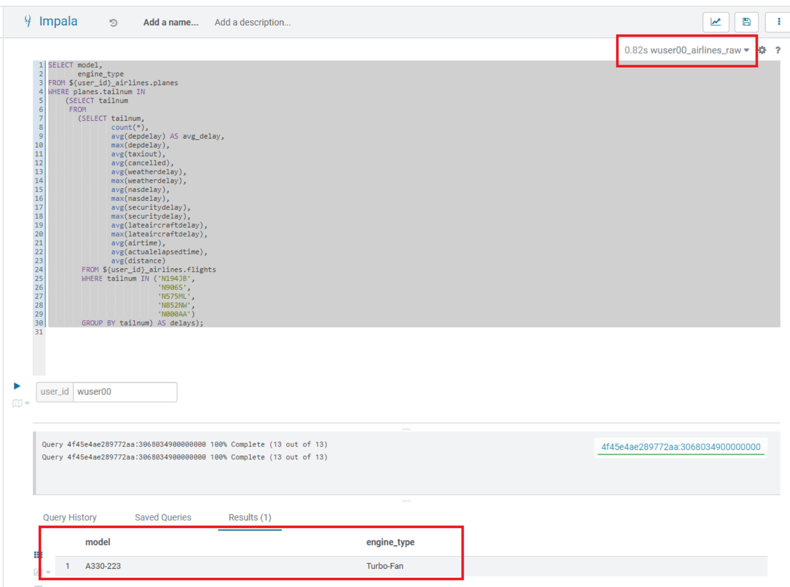

The Data Lakehouse DW query performs significantly better than the same query running against the CSV data.

== LAB 4 - PERFORMANCE OPTIMIZATION AND TABLE MAINTENANCE

In this Step we will look at some of the performance optimization and table maintenance tasks that can be performed to ensure the best possible TCO, while ensuring the best performance.

=== Iceberg in-place Partition Evolution[Performance Optimization]

==== Step 1 : Open HUE for the CDW Hive Virtual Warehouse

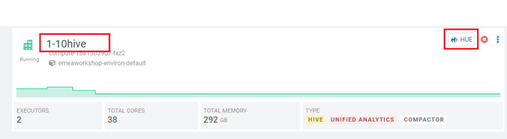

==== Step 2 : Execute Query

One of the key features for Iceberg tables is the ability to evolve the partition that is being used over time.

[source,sql]
----
ALTER TABLE 
  ${user_id}_airlines.flights 
SET 
  PARTITION spec (year, month);
----
[source,sql]
----
SHOW CREATE TABLE ${user_id}_airlines.flights;
----

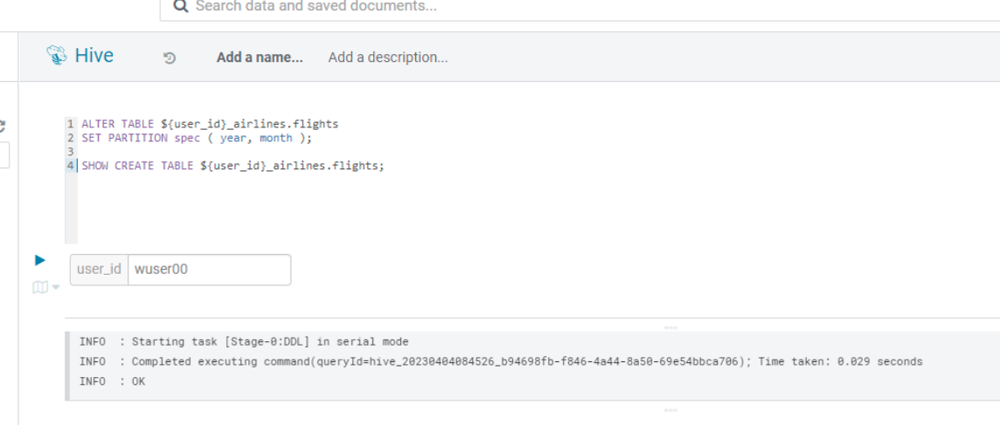

Check for the following where now the partition is by year, month.

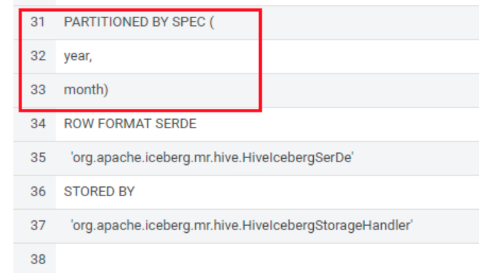

==== Step 3 : Check for optimizations

* {blank}
+
____
Load new data into the flights table using the NEW partition definition. This query will take a while to run
____

[source,sql]
----
INSERT INTO ${user_id}_airlines.flights 
SELECT 
  * 
FROM 
  ${user_id}_airlines_raw.flights_csv 
WHERE 
  year = 2007;
----

* {blank}
+
____
Go to *IMPALA* virtual warehouse and switch the Editor to use IMPALA instead of UNIFIED ANALYTICS

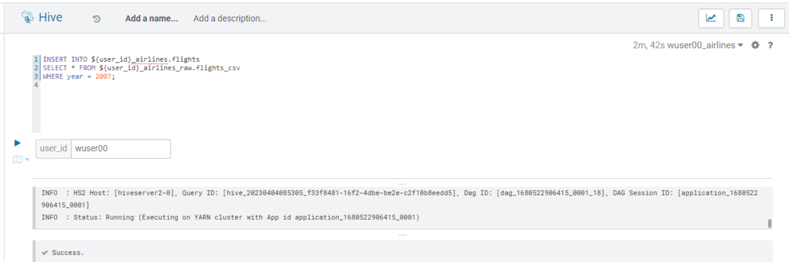
____

____
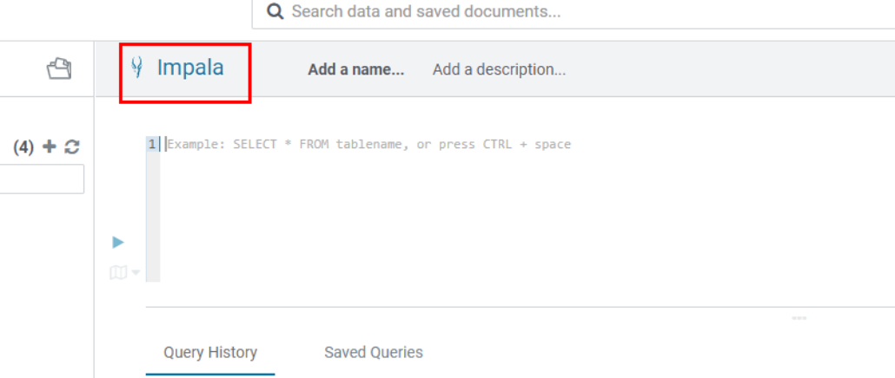
____

* {blank}
+
____
Copy/paste the following in the HUE Editor, but *DO NOT* execute the query.
____

[source,sql]
----
SELECT 
  year, 
  month, 
  count(*) 
FROM 
  ${user_id}_airlines.flights 
WHERE 
  year = 2006 
  AND month = 12 
GROUP BY 
  year, 
  month 
ORDER BY 
  year desc, 
  month asc;
----

Run Explain Plan against the above analytic queries to see how the new partition helps.

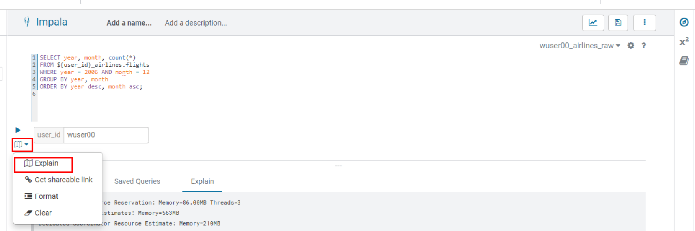

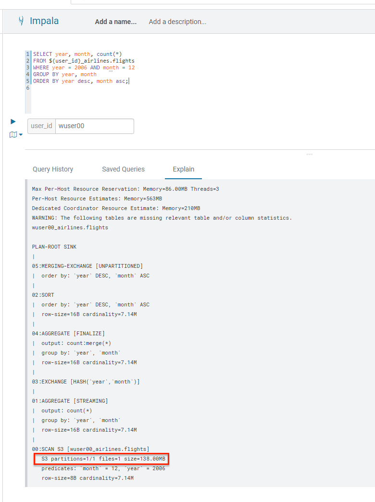

* {blank}
+
____
Copy/paste the following in the HUE Editor, but DO NOT execute the query but check the EXPLAIN PLAN.
____

[source,sql]
----
SELECT 
  year, 
  month, 
  count(*) 
FROM 
  ${user_id}_airlines.flights 
WHERE 
  year = 2007 
  AND month = 12 
GROUP BY 
  year, 
  month 
ORDER BY 
  year desc, 
  month asc;
----

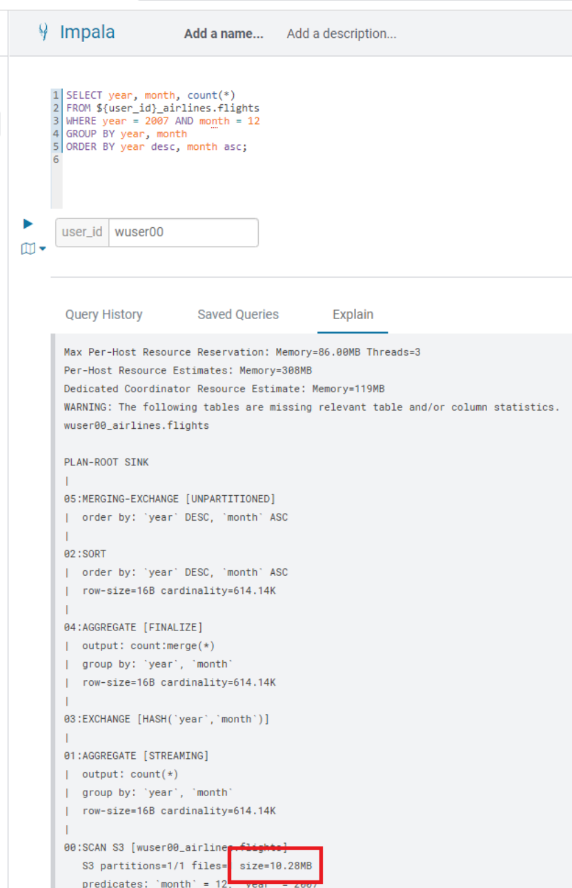

In the output notice the amount of data that needs to be scanned for this query, about 11 MB, is significantly less than that of the first, 138 MB. This shows an important capability of Iceberg, Partition Pruning. Meaning that much less data is scanned for this query and only the selected month of data needs to be processed.

=== Iceberg Snapshots [Table Maintenance]

In the previous steps we have loaded data into the flights iceberg table. We will insert more data into it. Each time we add (update or delete) data a snapshot is captured. The snapshot is important for eventual consistency & to allow multiple read/writes concurrently (from various engines or same engine).

[source,sql]
----
INSERT INTO ${user_id}_airlines.flights 
SELECT 
  * 
FROM 
  ${user_id}_airlines_raw.flights_csv 
WHERE 
  year >= 2008;
----

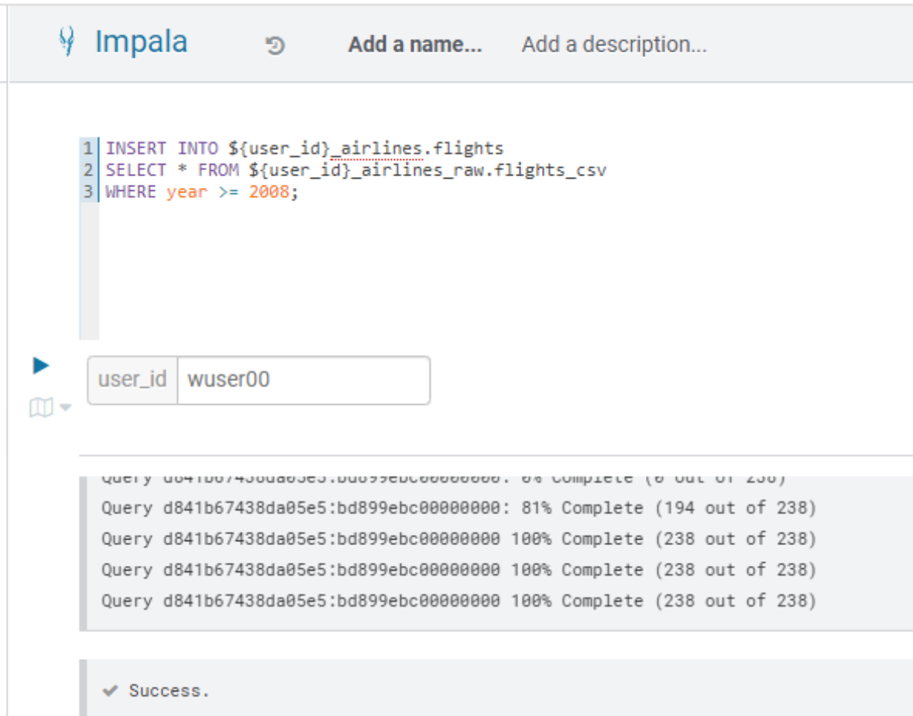

To see snapshots, execute the following SQL.

[source,sql]
----
DESCRIBE HISTORY ${user_id}_airlines.flights;
----

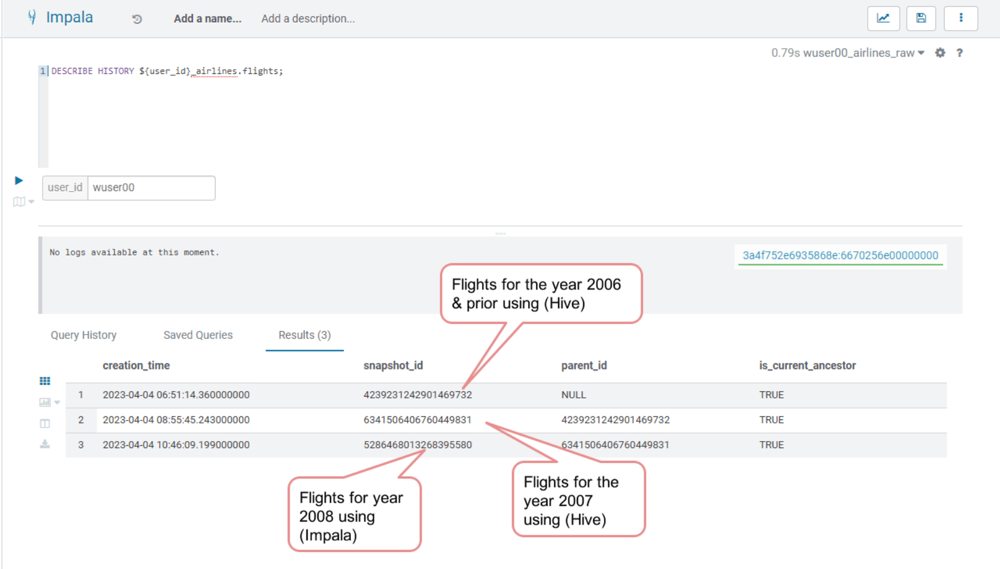

In the output there should be 3 Snapshots, described below. Note that we have been reading/writing data from/to the Iceberg table from both Hive & Impala. It is an important aspect of Iceberg Tables that they support multi-function analytics - ie. many engines can work with Iceberg tables (Cloudera Data Warehouse [Hive & Impala], Cloudera Data Engineering [Spark], Cloudera Machine Learning [Spark], Cloudera DataFlow [NiFi], and DataHub Clusters).

Get the details of the snapshots and store it in a notepad.

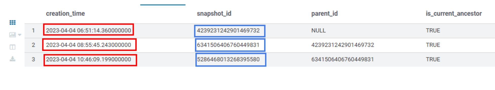

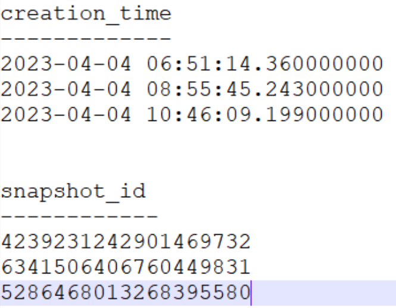

=== Iceberg Time Travel [Table Maintenance]

* {blank}
+
____
Copy/paste the following data into the Impala Editor, but DO NOT execute.
____

[source,sql]
----
-- SELECT DATA USING TIMESTAMP FOR SNAPSHOT

SELECT 
  year, 
  count(*) 
FROM 
  ${user_id}_airlines.flights FOR SYSTEM_TIME AS OF '${create_ts}' 
GROUP BY 
  year 
ORDER BY 
  year desc;

-- SELECT DATA USING TIMESTAMP FOR SNAPSHOT

SELECT 
  year, 
  count(*) 
FROM 
  ${user_id}_airlines.flights FOR SYSTEM_VERSION AS OF ${snapshot_id} 
GROUP BY 
  year 
ORDER BY 
  year desc;
----

After pasting the query you will see the following two options for *create_ts* and *snapshot_id*

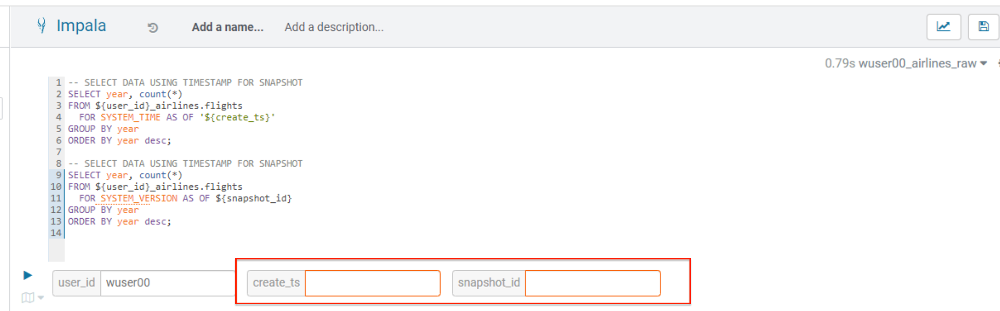

* {blank}
+
____
From the notepad just copy the first value of the timestamp. It could be the date or the timestamp. Paste it in the create_ts box. In our case the value was 2023-04-04 06:51:14.360000000. Then execute the higlighted query only (1st query).
____

____
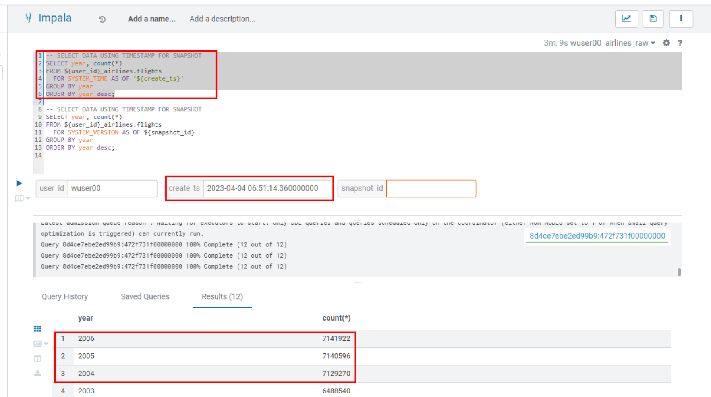
____

* {blank}
+
____
From the notepad just copy the second value of the snapshot id. In our case the value was 6341506406760449831. Paste it in the snapshot_id box. Then execute the highlighted query only (2nd query).
____

=== Iceberg Rollback [Table Maintenance] - DO NOT RUN

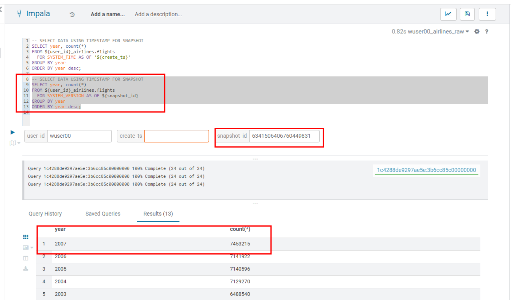

Sometimes data can be loaded incorrectly, due to many common issues - missing fields, only part of the data being loaded, bad data, etc.

In situations like this data would need to be removed, corrected, and reloaded. Iceberg can help with the Rollback command to remove the “unwanted” data.

This leverages Snapshot IDs to perform this action by using a simple ALTER TABLE command as follows. We will NOT RUN this command in this lab.

[source,sql]
----
-- ALTER TABLE ${user_id}_airlines.flights EXECUTE ROLLBACK(${snapshot_id});
----

=== Iceberg Rollback [Table Maintenance] - DO NOT RUN

As time passes it might make sense to expire old Snapshots, instead of the Snapshot ID you use the Timestamp to expire old Snapshots. You can do this manually by running a simple ALTER TABLE command as follows. We will NOT RUN this command in this lab.

-- Expire Snapshots up to the specified timestamp

-- BE CAREFUL: Once you run this you will not be able to Time Travel for any Snapshots that you Expire ALTER TABLE ${user_id}_airlines.flights

[source,sql]
----
-- ALTER TABLE ${user_id}_airlines_maint.flights EXECUTE expire_snapshots('${create_ts}');
----

=== Materialized Views [Performance Optimization]

This can be used for both Iceberg tables and Hive tables.

Go to the HUE UI of the HIVE virtual warehouse assigned to you

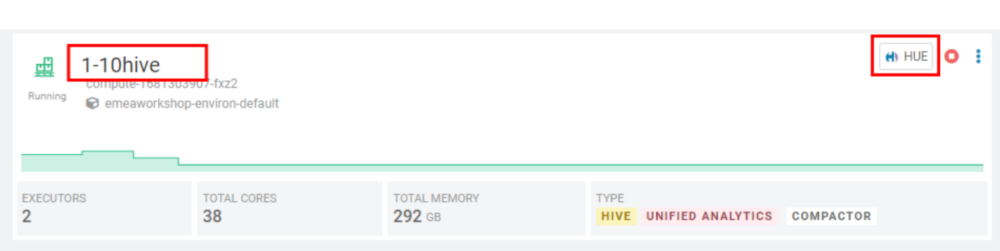

* {blank}
+
____
Copy/paste the following, make sure to highlight the entire block, and execute the following.
____

[source,sql]
----
SET hive.query.results.cache.enabled = false;

drop 
  table if exists ${user_id}_airlines.airlines;

CREATE EXTERNAL TABLE ${user_id}_airlines.airlines (code string, description string) STORED BY ICEBERG STORED AS ORC TBLPROPERTIES ('format-version' = '2');
INSERT INTO ${user_id}_airlines.airlines 
SELECT 
  * 
FROM 
  ${user_id}_airlines_raw.airlines_csv;
SELECT 
  airlines.code AS code, 
  MIN(airlines.description) AS description, 
  flights.month AS month, 
  sum(flights.cancelled) AS cancelled 
FROM 
  ${user_id}_airlines.flights flights, 
  ${user_id}_airlines.airlines airlines 
WHERE 
  flights.uniquecarrier = airlines.code 
group by 
  airlines.code, 
  flights.month;
----

ifdef::env-github[]
:tip-caption: :bulb:
:note-caption: :information_source:
:important-caption: :heavy_exclamation_mark:
:caution-caption: :fire:
:warning-caption: :warning:
endif::[]

[IMPORTANT]
Hive has built in performance improvements, such as a *Query Cache* that stores results of queries run so that similar queries don’t have to retrieve data, they can just get the results from the cache. In this step we are turning that off using the SET statement, this will ensure when we look at the query plan, we will not retrieve the data from the cache.

ifdef::env-github[]
:tip-caption: :bulb:
:note-caption: :information_source:
:important-caption: :heavy_exclamation_mark:
:caution-caption: :fire:
:warning-caption: :warning:
endif::[]

[IMPORTANT]
With this query you are combining an Iceberg Table Format (flight table) with a Hive Table Format (airlines ORC table) in the same query.

* {blank}
+
____
Let’s look at the Query Plan that was used to execute this query. On the left side click on Jobs, as shown in the screenshot below.
____

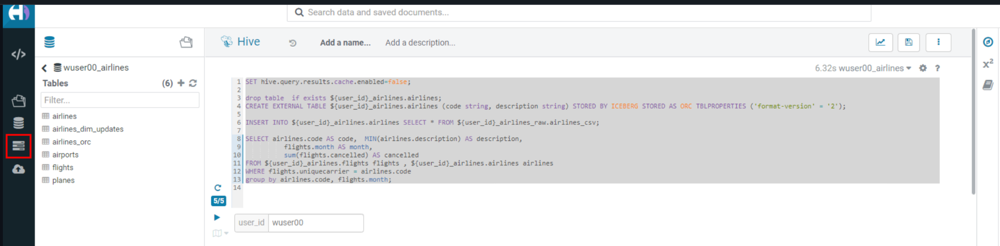

* {blank}
+
____
Then click on Queries. This is where an Admin will go when he wants to investigate the queries. In our case for this lab, we’d like to look at the query we just executed to see how it ran and the steps taken to execute the query. Administrators would also be able to perform other monitoring and maintenance tasks for what is running (or has been run). Monitoring and maintenance tasks could include cancel (kill) queries, see what is running, analyze whether queries that have been executed are optimized, etc.
____

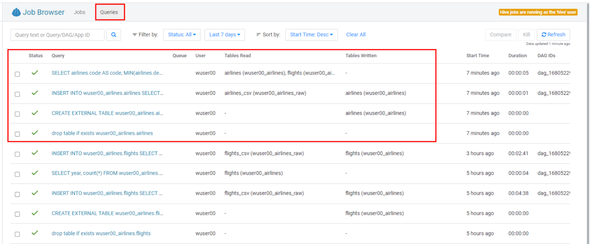

* {blank}
+
____
Click on the first query as shown below. Make sure that this is the latest query. You can look at the `Start Time' field here to know if it’s the latest or not.
____
* {blank}
+
____
This is where you can analyze queries at a deep level. For this lab let’s take a look at the Explain details, by clicking on the *Visual Explain* tab. It might take a while to appear, please click on refresh. This plan shows that this query needs to Read flights (86M rows) and airlines (1.5K rows) with hash join, group, and sort. This is a lot of data processing and if we run this query constantly it would be good to reduce the time this query takes to execute.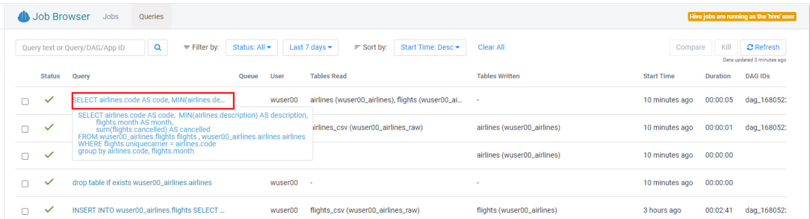

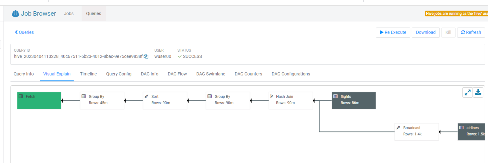
____

* {blank}
+
____
Click on the Editor option on the left side as shown.
____

____
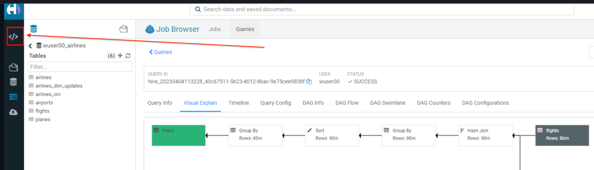
____

* {blank}
+
____
*Create Materialized View (MV) -* Queries will transparently be rewritten, when possible, to use the MV instead of the base tables. Copy/paste the following, highlight the entire block, and execute.
____

[source,sql]
----
DROP MATERIALIZED VIEW IF EXISTS ${user_id}_airlines.traffic_cancel_airlines;

CREATE MATERIALIZED VIEW ${user_id}_airlines.traffic_cancel_airlines as 
SELECT 
  airlines.code AS code, 
  MIN(airlines.description) AS description, 
  flights.month AS month, 
  sum(flights.cancelled) AS cancelled, 
  count(flights.diverted) AS diverted 
FROM 
  ${user_id}_airlines.flights flights 
  JOIN ${user_id}_airlines.airlines airlines ON (
    flights.uniquecarrier = airlines.code
  ) 
group by 
  airlines.code, 
  flights.month;
----
[source,sql]
----
-- show MV

SHOW MATERIALIZED VIEWS in ${user_id}_airlines;
----

* {blank}
+
____
Run Dashboard Query again to see usage of the MV - Copy/paste the following, make sure to highlight the entire block, and execute the following. This time an order by was added to make this query must do more work.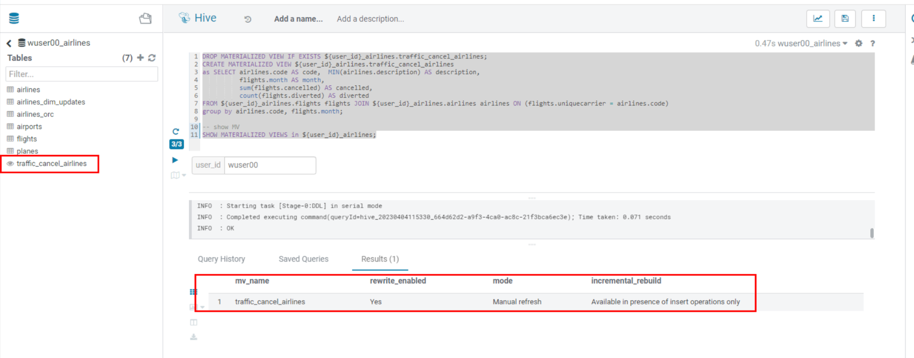
____

[source,sql]
----
SET hive.query.results.cache.enabled = false;

SELECT 
  airlines.code AS code, 
  MIN(airlines.description) AS description, 
  flights.month AS month, 
  sum(flights.cancelled) AS cancelled 
FROM 
  ${user_id}_airlines.flights flights, 
  ${user_id}_airlines.airlines airlines 
WHERE 
  flights.uniquecarrier = airlines.code 
group by 
  airlines.code, 
  flights.month 
order by 
  airlines.code;

----

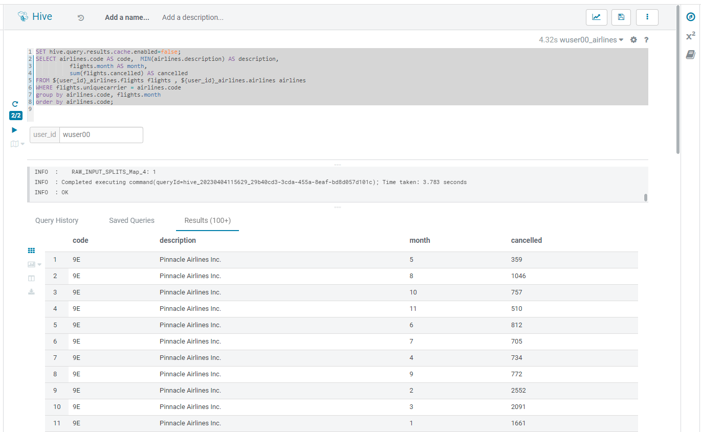

Let’s look at the Query Plan that was used to execute this query. On the left menu select Jobs. On the Jobs Browser - select the Queries tab to the right of the Job browser header. Hover over & click on the Query just executed (should be the first row). Click on the *Visual Explain* tab. 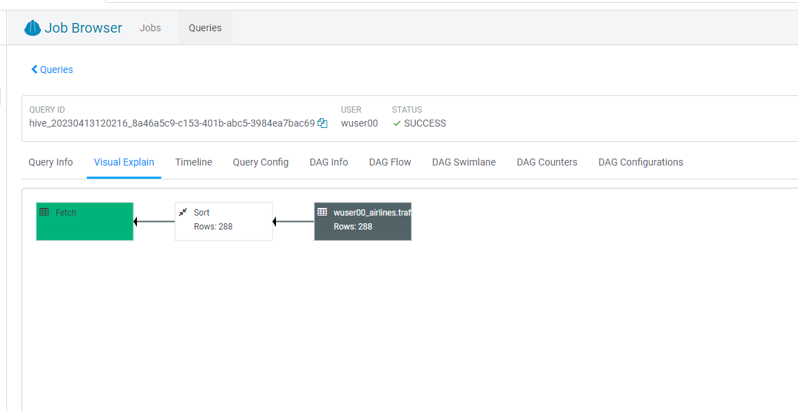

With query rewrite the materialized view is used and the new plan just reads the MV and sorts the data vs. reading flights (86M rows) and airlines (1.5K rows) with hash join, group and sorts. This results in significant reduction in run time for this query.

== LAB 5 - SECURITY AND GOVERNANCE

In this Lab you will experience the combination of what the Data Warehouse and the Shared Data Experience (SDX) offers. SDX enables you to provide Security and Governance tooling to ensure that you will be able to manage what is in the CDP Platform without having to stitch together multiple tools.

* {blank}
+
____
Go to the Cloudera Data Platform Console and click on Data Catalog
____

____
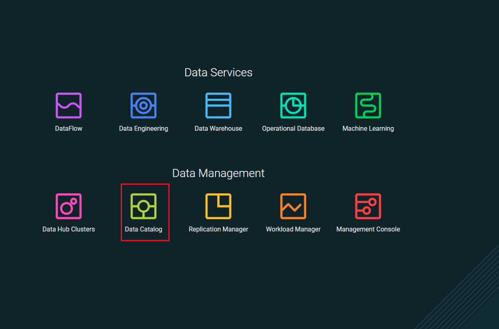
____

* {blank}
+
____
Change the radio button to select the appropriate data lake. In this case it is <environment-name-shared-by-instructor>
____

____
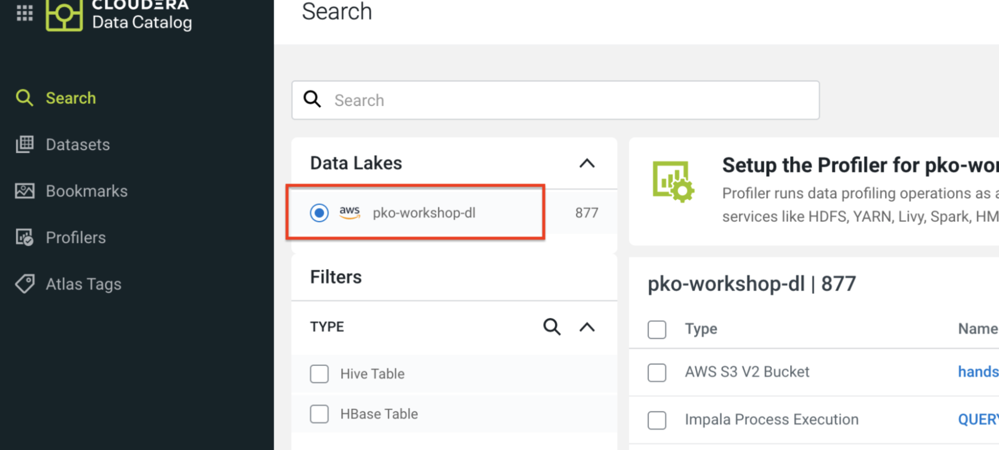
____

* {blank}
+
____
Filter for Assets we created - below the Data Lakes on the left of the screen under Filters, select TYPE to be Hive Table. The right side of the screen will update to reflect this selection.
____

____
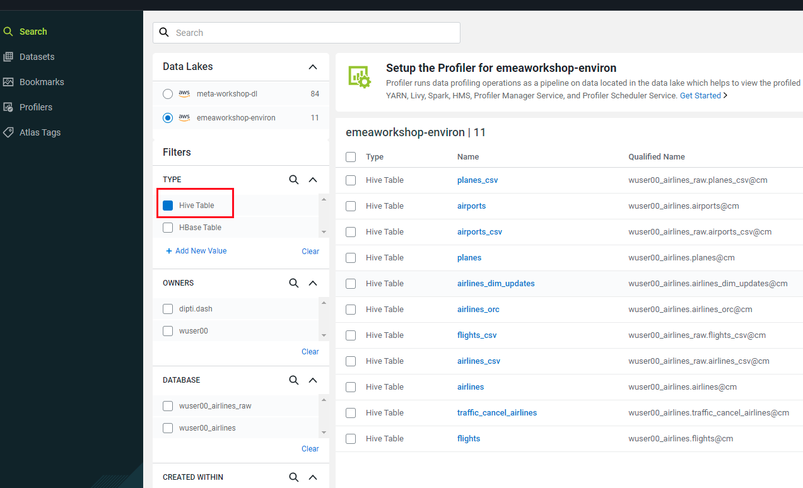
____

* {blank}
+
____
Under DATABASE, click Add new Value. In the box that appears start typing your <user_id> when you see the <user_id>_airlines database pop up select it.
____

____
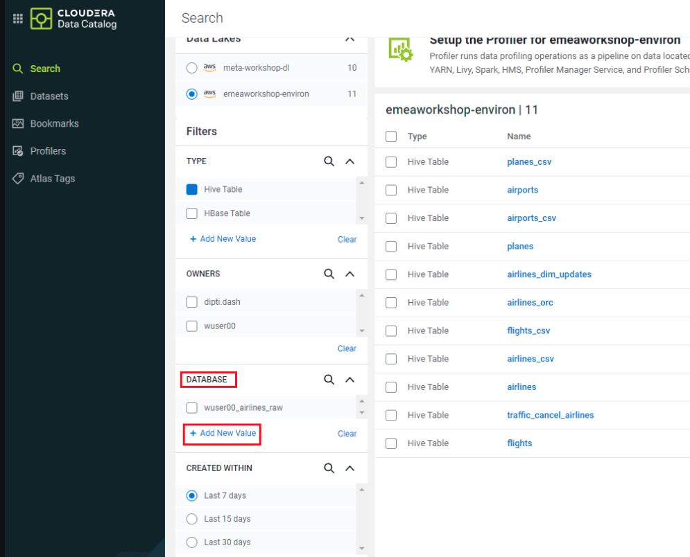

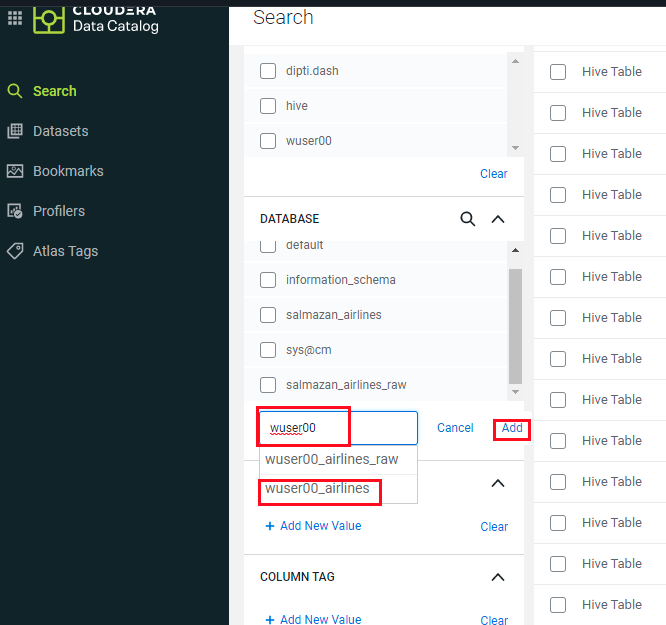
____

* {blank}
+
____
You should now see the tables and materialized views that have been created in the <user_id>_airlines database. Click on flights in the Name column to view more details on the table.
____

____
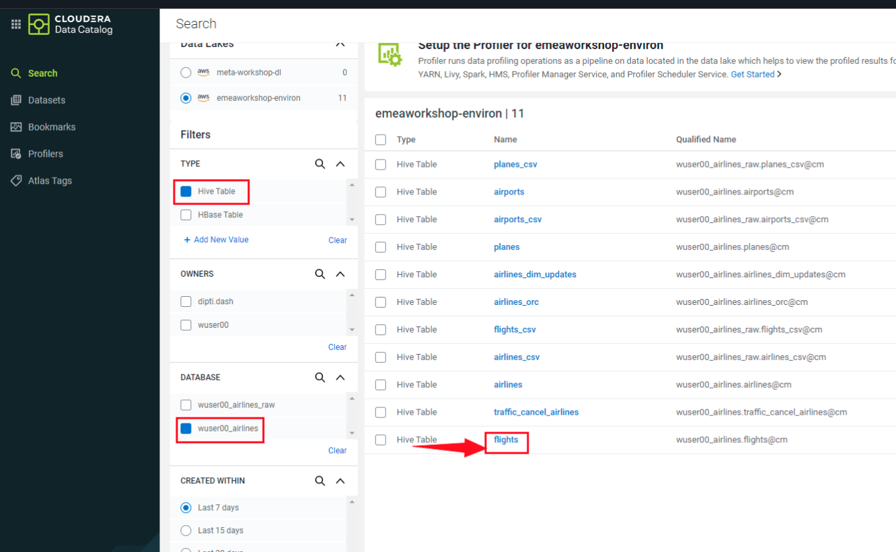
____

* {blank}
+
____
This page shows information about the flights table such as the table owner, when the table was created, when it was last accessed, and other properties. Below the summary details is the Overview tab which shows the lineage - hover over the flights click on the “i” icon that appears to see more detail on this table.
____

____
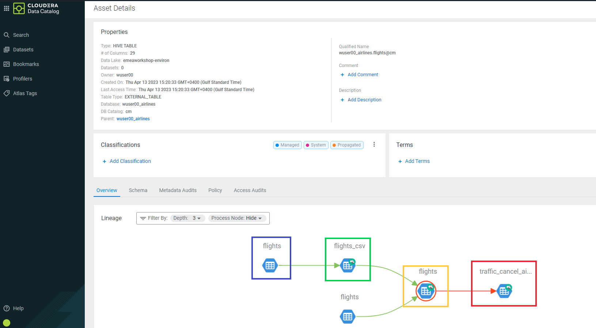
____

* {blank}
+
____
The lineage shows:
____
** {blank}
+
____
[blue box] - flights data file residing in an s3 folder.
____
** {blank}
+
____
[green box] - is showing how the flights_csv Hive table is created, this table was created and points to the data location of flights (blue box) s3 folder.
____
** {blank}
+
____
[orange box]- is showing the flights Iceberg table and how it is created, it uses data from flights_csv Hive table (CTAS).
____
** {blank}
+
____
[red box] - traffic_cancel_airlines is a Materialized View that uses data from the flights Iceberg table.
____

____
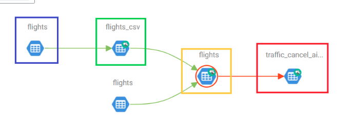
____

* {blank}
+
____
Click on the Policy tab to see what security policies have been applied on this table. Click on the arrow next all - database, table Policy Name to the number as shown in the screenshot
____

____
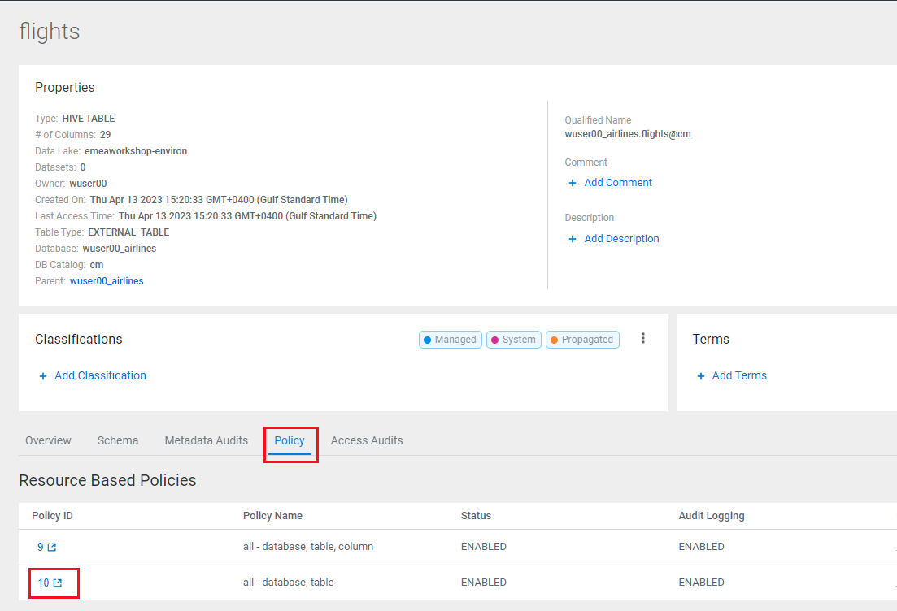
____

* {blank}
+
____
It will open Ranger which is for access management. Using Security (Ranger) - we can modify and create security policies for the various CDP Data Services. Click on Hadoop SQL link in the upper right corner - to view the security policies in place for CDW. Here, I will stick to the CDW related security features.
____

____
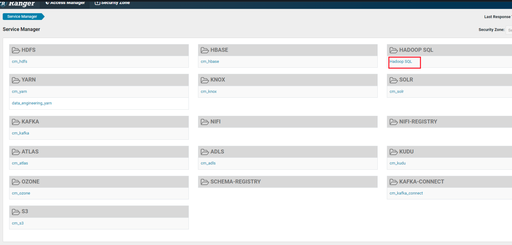
____

* {blank}
+
____
This screen shows the general Access related security policies - who has access to which Data Lakehouse databases, tables, views, etc. Click on the Row Level Filter tab to see the policies to restrict access to portions of data.
____

____
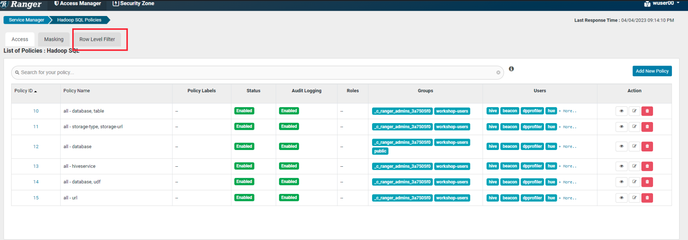
____

=== Step 1 : Add New Policy

* {blank}
+
____
There are currently no policies defined. Click on the Add New Policy button on the top right corner.
____

____
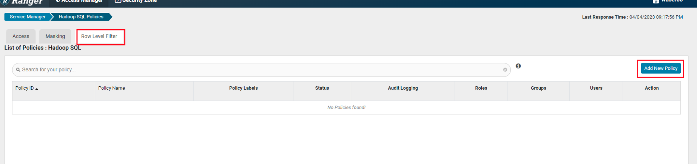
____

* {blank}
+
____
Fill out the form as follows.
____

____
Policy Name: <user_id>_RowLevelFilter (Ex: wuser00_RowLevelFilter)

Hive Database: <user_id>_airlines (Ex: wuser00_airlines)

Hive Table: flights (start typing, once you see this table in the list, select it)

Row Filtering Conditions:
____

* {blank}
+
____
Select User: <user_id>
____
* {blank}
+
____
Access Types: select
____
* {blank}
+
____
Row Level Filter: uniquecarrier="UA"
____

Click the Add button to accept this Policy.

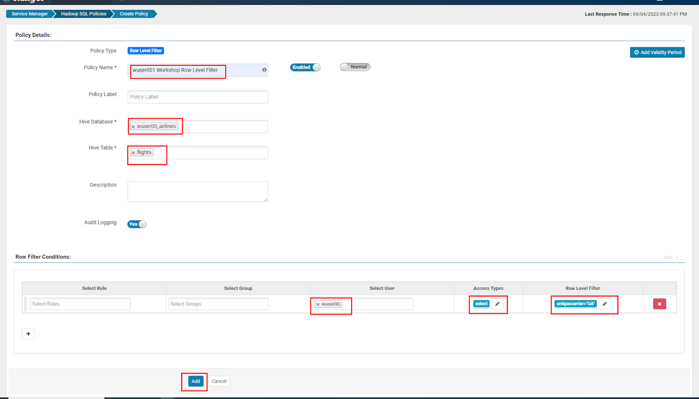

The new policy is added to the Row Level Filter policies (as below).

image:cdw-media/media/image64.png[cdw-media/media/image64,width=624,height=138]

=== Step 2 : Test New Policy

* {blank}
+
____
Test the policy is working - Open HUE for the CDW Impala Virtual Warehouse assigned to you and execute the following query.
____

[source,sql]
----
SELECT 
  uniquecarrier, 
  count(*) 
FROM 
  ${user_id}_airlines.flights 
GROUP BY 
  uniquecarrier;
----

____
You should now only see 1 row returned for this query - after the policy was applied you will only be able to access uniquecarrier = UA and no other carriers.

image:cdw-media/media/image5.png[cdw-media/media/image5,width=624,height=346]
____

== LAB 6 - CLOUDERA DATA VISUALIZATION

In this step you will build a Logistics Dashboard using Cloudera Data Visualization. The Dashboard will include details about flight delays and cancellations. But first we will start with Data Modeling.

=== Data Modeling

* {blank}
+
____
If you are not on the CDP home page, then go there and click on the following CDW icon to go into Cloudera Data Warehouse.
____

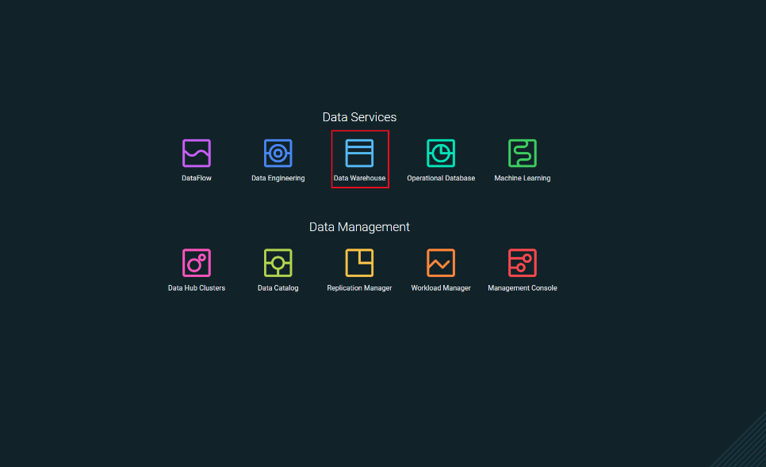

* {blank}
+
____
Click on the Data Visualization option in the left windowpane. You’ll see an option Data VIZ next to the data-viz application with the name *hol-data-viz*. It should open a new window.
____

____
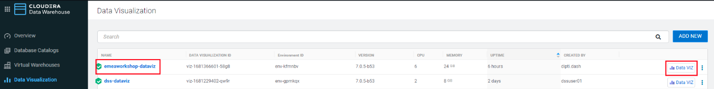
____

* {blank}
+
____
There are 4 areas of CDV - HOME, SQL, VISUALS, DATA - these are the tabs at the top of the screen in the black bar to the right of the Cloudera Data Visualization banner.
____

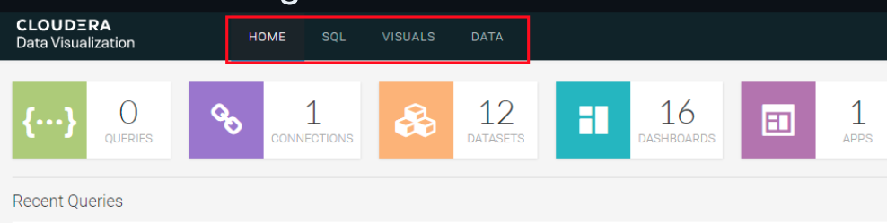

* {blank}
+
____
Click on DATA in the top banner. A Dataset is a Semantic Layer where you can create a business view on top of the data - data is not copied; this is just a logical layer.
____

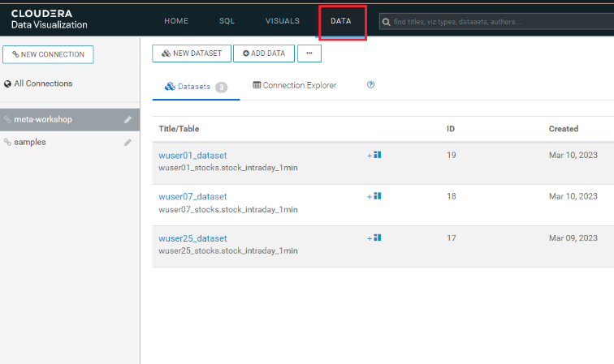

* {blank}
+
____
Create a connection - click on the NEW CONNECTION button on the left menu. Enter the details as shown in the screenshot and click on TEST.
____

____
*Connection type:* Select CDW Impala.

*Connection name*: <user_id>-airlines-lakehouse (Ex-wuser00-airlines-lakehouse).

*CDW Warehouse:* Make Sure you select the warehouse that is associated with your <user_id>.

*Hostname or IP address:* Gets automatically selected.

*Port:* Gets automatically filled up.

*Username:* Gets automatically filled up.

*Password:* Blank
____

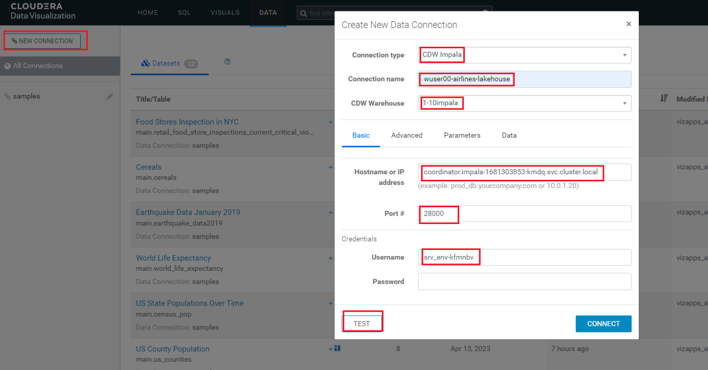

image:cdw-media/media/image3.png[cdw-media/media/image3,width=435,height=505]

* {blank}
+
____
Click on CONNECT.
____

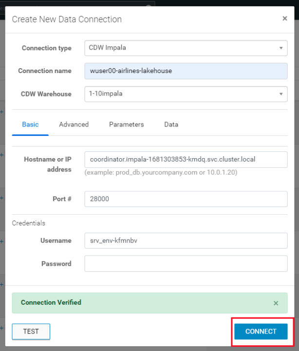

* {blank}
+
____
You will see your connection in the list of connections on the left menu. On the right side of the screen you will see Datasets and the Connection Explorer. Click on NEW DATASET.
____

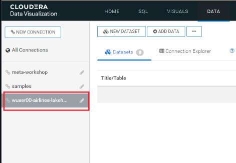

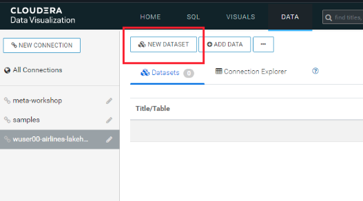

* {blank}
+
____
Fill the details as following and click CREATE. airline_logistics gets created
____

____
*Dataset title* - airline_logistics.

*Dataset Source* - Select From Table (however, you could choose to directly enter a SQL statement instead).

*Select Database* - <user_id>_airlines (Make Sure you select the database that is associated with your <user_id>).

*Select Table* - flights.
____

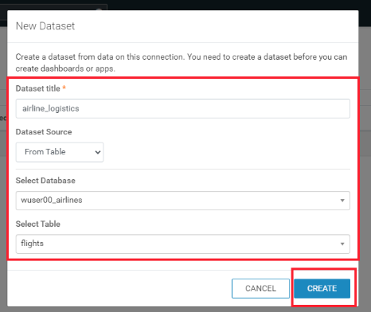

Edit the Dataset - click on airline_logistics on the right of the screen. This will open the details page, showing you information about the Dataset, such as connection details, and options that are set.

image:cdw-media/media/image74.png[cdw-media/media/image74,width=624,height=241]

Click on Fields option in the left window pane.

image:cdw-media/media/image91.png[cdw-media/media/image91,width=363,height=376]

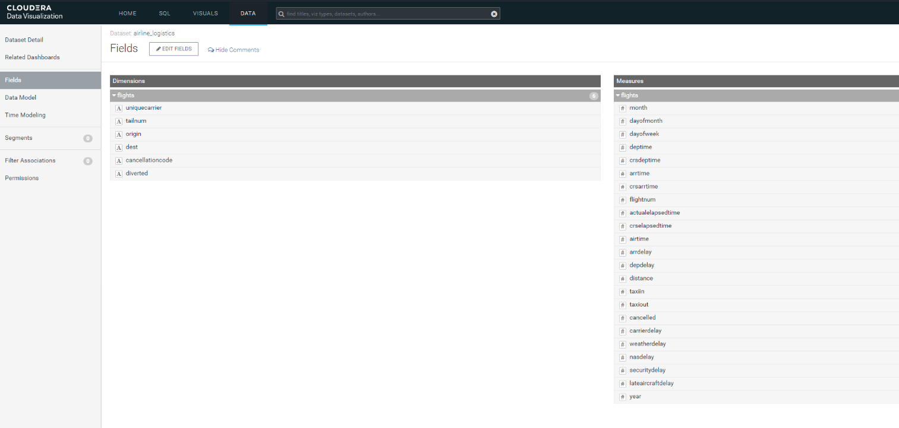

Click on Data Model - for our Dataset we need to join additional data to the flights table including the planes, airlines, and airports tables.

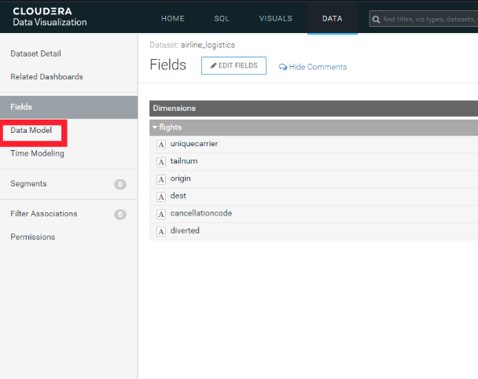

Click on EDIT DATA MODEL.

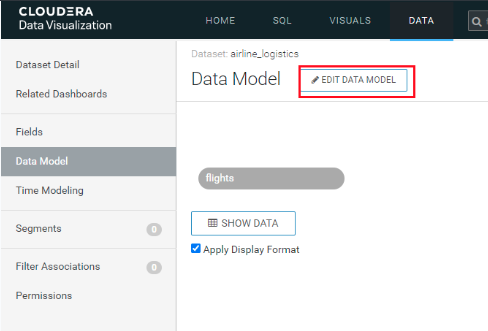

Click on the + icon next to the flights table option.

image:cdw-media/media/image104.png[cdw-media/media/image104,width=595,height=319]

Select the appropriate Database Name base on your user id (Ex: wuser00_airlines) and table name planes.

image:cdw-media/media/image95.png[cdw-media/media/image95,width=480,height=288]

Then click on the joinicon join icon and see that there are 2 join options tailnum & year. Click on EDIT JOIN and then remove the year join by clicking the little - (minus) icon to the right next to the year column. Click on APPLY.

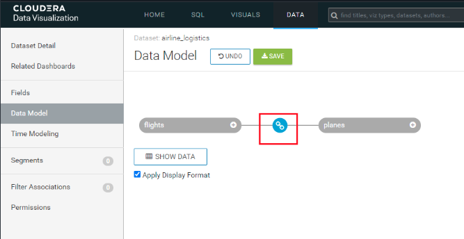

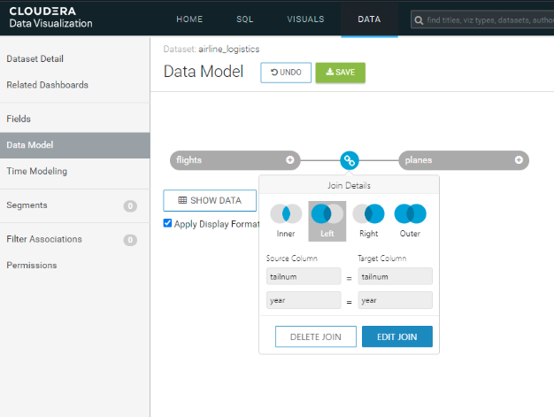

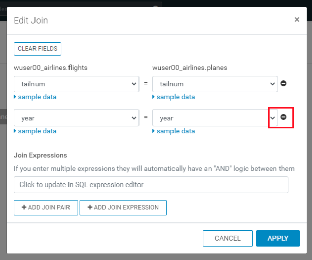

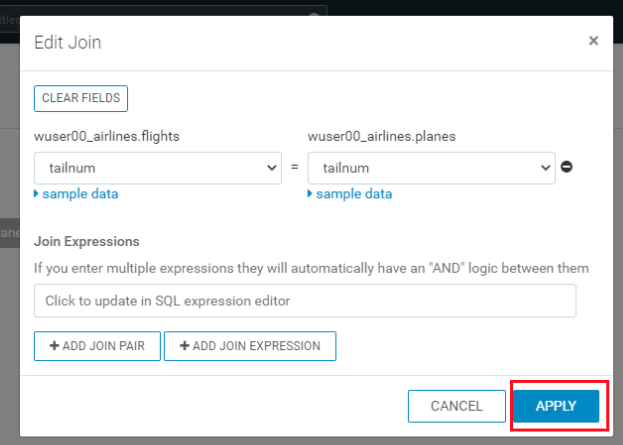

* {blank}
+
____
Now we will create a join between another table. Click on + icon next to flights as shown below. Select the appropriate Database Name based on your <user_id> (Ex: wuser00_airlines) and table name airlines.
____

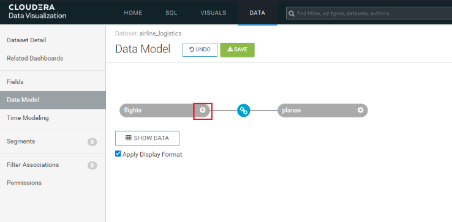

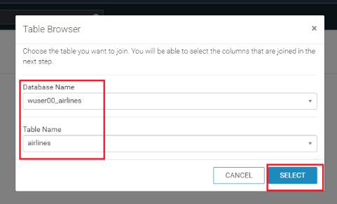

* {blank}
+
____
Make sure you select the column uniquecarrier from flights and column code from airlines table. Click APPLY.
____

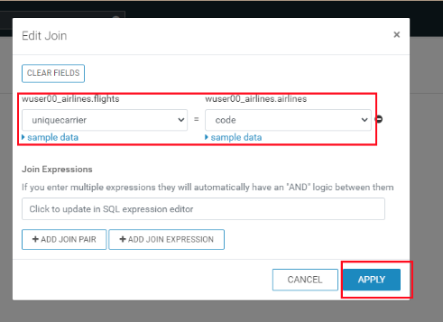

* {blank}
+
____
Click on + icon next to flights as shown below. Select the appropriate Database Name based on your <user_id> (Ex: wuser00_airlines) and table name airports.
____

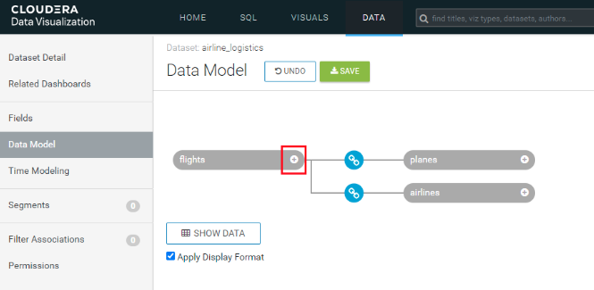

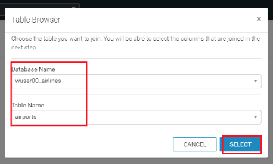

* {blank}
+
____
Make sure you select the column origin from flights and column iata from airports table. Click APPLY.
____

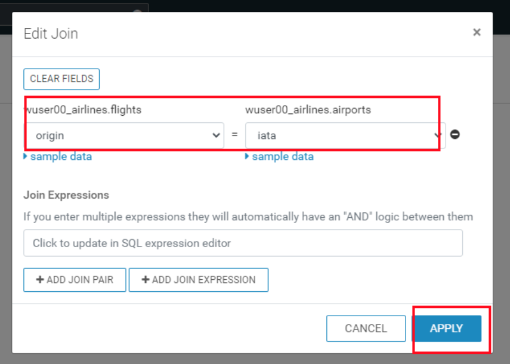

* {blank}
+
____
Click on + icon next to flights as shown below. Select the appropriate Database Name based on your <user_id> (Ex: wuser00_airlines) and table name airports.
____

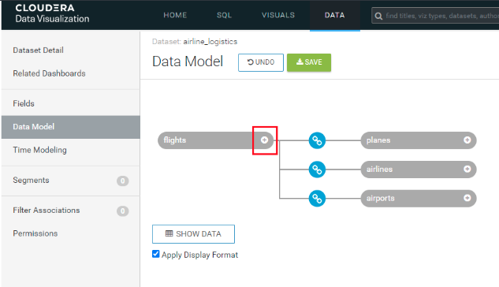

* {blank}
+
____
Make sure you select the column dest from flights and column iata from airports table. Click APPLY. Then click on SAVE.
____

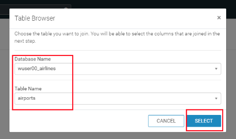

* {blank}
+
____
Select “dest” from the flights table and “iata” from the airports_a table. Click APPLY
____

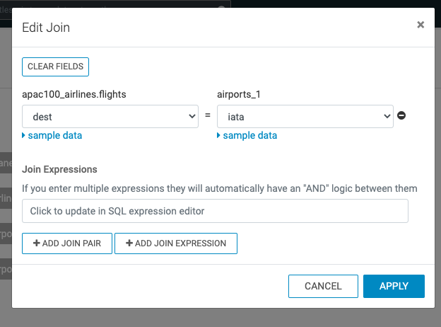

* {blank}
+
____
Verify that you have the joins which are as follows. You can do so by clicking the join icon.
____
** {blank}
+
____
flights.tailnum — planes.tailnum
____
** {blank}
+
____
flights.uniquecarrier — airlines.code
____
** {blank}
+
____
flights.origin — airports.iata
____
** {blank}
+
____
flights.dest — airports_1.iata
____

* {blank}
+
____
Click on SHOW DATA. And then click on SAVE.
____

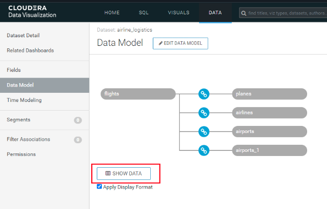

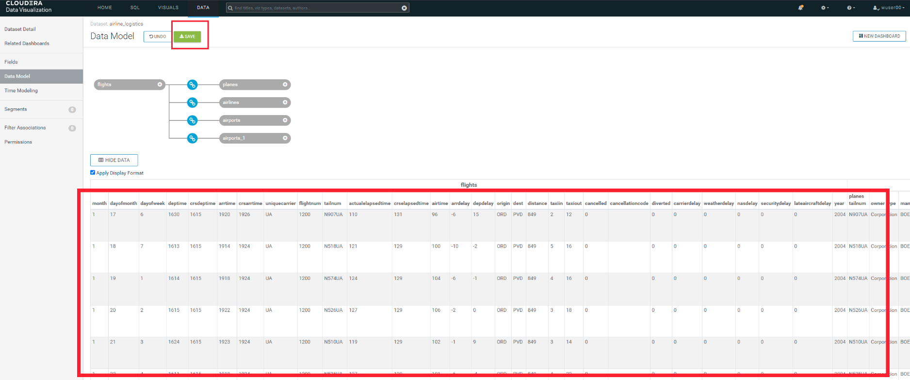

* {blank}
+
____
Click on the Fields column on the left window pane. Then click on EDIT FIELDS. Make sure that you click on the highlighted area to change # (measures icon) next to each column to Dim (dimension icon). The columns are as follows.
____

* {blank}
+
____
*flights table:* Columns (month, dayofmonth, dayofweek, deptime, crsdeptime, arrtime, crsarrtime, flightnum & year)
____

* {blank}
+
____
*planes table:* All columns
____

* {blank}
+
____
*airports table:* All columns
____

* {blank}
+
____
*airports_1 table:* All columns
____

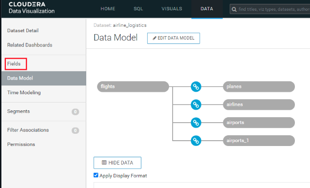

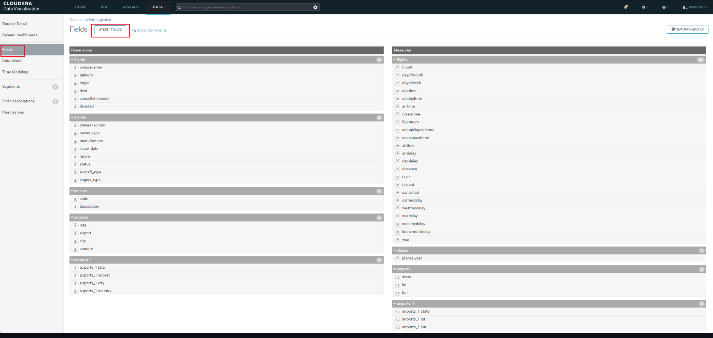

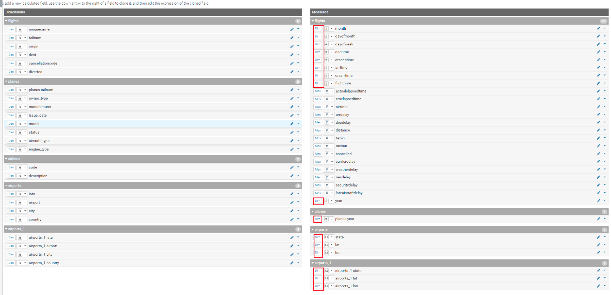

* {blank}
+
____
Click on TITLE CASE. And notice that the column names changes to be Camel case.
____

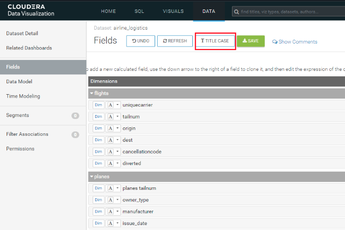

* {blank}
+
____
Click on the pencil icon next to Depdelay icon.
____

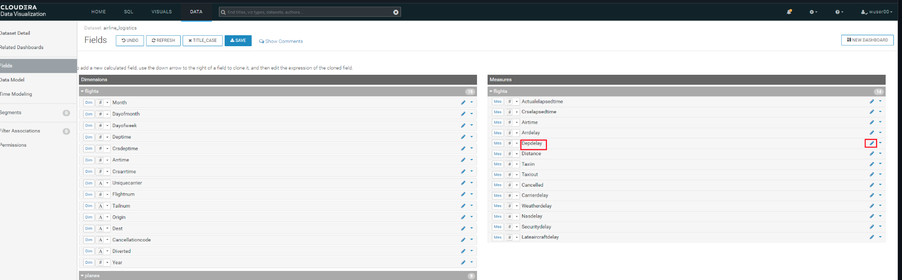

* {blank}
+
____
Change the Default Aggregation to Average.
____

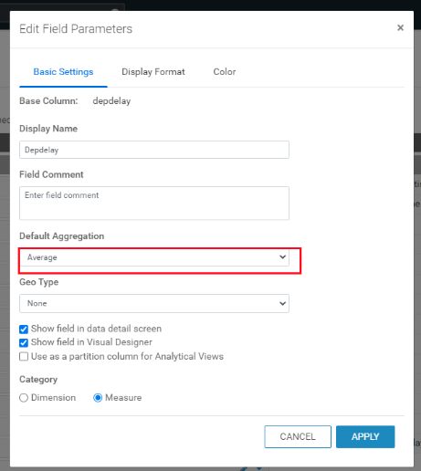

* {blank}
+
____
Click on the Display Format and then change Category to be Integer. Check mark the box next to the Use 1000 separator. Click on APPLY.
____

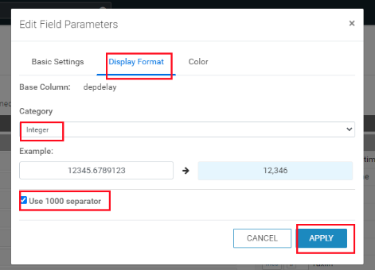

Click on the down arrow shown against the Origin column and the click on Clone. A column Copy of Origin is created. Click on the 'pencil' icon next to it.

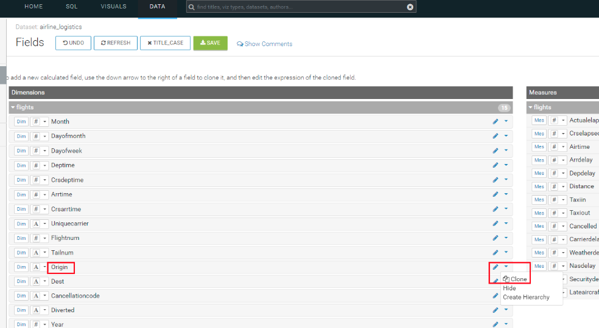

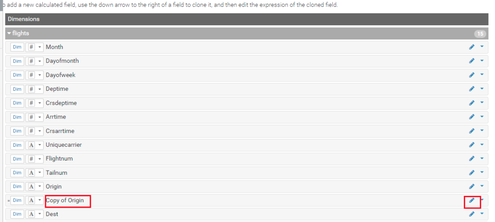

Change the Display Name to Route.

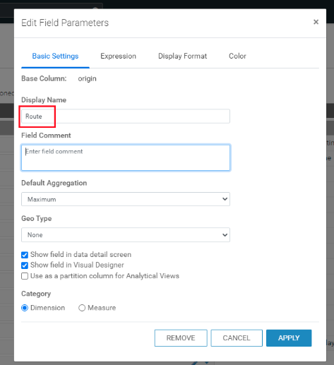

Then click on Expression and enter the following in the Expression editor. Click on APPLY.

____
concat([Origin], '-', [Dest])
____

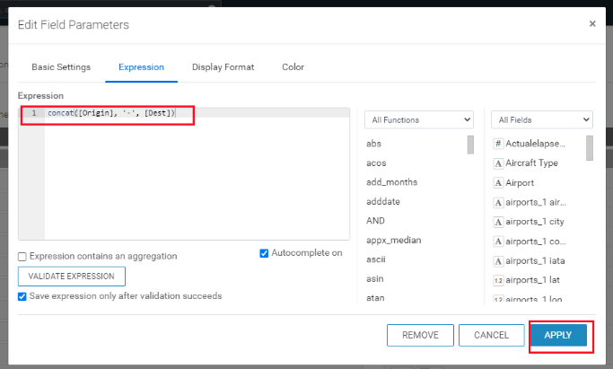

Click on SAVE. We have completed the step of data modeling and now we will create data visualization.

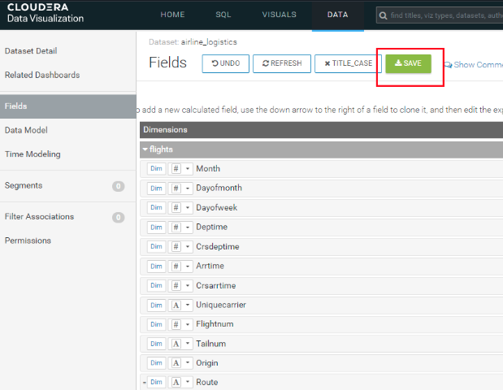

=== Dashboard Creation

* {blank}
+
____
Now we will create a dashboard page based on the data model that we just created. Click on NEW DASHBOARD.
____

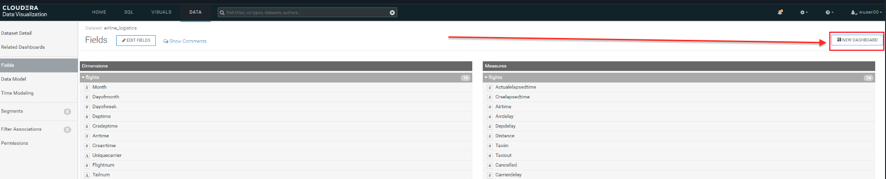

* {blank}
+
____
You will see the following.
____

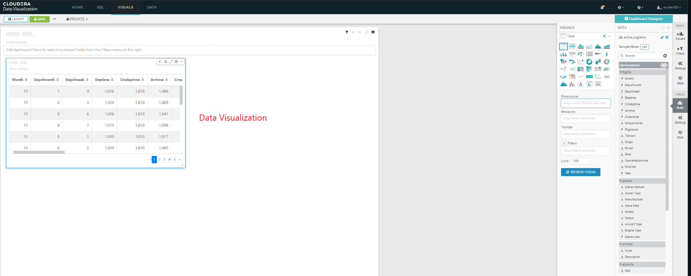

* {blank}
+
____
A quick overview of the screen that you are seeing is as follows. On the right side of the screen there will be a *VISUALS* menu. At the top of this menu, there is a series of Visual Types to choose from. There will be 30+ various visuals to choose from. Below the Visual Types you will see what are called Shelves. The Shelves that are present depend on the Visual Type that is selected. *Shelves* with a * are required, all other Shelves are optional. On the far right of the page there is a *DATA* menu, which identifies the Connection & Dataset used for this visual. Underneath that is the Fields from the Dataset broken down by Dimensions and Measures. With each of these Categories you can see that it is subdivided by each Table in the Dataset.
____

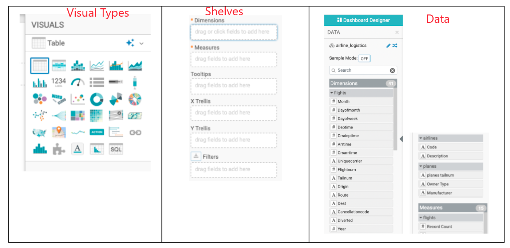

* {blank}
+
____
Let’s build 1st visual - Top 50 Routes by Avg Departure Delay. CDV will add a Table visual displaying a sample of the data from the Dataset as the default visualization when you create a new Dashboard or new Visuals on the Dashboard (see New Dashboard screen above). The next step is to modify (Edit) the default visualization to suit your needs.
____

* {blank}
+
____
Pick the Visual Type - Select the Stacked Bar chart visual on the top right as shown below. Make sure Build is selected for it to appear on the right side.
____

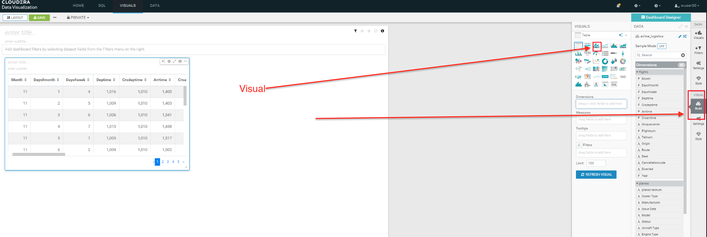

Find Route under Dimensions → flights. Drag to X-Axis. Similarly, find DepDelay under Measures → flights. Drag to Y-Axis. By default the aggergation selected is average and hence you would see avg(Depdelay).

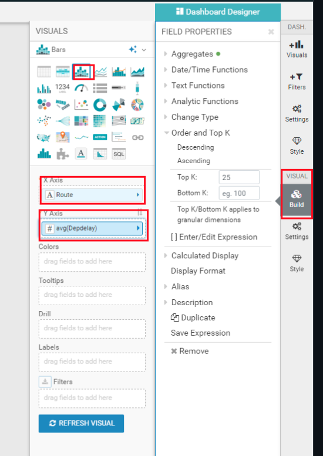

* {blank}
+
____
Click on the arrow next to avg(Depdelay). Enter 50 against the text box labeled Top K. Click on REFRESH VISUAL.
____

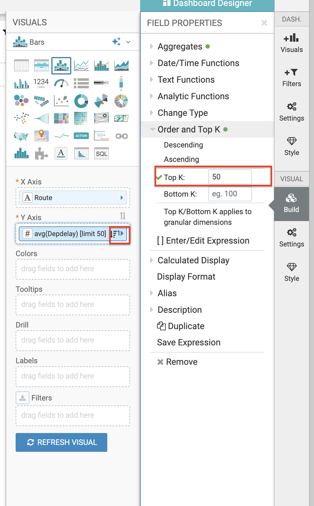

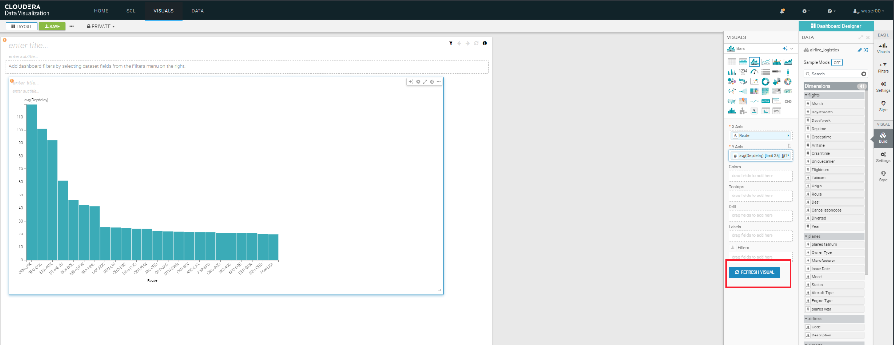

* {blank}
+
____
Click enter title and enter the title based on your user id as - <user_id>- Routes with Highest Avg. Departure Delays. Then click on SAVE.
____

____
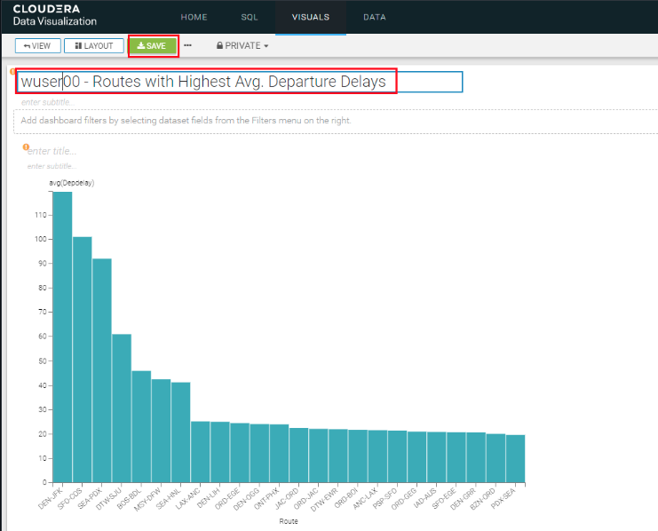
____

*_This concludes the workshop. Hope you had a great time learning something new and useful._*
